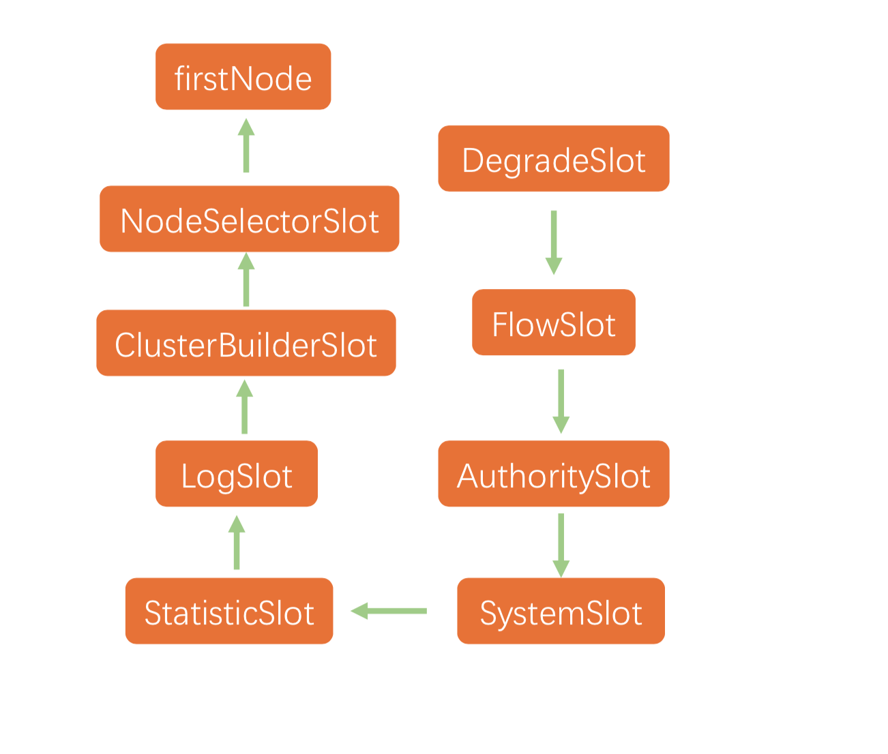
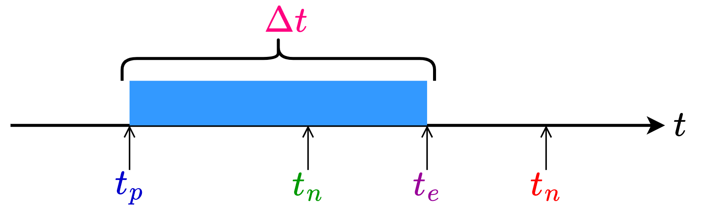
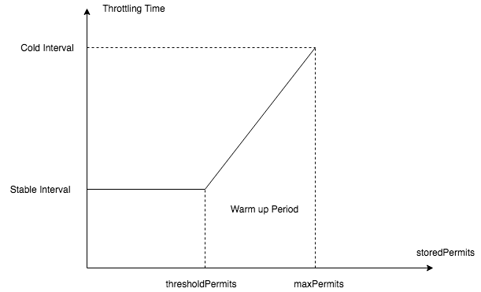

## 数据统计

### 数据结构

* `sentinel`使用滑动窗口方式统计一分钟内放行请求数、阻塞请求数、异常请求数、成功请求数和请求响应时间。

* 数据统计由`StatisticNode`类完成，内部保有数据统计数组`rollingCounterInMinute`，数组统计的时间范围为`60*1000ms`，统计范围内均匀采样`60`次，以`1000ms`为统计基本单位。同时记录下最近一次更新数据的时间`lastFetchTime`作为时间范围的上界，`lastFetchTime-6000ms`作为时间范围的下界，通过上下界过滤出`rollingCounterInMinute`中有效的统计单位节点。

```java
public class StatisticNode implements Node {
	// 数据统计的时间范围为60*1000ms，统计范围内均匀采样60次，以1000ms为统计基本单位
    private transient Metric rollingCounterInMinute = new ArrayMetric(60, 60 * 1000, false);
    private long lastFetchTime = -1;
}
```

* 统计数组`rollingCounterInMinute`本是上是一个存储`MetricBucket`的数组，`MetricBucket`用于统计一个统计基本单位，即`1000ms`内请求的汇总数据。其内部持有一个长度为6的数组，分别表示统计基本单位内放行请求数、阻塞请求数、异常请求数、成功请求数、请求响应时间和通过未来配额的请求数。

```java
public class MetricBucket {
	
    private final LongAdder[] counters;

    public MetricBucket() {
        // MetricEvent表示统计的维度，当前版本下为6个维度
        MetricEvent[] events = MetricEvent.values();
        this.counters = new LongAdder[events.length];
        // 将各个统计维度下统计值初始化为0
        for (MetricEvent event : events) {
            counters[event.ordinal()] = new LongAdder();
        }
    }
}
```

### 定时更新

* 在定义完规则并通过`FlowRuleManager.loadRules(rule)`时，触发`FlowRuleManager`的类加载。`FlowRuleManager`包含静态初始化代码块，用于启动定时任务`MetricTimerListener`，该任务每秒触发一次，即每个统计基本单位时间触发一次，用于清理统计数据结构中位于窗口外的数据。

```java
public class FlowRuleManager { 
    static {
            startMetricTimerListener();
        }
    private static void startMetricTimerListener() {
        // 1000ms
        long flushInterval = SentinelConfig.metricLogFlushIntervalSec();
        // 启动定时任务，清理统计数据结构中位于窗口外的数据
        SCHEDULER.scheduleAtFixedRate(new MetricTimerListener(), 0, flushInterval, TimeUnit.SECONDS);
    }
}
```

* `MetricTimerListener#run`方法中将调用`StatisticNode#metrics`方法，用于更新数据。

    `metrics`方法的主要内容是：

    * 更新当前时刻对应统计基本单位的有效期，如果当前时刻对应的统计基本单位过期，则重置统计数据；
    * 从全部统计基本单位中筛选出滑动窗口时间区间`[lastFetchTime-6000ms, lastFetchTime]`内有效的统计基本单位，并更新最近一次更新数据的时间`lastFetchTime`。

```java
public class StatisticNode implements Node {
    
    public Map<Long, MetricNode> metrics() {
        long currentTime = TimeUtil.currentTimeMillis();
        // 每个统计单位为1000ms，(currentTime%1000)为当前时刻与当前时刻所在统计基本单位起始时刻的差值
        // (currentTime-currentTime%1000)为当前时刻所在统计基本单位的起始时刻
        currentTime = currentTime - currentTime % 1000;
        Map<Long, MetricNode> metrics = new ConcurrentHashMap<>();
        // 从全部统计基本单位中筛选出滑动窗口时间区间[lastFetchTime-6000ms, lastFetchTime]内有效的统计基本单位
        List<MetricNode> nodesOfEverySecond = rollingCounterInMinute.details();
        long newLastFetchTime = lastFetchTime;
        for (MetricNode node : nodesOfEverySecond) {
            // 筛选出新增并且统计数据有效的bucket
            if (isNodeInTime(node, currentTime) && isValidMetricNode(node)) {
                metrics.put(node.getTimestamp(), node);
                newLastFetchTime = Math.max(newLastFetchTime, node.getTimestamp());
            }
        }
        // 更新最近一次更新数据的时间
        lastFetchTime = newLastFetchTime;
        return metrics;
    }
}
```

* 更新当前时刻对应`bucket`有效期的任务由`ArrayMetric#details`调用`LeapArray#currentWindow`完成。先计算当前实际属于`bucket`的编号`new_bucket_no=time_millis/1000ms`，再通过对编号取余的方式定位到该`new_bucket`在数组中下标`idx=new_bucket_no%60`。根据下标处原有`old_bucket=array[idx]`可能存在三种可能：
    * `old_bucket`为空，说明这是第一次访问`idx`所在`bucket`，需要初始化该`bucket`；
    * `old_bucket`与`new_bucket`对应的起始时间相同，说明这是在`old_bucket`负责的时间范围内再次访问`idx`处数据，此时`old_bucket`生命周期已被更新，不用处理；
    * `old_bucket`的起始时间小于`new_bucket`的起始时间，说明`new_bucket_no=old_bucket_no+60*k`，虽然`old_bucket_no`和`new_bucket_no`都会定位到同一个下标，但是当前已经完成至少一轮数组扫描，`old_bucket`已经过期，需要更新`bucket`起始时间，并将统计值置零。

```java
public abstract class LeapArray<T> {
     public WindowWrap<T> currentWindow(long timeMillis) {
        // 当前时刻在数组的下标，idx=(tm/1000)%60
        int idx = calculateTimeIdx(timeMillis);
        // 当前时刻对应bucket的起始时间：timeMillis - timeMillis % 1000ms;
        // (timeMillis%1000)为当前时刻与当前时刻所在bucket起始时刻的差值
        // (timeMillis-timeMillis%1000)为当前时刻所在bucket的起始时刻
        long windowStart = calculateWindowStart(timeMillis);

        while (true) {
            WindowWrap<T> old = array.get(idx);
            
            if (old == null) {
				// 如果所在bucket为空，说明这是第一次访问该idx，需要完成bucket初始化
                WindowWrap<T> window = new WindowWrap<T>(windowLengthInMs, windowStart, newEmptyBucket(timeMillis));
                // cas替换bucket
                if (array.compareAndSet(idx, null, window)) {
                    return window;
                } else {
                    // 替换失败说明发生多线程竞争，主动放弃CPU资源
                    Thread.yield();
                }
            } else if (windowStart == old.windowStart()) {
              	// 定位到的bucket的起始时间戳和当前一致
                // 说明再old负责的时间范围内再次访问该bucket，此时bucket生命周期已被更新，不用处理
                return old;
            } else if (windowStart > old.windowStart()) {
                // 定位到的bucket的起始时间戳小于当前当前时刻对应bucket的起始时间
                // 说明在上一次访问该bucket后，已经在数组上至少扫描一次，虽然会定位到数组的同一个下标，但原始bucket已经过期，需要更新
                if (updateLock.tryLock()) {
                    try {
                        // 更新bucket开始时间，并将统计值置零
                        return resetWindowTo(old, windowStart);
                    } finally {
                        updateLock.unlock();
                    }
                } else {
                    Thread.yield();
                }
            } else if (windowStart < old.windowStart()) {
                return new WindowWrap<T>(windowLengthInMs, windowStart, newEmptyBucket(timeMillis));
            }
        }
    }
}
```

* 筛选位于当前滑动窗口内有效的bucket的任务由`ArrayMetric#details`调用`LeapArray#list`完成。筛选出`bucket`不为空，并且`bucket`的起始时间在滑动窗口范围`[curr_time-60000ms, curr_time]`内的`bucket`。

```java
public abstract class LeapArray<T> {
    public List<WindowWrap<T>> list(long validTime) {
        int size = array.length();
        List<WindowWrap<T>> result = new ArrayList<WindowWrap<T>>(size);
        for (int i = 0; i < size; i++) {
            WindowWrap<T> windowWrap = array.get(i);
            // 当前bucket不为空，并且bucket的起始时间在滑动窗口范围[curr_time-60000ms, curr_time]内
            if (windowWrap == null || isWindowDeprecated(validTime, windowWrap)) {
                continue;
            }
            result.add(windowWrap);
        }
        return result;
    } 
}
```

## 拦截责任链

### 初始化

* 拦截入口为`SphU#entry`方法，`SphU#entry`方法将调用拦截的逻辑处理类`CtSph`，用于构建上下文、拦截责任链构建以及调用。

```java
public class CtSph implements Sph {
    
    private Entry entryWithPriority(ResourceWrapper resourceWrapper, int count, boolean prioritized, Object... args){
        // 获取拦截链路上下文，上下文存储在ThreadLocal中
        Context context = ContextUtil.getContext();
        if (context == null) {
            // 第一次调用需要初始化上下文
            context = InternalContextUtil.internalEnter(Constants.CONTEXT_DEFAULT_NAME);
        }
		// 查找当前资源对应的责任链，如果责任链不存在需要初始化
        ProcessorSlot<Object> chain = lookProcessChain(resourceWrapper);
        // 构建拦截责任链自行入口
        Entry e = new CtEntry(resourceWrapper, chain, context);
        // 执行责任链调用
        chain.entry(context, resourceWrapper, null, count, prioritized, args);
        return e;
    }
```

* 初始时上下文由`ContextUtil#trueEnter`完成。该方法主要是先通过双检查机制保证在多个请求同时访问同一个资源，同时触发初始化上下文时，上下文只会被初始化一次；再构建名称为`sentinel_default_context`的入口节点，作为责任链的入口，最后生成上下文，并传入生成的入口节点node及名称，再将上下文加入`ThreadLocal`缓存。

```java
public class ContextUtil {
    protected static Context trueEnter(String name, String origin) {
        // 双检查判断上下午是否未被生成，保证上下文只会被初始化一次
        Map<String, DefaultNode> localCacheNameMap = contextNameNodeMap;
        DefaultNode node = localCacheNameMap.get(name);
        if (node == null) {
            LOCK.lock();
            try {
                node = contextNameNodeMap.get(name);
                if (node == null) {
                    // 构建名称为sentinel_default_context的入口节点，作为责任链的入口
                    node = new EntranceNode(new StringResourceWrapper(name, EntryType.IN), null);
                    // 入口节点设置为全局根节点的子节点
                    Constants.ROOT.addChild(node);
                    // 更新上下文名称-上下文入口节点Map
                    Map<String, DefaultNode> newMap = new HashMap<>(contextNameNodeMap.size() + 1);
                    newMap.putAll(contextNameNodeMap);
                    newMap.put(name, node);
                    contextNameNodeMap = newMap;
                }
            } finally {
                LOCK.unlock();
            }
        }
        // 生成名称为上下文，设置入口节点node及名称
        context = new Context(node, name);
        context.setOrigin(origin);
        // 将生产上下文加入ThreadLocal缓存
        contextHolder.set(context);
    }
    return context;
}
```

* 查找责任链由`CtSph#lookProcessChain`完成，该过程同样使用双检查机制保证在多个请求同时访问同一个资源，同时触发初始化责任链时，责任链只会被初始化一次。该方法主要完成责任链的实例化，并添加`NodeSelector`,`SlotCluster`,`BuilderSlot`,`LogSlot`,`StatisticSlot`,`AuthoritySlot`,`SystemSlot`,`FlowSlot`,`DegradeSlot`这8个预加载的责任节点。

```java
public class CtSph implements Sph {
    ProcessorSlot<Object> (ResourceWrapper resourceWrapper) {
        // 双检查机制保证责任链只会被初始化一次
        ProcessorSlotChain chain = chainMap.get(resourceWrapper);
        if (chain == null) {
            synchronized (LOCK) {
                chain = chainMap.get(resourceWrapper);
                if (chain == null) {
                    // 实例化责任链
                    chain = SlotChainProvider.newSlotChain();
                    // 更新资源-责任链缓存
                    Map<ResourceWrapper, ProcessorSlotChain> newMap = new HashMap<ResourceWrapper, ProcessorSlotChain>(
                        chainMap.size() + 1);
                    newMap.putAll(chainMap);
                    newMap.put(resourceWrapper, chain);
                    chainMap = newMap;
                }
            }
        }
        return chain;
    }
```



### 责任链执行

* 所有的责任链节点均继承自`AbstractLinkedProcessorSlot`，在每个拦截节点的`entry`方法先执行自身拦截逻辑，再 通过`fireEntry`作为执行下一个责任链节点的入口，之后流转到`transformEntry`执行类型转换，调用下一个节点`entry`方法执行。循环往复直至完成所有节点执行。

```java
public abstract class AbstractLinkedProcessorSlot<T> implements ProcessorSlot<T> {

    private AbstractLinkedProcessorSlot<?> next = null;
	
    // 执行下一个责任链节点的入口,触发类型转换执行
    public void fireEntry(){
        if (next != null) {
            next.transformEntry();
        }
    }
	// 执行责任链节点类型转换，触发责任链节点拦截逻辑调用
    void transformEntry()
        throws Throwable {
        T t = (T)o;
        entry();
    }
    // 执行自身拦截逻辑，触发下一个责任链节点调用
    public void entry() throws Throwable {
        doCheck();
        fireEntry();
    }
}
```

## 限流实现

* 请求QPS限流通过`FlowSlot`实现，有漏桶限流算法、令牌桶限流算法等限流算法可供选择。`FlowSlot#entry`调用`FlowRuleChecker#checkFlow`方法，获取目标资源对应的全部规则，并依次完成规则校验，只有全部限流规则都通过，才能进入下一个责任链节点的处理。

```java
public class FlowRuleChecker {
    public void checkFlow(Function<String, Collection<FlowRule>> ruleProvider, ResourceWrapper resource, Context context, DefaultNode node, int count, boolean prioritized){
        // 获取目标资源对应的全部规则
        Collection<FlowRule> rules = ruleProvider.apply(resource.getName());
        if (rules != null) {
            for (FlowRule rule : rules) {
                // 根据规则获得对应的规则校验器，判断当前请求是否能够通过
                if (!canPassCheck(rule, context, node, count, prioritized)) {
                    throw new FlowException(rule.getLimitApp(), rule);
                }
            }
        }
    }
}
```

* 共有4种限流规则可供选择：`RateLimiterController`漏桶算法、`DefaultController`单位时间处理请求数或者正在处理请求数阈值限流、`WarmUpController`，`WarmUpRateLimiterController`。

### 漏桶限流

* `RateLimiterController`使用漏桶算法，假定服务器以固定速率消耗请求。

    假设系统最近一次放行请求的时间为$t_p$，每秒钟能处理$q$个请求。当有$n_r$个请求到达时，首先计算处理完这$n_r$个请求需要的时间$\Delta t=n_r\times\frac{1}{q}$，得到放行请求的时刻$t_e=t_p+\Delta t$，四个时间可以用下图表示

    

    比较期望放行时刻$t_e$与当前时刻$t_n$大小

    * 如果$t_e > t_n$：说明$t_n-t_p<\Delta t$，空闲的时间间隔无法处理新到来请求，需要等待$t_n$增大，等待时间为$t_p+\Delta t-t_n$
    * 如果$t_e \leq  t_n$​：说明$t_n-t_p\ t_c$，空闲的时间间隔能够处理新到来请求，不需等待。

    在实现细节上：

    * 由于在高并发下，线程在计算过程中可能被中断过，并且在大QPS下请求等待时间较短，中断时间不可忽略，所以每次用到当前时刻$t_n$都需要实时从系统获取，柱塞时间也需要重新计算；
    * 判断处请求将被柱塞时，需要提前将最近放行请求时间更新，相当于提前预支了服务器时间，当有新请求到来时，将在新设置的最近放行请求时间上计算，不影响之前被阻塞请求放行；
    * 更新最近放行请求时间的操作需要是原子操作，防止多个请求同时到到，并发修改最近放行请求时间。

```java
public class RateLimiterController implements TrafficShapingController {
    public boolean canPass(Node node, int acquireCount, boolean prioritized) {

        long currentTime = TimeUtil.currentTimeMillis();
        // 计算计算处理完这acquireCount个请求需要的时间
        long costTime = Math.round(1.0 * (acquireCount) / count * 1000);
        // 期望放行请求时刻
        long expectedTime = costTime + latestPassedTime.get();
		// 空闲的时间间隔能够处理新到来请求，不需等待
        if (expectedTime <= currentTime) {
            // 更新最近放行请求时间
            latestPassedTime.set(currentTime);
            return true;
        } else {
            // 空闲的时间间隔无法处理新到来请求，需要等
            // 等待时间时间为期望放心时间与当前时间差值
            long waitTime = costTime + latestPassedTime.get() - TimeUtil.currentTimeMillis();
            // 等待时间过长，直接拒绝
            if (waitTime > maxQueueingTimeMs) {
                return false;
            } else {
                // 此时请求将被诸塞后放行，需要提前将最近放行请求时间更新，相当于提前预支了服务器时间，当当前请求柱塞期间，有新请求到来时，将在新设置的最近放行请求时间上计算，不影响之前被阻塞请求放行
                // 原子操作防止多个请求同时到到，并发修改最近放行请求时间
                long oldTime = latestPassedTime.addAndGet(costTime);
                try {
                    // 在高并发下，当前线程在第一次计算等待时间后被中断过，在大QPS下请求等待时间脚本，终端时间不可忽略，所以需要重新计算等待时间需要重新计算
                    waitTime = oldTime - TimeUtil.currentTimeMillis();
                    // 超过阈值，直接拒接
                    if (waitTime > maxQueueingTimeMs) {
                        latestPassedTime.addAndGet(-costTime);
                        return false;
                    }
                    if (waitTime > 0) {
                        Thread.sleep(waitTime);
                    }
                    return true;
                } catch (InterruptedException e) {
                }
            }
        }
        return false;
    }
}
```

### 令牌桶限流

* `WarmUpController`实现了带预热的令牌桶发算法。它设定令牌生成间隔和令牌桶中剩余令牌数成反比，当令牌桶中堆积较多令牌时，证明当前系统QPS较小，需要增大生成令牌的时间间隔；当令牌桶中剩余令牌较少时，证明当前系统QPS较大，需要减少生成令牌的时间间隔。

* 推过这种策略，当单位时间请求数组件增大时，令牌生成间隔不断减少，单位时间放行的请求将逐渐增多，直至到达设定的最大放行请求数。等价于给冷系统一个预热的时间，给出额外时间进行初始化，避免流量突然增加时，大量请求直接获得令牌进入系统，瞬间把系统压垮。

* 当桶内堆积令牌数大于`tps`时，进入预热阶段，预热开始时令牌生成间隔`ci=fc/count`，预热结束时令牌生成间隔`si=1/count`，预热时长`wp` ,预热阶段令牌生成间隔和堆积令牌数成正比。

  

  

* 开启预热的阈值定义为$tps=\frac{wp}{fc/count-1/count}=\frac{wp*count}{fc-1}$

  令牌桶内最大令牌数`mps`=开启预热的阈值`tps`+预热期间生成的令牌数`wps`。由于预热期间令牌生成间隔从$fc/count$到$1/count$均匀变化，所以预热期间生成令牌的平均间隔为$(\frac{fc}{count}+\frac{1}{count})/2$，`wp`时间内生成的令牌数$wps=wp*\frac{1}{(\frac{fc}{count}+\frac{1}{count})/2}$。

* 在进入预热阶段，令牌生成间隔与堆积令牌数曲线的斜率等于预热开始与终止时，令牌生成时间间隔之差除以预热开始与终止时令牌堆积数之差，$k=\frac{ci-si}{mps-tps}=\frac{cf-1}{cout*(mps-tps)}$，得到预热阶段令牌生成速率`qps`与当前堆积令牌数`ps`的关系$wcount=\frac{1}{(ps-tps)*k+1/count}$。

```java
public class WarmUpController implements TrafficShapingController {

    private void construct(double count, int warmUpPeriodInSec, int coldFactor) {
        this.count = count;
        this.coldFactor = coldFactor;
        // 当桶内堆积令牌数大于wt时，进入预热阶段
        // 预热开始时令牌生成速率 count/fc，预热结束时令牌生成速率 count，预热时长wp
        // 预热阶段令牌生成间隔和堆积令牌数成正比
        warningToken = (int)(warmUpPeriodInSec * count) / (coldFactor - 1);
        // 令牌桶内最大令牌数等于开启预热的阈值+预热期间生成的令牌数
        maxToken = warningToken + (int)(2 * warmUpPeriodInSec * count / (1.0 + coldFactor));
        // 斜率等于预热开始与终止令牌生成时间间隔只差处于预热开始与终止令牌堆积数
        slope = (coldFactor - 1.0) / count / (maxToken - warningToken);
    }
}
```

* 当请求到来时，先通过`WarmUpController#coolDownTokens`计算当前令牌桶堆积令牌数，涉及计算最近一次生成令牌时间与当前时间之间生成的令牌数，当堆积令牌数超过预热阈值`tps`时，令牌生成速率为`count/fc`；当堆积令牌数未超过预热阈值`tps`时，令牌生成速率为`count`。

```java
public class WarmUpController implements TrafficShapingController {
    private long coolDownTokens(long currentTime, long passQps) {
        long oldValue = storedTokens.get();
        long newValue = oldValue;
        // 令牌堆积不严重，正常速率生成令牌
        if (oldValue < warningToken) {
            newValue = (long)(oldValue + (currentTime - lastFilledTime.get()) * count / 1000);
        } else if (oldValue > warningToken) {
            if (passQps < (int)count / coldFactor) {
                // 令牌堆积严重，降低生成令牌速率
                newValue = (long)(oldValue + (currentTime - lastFilledTime.get()) * count / 1000);
            }
        }
        return Math.min(newValue, maxToken);
    }
}
```

* 判断请求是否被拦截由`WarmUpController#canPass`实现。先判断堆积令牌数是否超过预热阈值`tps`，如果未超过阈值，说明令牌堆积较少，正常生成令牌，系统QPS维持预定值`count`；令牌超过阈值，说明消耗较慢，需要减少令牌生成速率，当前QPS降低为$wcount=\frac{1}{(ps-tps)*k+1/count}$。

```java
public class WarmUpController implements TrafficShapingController {
    public boolean canPass(Node node, int acquireCount, boolean prioritized) {
        long passQps = (long) node.passQps();
        long previousQps = (long) node.previousPassQps();
        // 更新最近一次生成令牌时间与当前时间之间推挤的令牌数
        syncToken(previousQps);
        long restToken = storedTokens.get();
        if (restToken >= warningToken) {
            // 令牌堆积炒超过阈值，说明消耗较慢，需要减少令牌生成速率，降低放行QPS
            long aboveToken = restToken - warningToken;
            // 当前令牌生成间隔restToken*slope+1/count
            double warningQps = Math.nextUp(1.0 / (aboveToken * slope + 1.0 / count));
            // 令牌数足够则放行，否则阻止
            if (passQps + acquireCount <= warningQps) {
                return true;
            }
        } else {
            // 令牌堆积较少，正常生成令牌，系统QPS维持预定值
            if (passQps + acquireCount <= count) {
                return true;
            }
        }
        return false;
    }
}
```

## 统计实现

* 请求统计由`StatisticSlot`实现，在拦截责任链中单请求通过`AuthoritySlot`,`SystemSlot`,`FlowSlot`,`DegradeSlot`拦截后，则认为请求被放行，更新当前时间`MetricBucket`中的放行请求数和正在处理请求数；如果请求被拦截，更新`MetricBucket`中被拦截请求数。

  数据的更新最终落实下`MetricBucket#counters`数组中，根据要更新数据的类型，找到该指标的下标并更新数值。

```java
public class StatisticSlot extends AbstractLinkedProcessorSlot<DefaultNode> {
    @Override
    public void entry(Context context, ResourceWrapper resourceWrapper, DefaultNode node, int count,boolean prioritized, Object... args) throws Throwable {
        try {
            // 执行`AuthoritySlot`,`SystemSlot`,`FlowSlot`,`DegradeSlot`拦截节点拦截
            fireEntry(context, resourceWrapper, node, count, prioritized, args);
            // 如果通过全部拦截节点，更新放行请求数和正在处理请求数，如果请求被拦截，将抛出异常不会执行下列更新
            node.increaseThreadNum();
            node.addPassRequest(count);
       catch (BlockException e) {
           // 如果请求被拦截，将抛出异常
            // 更新被拦截请求数
            node.increaseBlockQps(count);
            throw e;
        } catch (Throwable e) {
            throw e;
        }
    }
}
```
