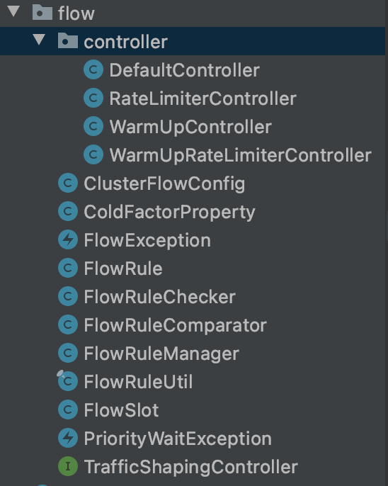
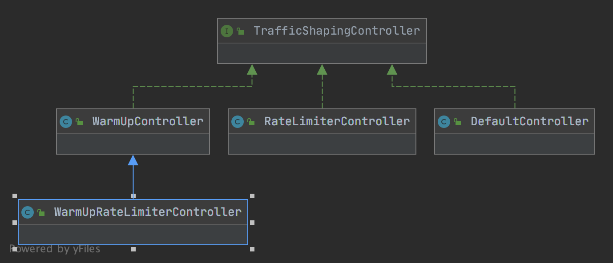
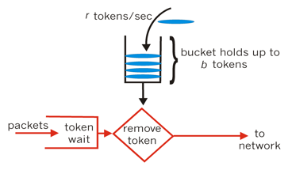
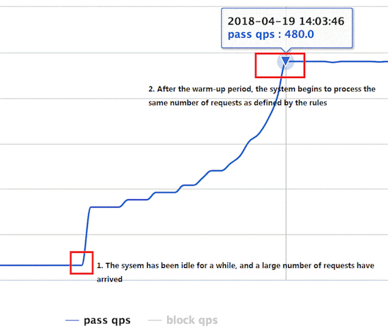
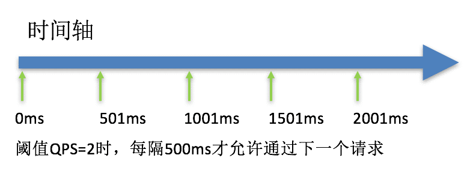
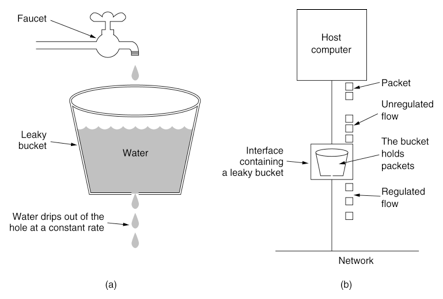

[Gary's Blog](https://myblackboxrecorder.com/)

- [Home](https://myblackboxrecorder.com/)
- [Archives](https://myblackboxrecorder.com/archives)
- [Tags](https://myblackboxrecorder.com/tags)
- [about](https://myblackboxrecorder.com/about)

# Sentinel源码阅读（四）

*2021-10-11*

[#技术](https://myblackboxrecorder.com/tags/技术/) [#Java](https://myblackboxrecorder.com/tags/Java/) [#Sentinel](https://myblackboxrecorder.com/tags/Sentinel/)

前文：

[Sentinel源码阅读（一）](https://myblackboxrecorder.com/Sentinel_reading_1/)

[Sentinel源码阅读（二）](https://myblackboxrecorder.com/Sentinel_reading_2/)

[Sentinel源码阅读（三）](https://myblackboxrecorder.com/sentinel-reading-3/)

本文将是该系列的最后一篇，主要解析限流部分原理

限流的责任链节点为FlowSlot，代码结构如下：



重要的类有：

- FlowSlot：责任链节点
- FlowRuleChecker：实际限流的执行者
- TrafficShapingController：限流器，其有多种实现，在controller包下

FlowSlot内逻辑非常简单，就是调用了FlowRuleChecker::checkFlow方法。

```
public void checkFlow(Function<String, Collection<FlowRule>> ruleProvider, ResourceWrapper resource,
                      Context context, DefaultNode node, int count, boolean prioritized) throws BlockException {
    if (ruleProvider == null || resource == null) {
        return;
    }
    Collection<FlowRule> rules = ruleProvider.apply(resource.getName());
    if (rules != null) {
        for (FlowRule rule : rules) {
            if (!canPassCheck(rule, context, node, count, prioritized)) {
                throw new FlowException(rule.getLimitApp(), rule);
            }
        }
    }
}
```

会对每种FlowRule，执行canPassCheck检查是否可以通过，如果不能，抛出FlowException，这是一种BlockException。

canPassCheck中有两个分支，分别为单机限流passLocalCheck与集群限流passLocalCheck，我们本次只分析常用的单机限流。

```
private static boolean passLocalCheck(FlowRule rule, Context context, DefaultNode node, int acquireCount,
                                      boolean prioritized) {
    Node selectedNode = selectNodeByRequesterAndStrategy(rule, context, node);
    if (selectedNode == null) {
        return true;
    }

    return rule.getRater().canPass(selectedNode, acquireCount, prioritized);
}
```

首先根据调用方与流控模式拿到相关的Node。

流控模式包含三种：

- 直接流控模式（DIRECT）：最简单的模式，对当前资源达到条件后直接限流。
- 关联流控模式（RELATE）：定义一个关联接口，当关联接口达到限流条件，当前资源会限流。
- 链路流控模式（CHAIN）：针对来源进行区分，定义一个入口资源，如果当前资源达到限流条件，只会对该入口进行限流。

selectNodeByRequesterAndStrategy方法中的逻辑为

- 直接流控模式下
    - 如果配置了限流上游为default（全部），返回当前的clusterNode
    - 如果配置了且与当前调用来源匹配，返回当前来源的originNode
    - 都不匹配，返回null，不需要限流
- 关联流控模式下
    - 返回关联资源的clusterNode
- 链路模式下
    - 如果context中的来源与配置匹配，返回当前Node
    - 不匹配，返回null，不需要限流

最后是执行限流规则中配置的限流器的canPass方法，我们接下来重点分析下这个方法。

### 限流器

限流器就是TrafficShapingController，我们直接看它的几种实现类，对应几种流控效果，类图如下：



- DefaultController：快速失败
- WarmUpController：预热
- RateLimiterController：匀速排队
- WarmUpRateLimiterController：预热+匀速排队

我们逐个分析

#### DefaultController

DefaultController的算法较为简单，就是当前统计窗口（每秒），判断是否有足够剩余的容量（代码中也用了令牌的概念）计算如果剩余令牌足够就放行，否则，如果设置了允许occupied_pass，会先借用未来的时间窗口，如果都不行则会直接拒绝（快速失败）。借用相关逻辑在StatisticNode，逻辑就是去计算要到下一个空闲bucket所需时间（借用则会占用，下次不能再借），再与超时时间进行比较。

```
public boolean canPass(Node node, int acquireCount, boolean prioritized) {
    // 计算已使用的令牌，如果是qps则计算passQps，否则计算线程数
    int curCount = avgUsedTokens(node);
    // 如果当前请求加入会超出令牌上限
    if (curCount + acquireCount > count) {
        // 如果当前为高优先级业务，且指标为QPS
        if (prioritized && grade == RuleConstant.FLOW_GRADE_QPS) {
            long currentTime;
            long waitInMs;
            currentTime = TimeUtil.currentTimeMillis();
            // 尝试借用未来时间窗口，获取一个等待时间
            waitInMs = node.tryOccupyNext(currentTime, acquireCount, count);
            if (waitInMs < OccupyTimeoutProperty.getOccupyTimeout()) {
                node.addWaitingRequest(currentTime + waitInMs, acquireCount);
                node.addOccupiedPass(acquireCount);
                // sleep至未来时间窗口
                sleep(waitInMs);

                // PriorityWaitException indicates that the request will pass after waiting for {@link @waitInMs}.
                throw new PriorityWaitException(waitInMs);
            }
        }
        return false;
    }
    return true;
}
```

#### WarmUpController

当服务未达到一个稳定状态时，一般即仍在初始化时（如建立数据库连接，java static变量懒加载），服务的承载能力可能会远低于稳定状态，即使相对少的请求，仍会拖垮服务，所以我们需要预热（WarmUp），让处理请求的数量缓缓增多。

WarmUpController用了令牌桶算法（或者说思想）。



令牌以一个恒定的速率添加到桶中，当有新的数据包进来时，需要检查桶是否包含足够的令牌。如果不符合，则会按照各种策略进行处理（WarmUpController使用了预热的策略）。

官网上的图，允许通过的qps随时间的变化：



**一开始，系统流量很少，突然流量开始飙增，飙增到一个冷启动阈值时，触发预热，流量缓缓增加，直到达到限流阈值。**

下面我们通过看源码，了解具体实现。

```
public class WarmUpController implements TrafficShapingController {
    protected double count;
    private int coldFactor;
    protected int warningToken = 0;
    private int maxToken;
    protected double slope;

    protected AtomicLong storedTokens = new AtomicLong(0);
    protected AtomicLong lastFilledTime = new AtomicLong(0);
}


/**
 * 初始化函数，构造时调用
 */
private void construct(double count, int warmUpPeriodInSec, int coldFactor) {
    if (coldFactor <= 1) {
        throw new IllegalArgumentException("Cold factor should be larger than 1");
    }
    this.count = count;
    this.coldFactor = coldFactor;
    warningToken = (int)(warmUpPeriodInSec * count) / (coldFactor - 1);
    maxToken = warningToken + (int)(2 * warmUpPeriodInSec * count / (1.0 + coldFactor));
    slope = (coldFactor - 1.0) / count / (maxToken - warningToken);
}
```

Sentinel的预热算法基于的基本逻辑是（实际代码实现方式有区别）：

- 假设系统每秒能承载x数量的请求
- 每一秒，都会有x个令牌被添加到桶中，直至桶的上限
- 每个请求到来时，会使用一个令牌
- 桶中存在的令牌越多，说明系统的利用率越低
- 当桶中（令牌/上限）达到一个阈值，视为系统进入饱和状态

我们再简单分析成员变量：

- count：配置的限流阈值，也是桶的上限
- warmUpPeriodInSec：配置的冷启动需要的时间，单位秒
- coldFactor：冷启动因子，默认为3，主要用在算法中，见下文，由coldFactor可以得到触发冷启动的阈值threshold为count/coldFactor
- warningToken：一个警戒线，是冷启动阈值的实现。如果令牌数大于这个值，说明需要预热或还在预热期
- maxToken：桶中token数上限
- slope：斜率，见下文
- storedTokens：桶存储的token数
- lastFilledTime：上一次进入限流器的时间，用于判断时间过去了多久，以添加对应数量的令牌到桶中

一个问题是，桶的上限、警戒线与斜率为什么是这么算的？

这坨公式和含义啃了好久，还需要参考Guava的一个实现（因为Sentinel的限流算法基于Guava理论）：

[Guava 实现](https://github.com/google/guava/blob/master/guava/src/com/google/common/util/concurrent/SmoothRateLimiter.java)

> Sentinel’s “warm-up” implementation is based on the Guava’s algorithm.However, Guava’s implementation focuses on adjusting the request interval, which is similar to leaky bucket. Sentinel pays more attention to controlling the count of incoming requests per second without calculating its interval, which resembles token bucket algorithm.

注释中提到，Guava聚焦于调整请求的间隔，从而控制流量。为了便于理解Sentinel的实现，我们先看Guava的实现

```
         ^ throttling
         |
   cold  +                  /
interval |                 /.
         |                / .
         |               /  .   
         |              /   .     
         |             /    .
         |            /     .
         |           /      .
  stable +----------/  WARM .
interval |          .   UP  .
         |          . PERIOD.
         |          .       .
       0 +----------+-------+--------------→ storedTokens
         0   warningTokens maxTokens
```

一个坐标图，变量名与sentinel尽量做了匹配。其中横坐标是桶中的令牌数，纵坐标是从桶中取出令牌需要的时间间隔。为什么有时间间隔？Guava的理念是，假设qps上限为100，那么稳定状态下的时间间隔就应该是10ms。Guava通过如让线程sleep的方式，来调整时间间隔，从而达到预热缓慢让qps上升的效果，从而实现流量的控制。

其中stable interval表示稳定状态下的时间间隔，即100ms。cold interval表示系统完全在“冷”的状态，即桶为满状态下的时间间隔。两个状态的令牌数分别为warningTokens与maxTokens。而在实际系统中，预热是从右往左进行的，从cold状态逐步进入stable状态。中间的这段过程则是预热的过程。cold interval/stable interval是Guava中的coldFactor，默认也为3。

Guava定义预热的过程是线性的，那么从maxTokens到warningTokens是一个梯形，**这个梯形的面积就是预热的时间WarmUpPeriod**，如果你不理解，可以想象下微积分，是同理的（带入值，划分成长方体），如果还不理解，可以评论区留言。

那么有公式1:

因为Sentinel没有时间间隔一说，更关注数量。稳定状态下，每秒能取count个令牌。而Guava中1/stableInterval就是是1秒除以稳定状态下取一个令牌需要的时间，也就是稳定状态下1秒内能取到的令牌数，两者是相等的。等式1:

然后则有以下公式

这样，上面maxTokens的计算公式就推导出来了。接下来是warningTokens。

可以看出来这个坐标图的形状是与warningTokens相关的，在两个interval与warmUpPeriod固定的情况下，warningTokens值的变化，会引起maxTokens的变化，进而引起整个图形的变化。那么很明显它不是被一个计算的值，而是一个约定的值。以什么规则约定的？

其实，coldFactor除了是coldInterval/stableInterval的值以外，还有一个规则，即从maxTokens到0这个过程中，期望在stable状态下的时间是总时间的 1/coldFactor。stable状态下的时间是图形左边的矩形面积：stableInterval * warningTokens，梯形面积已经知道，那么有公式：

由于上面的等式1，则有

这样warningTokens的公式也推导出来了。

至于斜率slope，指的也是坐标图中预热过程斜坡的斜率，比较好计算：

slope公式也推导完成。这部分的要点要去了解Guava的算法基础，否则，很难去理解这几个参数的含义。

接下来，我们继续看限流器中的细节。之前提到限流会调用限流器的canPass方法，与Guava相比，Sentinel调整流量速率的方式就是部分通过部分不通过，判断是否通过则要根据令牌桶了，如下。

```
public boolean canPass(Node node, int acquireCount, boolean prioritized) {
    long passQps = (long) node.passQps();
    long previousQps = (long) node.previousPassQps();
    syncToken(previousQps);
    // 开始计算它的斜率
    // 如果进入了警戒线，开始调整他的qps
    long restToken = storedTokens.get();
    if (restToken >= warningToken) {
        long aboveToken = restToken - warningToken;
        double warningQps = Math.nextUp(1.0 / (aboveToken * slope + 1.0 / count));
        if (passQps + acquireCount <= warningQps) {
            return true;
        }
    } else {
        if (passQps + acquireCount <= count) {
            return true;
        }
    }
    return false;
}
```

可以看到有个syncToken方法，这个方法是用来更新桶中的令牌数的，至于为什么传入的是前一秒的qps，因为每次请求令牌的计算实际是在下一次才需要去算的，所以sentinel选择同步令牌桶的时机为限流前，而不是每次请求结束后再去更新令牌桶。syncToken中的逻辑就是上面提到的“每秒往桶内添加count个令牌”，以及“拿走previousQps个令牌”（这里有个细节，只有 当令牌的消耗程度远远低于警戒线的时候，才会添加）。

接下去判断当前桶内令牌数restTokens是否超过warningTokens，超过说明需要预热，否则说明已经在stable状态，直接按普通限流处理即可。当需要预热时，我们需要调整qps让他不超过当前计算出的warningQps。这个warningQps计算公式也要通过Guava那张坐标图理解。

```
         ^ throttling
         |               restTokens
   cold  +              .   /
interval |              .  /.
         |              . / .
         |              ./  .   
         |              /------------> interval    
         |             /    .
         |            /     .
         |           /      .
  stable +----------/  WARM .
interval |          .   UP  .
         |          . PERIOD.
         |          .       .
       0 +----------+-------+--------------→ storedTokens
         0   warningTokens maxTokens
```

调整qps与调整时间间隔效果是一样的，他们的关系是warningQps = 1 / interval，当前处于的位置横坐标为restTokens，很明显，可以算出来纵坐标的interval为

换算一下，代入一下代码的变量：

与代码中一致。接下去的代码就好理解了，判断是否超过warningQps，是则限流，否则不限，放进来作为预热，缓慢增加qps。至此，WarmingUpController部分看完了。

#### RateLimiterController

RateLimiterController的限流策略是匀速排队，有了上面GuavaRateLimiter的基础，我们很容易理解，其作用就是通过让线程sleep来调整请求的间隔，达到匀速排队的效果。这种方式主要用于处理间隔性突发的流量，例如消息队列。想象一下这样的场景，在某一秒有大量的请求到来，而接下来的几秒则处于空闲状态，我们希望系统能够在接下来的空闲期间逐渐处理这些请求，而不是在第一秒直接拒绝多余的请求。



看代码

```
public class RateLimiterController implements TrafficShapingController {
    private final int maxQueueingTimeMs;
    private final double count;
    private final AtomicLong latestPassedTime = new AtomicLong(-1);
}
```

- maxQueueingTimeMs：最大的排队时间，如果需要排队的时间超过这个值，那么就直接拒绝，不排队了
- count：限流阈值
- latestPassedTime：上一次请求通过的时间戳

canPass方法：

```
public boolean canPass(Node node, int acquireCount, boolean prioritized) {
    // Pass when acquire count is less or equal than 0.
    if (acquireCount <= 0) {
        return true;
    }
    // Reject when count is less or equal than 0.
    // Otherwise,the costTime will be max of long and waitTime will overflow in some cases.
    if (count <= 0) {
        return false;
    }

    long currentTime = TimeUtil.currentTimeMillis();
    // Calculate the interval between every two requests.
    long costTime = Math.round(1.0 * (acquireCount) / count * 1000);

    // Expected pass time of this request.
    long expectedTime = costTime + latestPassedTime.get();

    if (expectedTime <= currentTime) {
        // Contention may exist here, but it's okay.
        latestPassedTime.set(currentTime);
        return true;
    } else {
        // Calculate the time to wait.
        long waitTime = costTime + latestPassedTime.get() - TimeUtil.currentTimeMillis();
        if (waitTime > maxQueueingTimeMs) {
            return false;
        } else {
            long oldTime = latestPassedTime.addAndGet(costTime);
            try {
                waitTime = oldTime - TimeUtil.currentTimeMillis();
                if (waitTime > maxQueueingTimeMs) {
                    latestPassedTime.addAndGet(-costTime);
                    return false;
                }
                // in race condition waitTime may <= 0
                if (waitTime > 0) {
                    Thread.sleep(waitTime);
                }
                return true;
            } catch (InterruptedException e) {
            }
        }
    }
    return false;
}
```

使用了漏桶算法，偷网上的图：



核心是可以看作一个带有常量服务时间的队列，有请求就一直放入桶中直到溢出丢弃，流出的速度也被捅所控制（一般是固定值）。在Sentinel中，这个队列长度就是maxQueueingTimeMs，限定流出的速度是1 / count秒，这样就做到了匀速排队。

理解了漏桶算法再看代码就比较简单，先通过算等待时间判断能不能放入队列中了，如果能放入则sleep直至匀速要求的时间间隔再放行，否则拒绝。这里有个不好理解的地方是waitTime为什么要一模一样的算两次，考虑是在高并发下保险一点？如果你有答案可以在评论区留言。

值得一提的是令牌桶算法与漏桶算法的适合业务场景。两者都可以做到流量控制，漏桶较为简单，直接控制请求的速度，且阈值一直是恒定的，多余的请求会首先尝试排队再去拒绝。令牌桶因为桶中会有过往的令牌，它能允许短时间内通过比阈值更大的流量，因此我认为应对抖动的突发流量令牌桶会更合适（当然，你还需要关注下游是否能承载这样的突发流量）。而如果业务场景更关注请求可用，因为漏桶会先去尝试排队，请求可能只是慢一点而不是直接拒绝，对用户体验来说好一些。例如长时间的高并发场景（秒杀、抢购、0点签到），这些场景已经不能归于“抖动”的范畴，且业务上肯定更希望尽量多的的请求成功，即使慢一些，这时候漏桶会合适一些。

#### WarmUpRateLimiterController

WarmUpRateLimiterController是WarmUpController子类，它其实就是将上述两个限流器结合起来，博采众长。

它的canPass方法结合了两者，流程是：

- 预热的步骤，同步令牌桶，计算预热的warningQps
- 用这个warningQps替代count计算排队需要的等待时间
- 后面则是排队步骤

```
public boolean canPass(Node node, int acquireCount, boolean prioritized) {
    long previousQps = (long) node.previousPassQps();
    syncToken(previousQps);

    long currentTime = TimeUtil.currentTimeMillis();

    long restToken = storedTokens.get();
    long costTime = 0;
    long expectedTime = 0;
    if (restToken >= warningToken) {
        long aboveToken = restToken - warningToken;

        // current interval = restToken*slope+1/count
        double warmingQps = Math.nextUp(1.0 / (aboveToken * slope + 1.0 / count));
        costTime = Math.round(1.0 * (acquireCount) / warmingQps * 1000);
    } else {
        costTime = Math.round(1.0 * (acquireCount) / count * 1000);
    }
    expectedTime = costTime + latestPassedTime.get();

    if (expectedTime <= currentTime) {
        latestPassedTime.set(currentTime);
        return true;
    } else {
        long waitTime = costTime + latestPassedTime.get() - currentTime;
        if (waitTime > timeoutInMs) {
            return false;
        } else {
            long oldTime = latestPassedTime.addAndGet(costTime);
            try {
                waitTime = oldTime - TimeUtil.currentTimeMillis();
                if (waitTime > timeoutInMs) {
                    latestPassedTime.addAndGet(-costTime);
                    return false;
                }
                if (waitTime > 0) {
                    Thread.sleep(waitTime);
                }
                return true;
            } catch (InterruptedException e) {
            }
        }
    }
    return false;
}
```

**WarmUpRateLimiterController相对WarmUpController的变化是改变了达到警戒线后的策略，不是直接拒绝而是排队。相对RateLimiterController的变化则是让排队不再是匀速的，在cold阶段，速度较慢，stable阶段，速度较快，有预热的效果。**

至此，限流部分结束。另外第一篇里讲到了隔离，其实隔离就是限流的一种，只是限的不是qps，而是线程数，我们可以看到代码中取令牌可以有算qps和算线程数两种方式，如果是线程数，其实用处就是隔离了。

另外剩余的如黑白名单控制，系统规则其实都较为简单。黑白名单控制在`AuthoritySlot`，逻辑是根据Context中的origin与规则中的配置做比较配对，再做控制。系统规则在`SystemSlot`，有一个全局的类存储配置，并且其qps等指标不会从当前Node拿，而是会从一个全局的ClusterNode拿，这个node会聚合所有下面Node的指标，系统规则就根据全局的指标执行全局的系统规则。

### 总结

至此，Sentinel的源码阅读告一段落了（长舒一口气），前前后后快三个月时间。从一开始看通主要流程后觉得还比较简单，到死磕Context、Statistics、Degrade、FlowControl等难度较大的模块，收获良多，也切实反馈到了实际工作中。一些诸如锁、上下文模块、责任链模式等从代码中学到的内容，在做一些业务基础设施时，怎么设计怎么写，对我有很大的参考价值。而且读源码与读其他归纳的博客是不一样的，且不说那些博客有大量雷同，含金量未知，这个思考的过程以及细节的推敲是只有源码阅读才能带给你的。最后，如果你看到了这里，感谢你的阅读，希望对你理解Sentinel以及其中的原理算法有帮助。

[0](https://github.com/Elliotloststh/elliotloststh.github.io/issues/16) 条评论

未登录用户


[支持 Markdown 语法](https://guides.github.com/features/mastering-markdown/)预览使用 GitHub 登录

来做第一个留言的人吧！

------

- 
-  
- 

© 2022 Gary Yuan