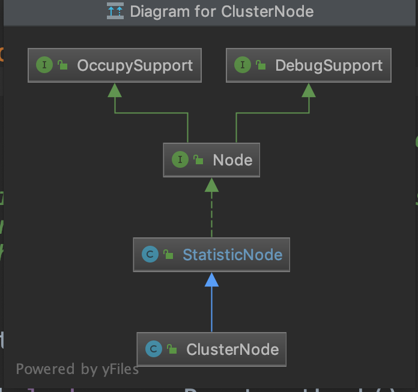

[](https://www.cnblogs.com/luozhiyun/)

# [luozhiyun](https://www.cnblogs.com/luozhiyun)

- 
- [首页](https://www.cnblogs.com/luozhiyun/)
- [标签](https://www.cnblogs.com/luozhiyun/tag)
- [关于](https://www.luozhiyun.com/关于)
- [新随笔](https://i.cnblogs.com/EditPosts.aspx?opt=1)
- 
- 
- 

# [1.Sentinel源码分析—FlowRuleManager加载规则做了什么？](https://www.cnblogs.com/luozhiyun/p/11439993.html)


分类: [Sentinel](https://www.cnblogs.com/luozhiyun/category/1538235.html) 标签: [Sentinel](https://www.cnblogs.com/luozhiyun/tag/Sentinel/)

最近我很好奇在RPC中限流熔断降级要怎么做，hystrix已经1年多没有更新了，感觉要被遗弃的感觉，那么我就把眼光聚焦到了阿里的Sentinel，顺便学习一下阿里的源代码。

这一章我主要讲的是FlowRuleManager在加载FlowRule的时候做了什么，下一篇正式讲Sentinel如何控制并发数的。

下面我给出一个简化版的demo，这个demo只能单线程访问，先把过程讲清楚再讲多线程版本。

初始化流量控制的规则：限定20个线程并发访问

```java
Copypublic class FlowThreadDemo {

    private static AtomicInteger pass = new AtomicInteger();
    private static AtomicInteger block = new AtomicInteger();
    private static AtomicInteger total = new AtomicInteger();
    private static AtomicInteger activeThread = new AtomicInteger();

    private static volatile boolean stop = false;
    private static final int threadCount = 100;

    private static int seconds = 60 + 40;
    private static volatile int methodBRunningTime = 2000;

    public static void main(String[] args) throws Exception {
        System.out.println(
            "MethodA will call methodB. After running for a while, methodB becomes fast, "
                + "which make methodA also become fast ");
        tick();
        initFlowRule();

        Entry methodA = null;
        try {
            TimeUnit.MILLISECONDS.sleep(5);
            methodA = SphU.entry("methodA");
            activeThread.incrementAndGet();
            //Entry methodB = SphU.entry("methodB");
            TimeUnit.MILLISECONDS.sleep(methodBRunningTime);
            //methodB.exit();
            pass.addAndGet(1);
        } catch (BlockException e1) {
            block.incrementAndGet();
        } catch (Exception e2) {
            // biz exception
        } finally {
            total.incrementAndGet();
            if (methodA != null) {
                methodA.exit();
                activeThread.decrementAndGet();
            }
        }
    }

    private static void initFlowRule() {
        List<FlowRule> rules = new ArrayList<FlowRule>();
        FlowRule rule1 = new FlowRule();
        rule1.setResource("methodA");
        // set limit concurrent thread for 'methodA' to 20
        rule1.setCount(20);
        rule1.setGrade(RuleConstant.FLOW_GRADE_THREAD);
        rule1.setLimitApp("default");

        rules.add(rule1);
        FlowRuleManager.loadRules(rules);
    }

    private static void tick() {
        Thread timer = new Thread(new TimerTask());
        timer.setName("sentinel-timer-task");
        timer.start();
    }

    static class TimerTask implements Runnable {

        @Override
        public void run() {
            long start = System.currentTimeMillis();
            System.out.println("begin to statistic!!!");

            long oldTotal = 0;
            long oldPass = 0;
            long oldBlock = 0;

            while (!stop) {
                try {
                    TimeUnit.SECONDS.sleep(1);
                } catch (InterruptedException e) {
                }
                long globalTotal = total.get();
                long oneSecondTotal = globalTotal - oldTotal;
                oldTotal = globalTotal;

                long globalPass = pass.get();
                long oneSecondPass = globalPass - oldPass;
                oldPass = globalPass;

                long globalBlock = block.get();
                long oneSecondBlock = globalBlock - oldBlock;
                oldBlock = globalBlock;

                System.out.println(seconds + " total qps is: " + oneSecondTotal);
                System.out.println(TimeUtil.currentTimeMillis() + ", total:" + oneSecondTotal
                    + ", pass:" + oneSecondPass
                    + ", block:" + oneSecondBlock
                    + " activeThread:" + activeThread.get());
                if (seconds-- <= 0) {
                    stop = true;
                }
                if (seconds == 40) {
                    System.out.println("method B is running much faster; more requests are allowed to pass");
                    methodBRunningTime = 20;
                }
            }

            long cost = System.currentTimeMillis() - start;
            System.out.println("time cost: " + cost + " ms");
            System.out.println("total:" + total.get() + ", pass:" + pass.get()
                + ", block:" + block.get());
            System.exit(0);
        }
    }
}
```

### FlowRuleManager[#](https://www.cnblogs.com/luozhiyun/p/11439993.html#19567421)

在这个demo中，首先会调用FlowRuleManager#loadRules进行规则注册
我们先聊一下规则配置的代码：

```java
Copyprivate static void initFlowRule() {
    List<FlowRule> rules = new ArrayList<FlowRule>();
    FlowRule rule1 = new FlowRule();
    rule1.setResource("methodA");
    // set limit concurrent thread for 'methodA' to 20
    rule1.setCount(20);
    rule1.setGrade(RuleConstant.FLOW_GRADE_THREAD);
    rule1.setLimitApp("default");

    rules.add(rule1);
    FlowRuleManager.loadRules(rules);
}
```

这段代码里面先定义一个**流量控制规则**，然后调用loadRules进行注册。

#### FlowRuleManager初始化[#](https://www.cnblogs.com/luozhiyun/p/11439993.html#1260358755)

**FlowRuleManager**
FlowRuleManager 类里面有几个静态参数：

```java
Copy//规则集合
private static final Map<String, List<FlowRule>> flowRules = new ConcurrentHashMap<String, List<FlowRule>>();
//监听器
private static final FlowPropertyListener LISTENER = new FlowPropertyListener();
//用来监听配置是否发生变化
private static SentinelProperty<List<FlowRule>> currentProperty = new DynamicSentinelProperty<List<FlowRule>>();

//创建一个延迟的线程池
@SuppressWarnings("PMD.ThreadPoolCreationRule")
private static final ScheduledExecutorService SCHEDULER = Executors.newScheduledThreadPool(1,
    new NamedThreadFactory("sentinel-metrics-record-task", true));

static {
    //设置监听
    currentProperty.addListener(LISTENER);
    //每一秒钟调用一次MetricTimerListener的run方法
    SCHEDULER.scheduleAtFixedRate(new MetricTimerListener(), 0, 1, TimeUnit.SECONDS);
}
```

在初始化的时候会为静态变量都赋上值。

在新建MetricTimerListener实例的时候做了很多事情，容我慢慢分析。

**MetricTimerListener**

```java
Copypublic class MetricTimerListener implements Runnable {

    private static final MetricWriter metricWriter = new MetricWriter(SentinelConfig.singleMetricFileSize(),
        SentinelConfig.totalMetricFileCount());
	   ....
}
```

首次初始化MetricTimerListener的时候会创建一个MetricWriter实例。我们先看传入的两个参数SentinelConfig.*singleMetricFileSize*()和SentinelConfig.*totalMetricFileCount*()。

SentinelConfig在首次初始化的时候会初始化静态代码块：

**SentinelConfig**

```java
Copystatic {
    try {
        initialize();
        loadProps();
        resolveAppType();
        RecordLog.info("[SentinelConfig] Application type resolved: " + appType);
    } catch (Throwable ex) {
        RecordLog.warn("[SentinelConfig] Failed to initialize", ex);
        ex.printStackTrace();
    }
}
```

这段静态代码块主要是设置一下配置参数。

**SentinelConfig#singleMetricFileSize**
**SentinelConfig#totalMetricFileCount**

```java
Copypublic static long singleMetricFileSize() {
    try {
        //获取的是 1024 * 1024 * 50
        return Long.parseLong(props.get(SINGLE_METRIC_FILE_SIZE));
    } catch (Throwable throwable) {
        RecordLog.warn("[SentinelConfig] Parse singleMetricFileSize fail, use default value: "
                + DEFAULT_SINGLE_METRIC_FILE_SIZE, throwable);
        return DEFAULT_SINGLE_METRIC_FILE_SIZE;
    }
}

public static int totalMetricFileCount() {
    try {
        //默认是：6
        return Integer.parseInt(props.get(TOTAL_METRIC_FILE_COUNT));
    } catch (Throwable throwable) {
        RecordLog.warn("[SentinelConfig] Parse totalMetricFileCount fail, use default value: "
                + DEFAULT_TOTAL_METRIC_FILE_COUNT, throwable);
        return DEFAULT_TOTAL_METRIC_FILE_COUNT;
    }
}
```

singleMetricFileSize方法和totalMetricFileCount主要是获取SentinelConfig在静态变量里设入得参数。

然后我们进入到MetricWriter的构造方法中：
**MetricWriter**

```java
Copypublic MetricWriter(long singleFileSize, int totalFileCount) {
    if (singleFileSize <= 0 || totalFileCount <= 0) {
        throw new IllegalArgumentException();
    }
    RecordLog.info(
            "[MetricWriter] Creating new MetricWriter, singleFileSize=" + singleFileSize + ", totalFileCount="
                    + totalFileCount);
    //  /Users/luozhiyun/logs/csp/
    this.baseDir = METRIC_BASE_DIR;
    File dir = new File(baseDir);
    if (!dir.exists()) {
        dir.mkdirs();
    }

    long time = System.currentTimeMillis();
    //转换成秒
    this.lastSecond = time / 1000;
    //singleFileSize = 1024 * 1024 * 50
    this.singleFileSize = singleFileSize;
    //totalFileCount = 6
    this.totalFileCount = totalFileCount;
    try {
        this.timeSecondBase = df.parse("1970-01-01 00:00:00").getTime() / 1000;
    } catch (Exception e) {
        RecordLog.warn("[MetricWriter] Create new MetricWriter error", e);
    }
}
```

构造器里面主要是创建文件夹，设置单个文件大小，总文件个数，设置时间。

讲完了MetricTimerListener的静态属性，现在我们来讲MetricTimerListener的run方法。

**MetricTimerListener#run**

```java
Copypublic void run() {
    //这个run方法里面主要是做定时的数据采集，然后写到log文件里去
    Map<Long, List<MetricNode>> maps = new TreeMap<Long, List<MetricNode>>();
    //遍历集群节点
    for (Entry<ResourceWrapper, ClusterNode> e : ClusterBuilderSlot.getClusterNodeMap().entrySet()) {
        String name = e.getKey().getName();
        ClusterNode node = e.getValue();
        Map<Long, MetricNode> metrics = node.metrics();
        aggregate(maps, metrics, name);
    }
    //汇总统计的数据
    aggregate(maps, Constants.ENTRY_NODE.metrics(), Constants.TOTAL_IN_RESOURCE_NAME);
    if (!maps.isEmpty()) {
        for (Entry<Long, List<MetricNode>> entry : maps.entrySet()) {
            try {
                //写入日志中
                metricWriter.write(entry.getKey(), entry.getValue());
            } catch (Exception e) {
                RecordLog.warn("[MetricTimerListener] Write metric error", e);
            }
        }
    }
}
```

上面的run方法其实就是每秒把统计的数据写到日志里去。其中`Constants.ENTRY_NODE.metrics()`负责统计数据，我们下面分析以下这个方法。

`Constants.ENTRY_NODE`这句代码会实例化一个ClusterNode实例。
ClusterNode是继承StatisticNode，统计数据时在StatisticNode中实现的。



Metrics方法也是调用的StatisticNode方法。

我们先看看**StatisticNode**的全局变量

```java
Copypublic class StatisticNode implements Node {
		//构建一个统计60s的数据，设置60个滑动窗口，每个窗口1s
		//这里创建的是BucketLeapArray实例来进行统计
		private transient volatile Metric rollingCounterInSecond = new ArrayMetric(SampleCountProperty.SAMPLE_COUNT,
    IntervalProperty.INTERVAL);
		//上次统计的时间戳
		private long lastFetchTime = -1;
		.....
}
```

然后我们看看StatisticNode的metrics方法：
**StatisticNode#metrics**

```java
Copypublic Map<Long, MetricNode> metrics() {
    // The fetch operation is thread-safe under a single-thread scheduler pool.
    long currentTime = TimeUtil.currentTimeMillis();
    //获取当前时间的滑动窗口的开始时间
    currentTime = currentTime - currentTime % 1000;
    Map<Long, MetricNode> metrics = new ConcurrentHashMap<>();
    //获取滑动窗口里统计的数据
    List<MetricNode> nodesOfEverySecond = rollingCounterInMinute.details();
    long newLastFetchTime = lastFetchTime;
    // Iterate metrics of all resources, filter valid metrics (not-empty and up-to-date).
    for (MetricNode node : nodesOfEverySecond) {
        //筛选符合的滑动窗口的节点
        if (isNodeInTime(node, currentTime) && isValidMetricNode(node)) {
            metrics.put(node.getTimestamp(), node);
            //选出符合节点里最大的时间戳数据赋值
            newLastFetchTime = Math.max(newLastFetchTime, node.getTimestamp());
        }
    }
    //设置成滑动窗口里统计的最大时间
    lastFetchTime = newLastFetchTime;

    return metrics;
}
```

这个方法主要是调用rollingCounterInMinute进行数据的统计，然后筛选出有效的统计结果返回。

我们进入到rollingCounterInMinute是ArrayMetric的实例，所以我们进入到ArrayMetric的details方法中

**ArrayMetric#details**

```java
Copypublic List<MetricNode> details() {
    List<MetricNode> details = new ArrayList<MetricNode>();
    //调用BucketLeapArray
    data.currentWindow();
    //列出统计结果
    List<WindowWrap<MetricBucket>> list = data.list();
    for (WindowWrap<MetricBucket> window : list) {
        if (window == null) {
            continue;
        }
        //对统计结果进行封装
        MetricNode node = new MetricNode();
        //代表一秒内被流量控制的请求数量
        node.setBlockQps(window.value().block());
        //则是一秒内业务本身异常的总和
        node.setExceptionQps(window.value().exception());
        // 代表一秒内到来到的请求
        node.setPassQps(window.value().pass());
        //代表一秒内成功处理完的请求；
        long successQps = window.value().success();
        node.setSuccessQps(successQps);
        //代表一秒内该资源的平均响应时间
        if (successQps != 0) {
            node.setRt(window.value().rt() / successQps);
        } else {
            node.setRt(window.value().rt());
        }
        //设置统计窗口的开始时间
        node.setTimestamp(window.windowStart());

        node.setOccupiedPassQps(window.value().occupiedPass());

        details.add(node);
    }

    return details;
}
```

这个方法首先会调用`dat.currentWindow（）`设置当前时间窗口到窗口列表里去。然后调用`data.list()`列出所有的窗口数据，然后遍历不为空的窗口数据封装成MetricNode返回。

data是BucketLeapArray的实例，BucketLeapArray继承了LeapArray，主要的统计都是在LeapArray中进行的，所以我们直接看看LeapArray的currentWindow方法。

**LeapArray#currentWindow**

```java
Copypublic WindowWrap<T> currentWindow(long timeMillis) {
    if (timeMillis < 0) {
        return null;
    }
    //通过当前时间判断属于哪个窗口
    int idx = calculateTimeIdx(timeMillis);
    //计算出窗口开始时间
    // Calculate current bucket start time.
    long windowStart = calculateWindowStart(timeMillis);

    while (true) {
        //获取数组里的老数据
        WindowWrap<T> old = array.get(idx);
        if (old == null) {
           
            WindowWrap<T> window = new WindowWrap<T>(windowLengthInMs, windowStart, newEmptyBucket(timeMillis));
            if (array.compareAndSet(idx, null, window)) {
                // Successfully updated, return the created bucket.
                return window;
            } else {
                // Contention failed, the thread will yield its time slice to wait for bucket available.
                Thread.yield();
            }
            // 如果对应时间窗口的开始时间与计算得到的开始时间一样
            // 那么代表当前即是我们要找的窗口对象，直接返回
        } else if (windowStart == old.windowStart()) {
             
            return old;
        } else if (windowStart > old.windowStart()) { 
            //如果当前的开始时间小于原开始时间，那么就更新到新的开始时间
            if (updateLock.tryLock()) {
                try {
                    // Successfully get the update lock, now we reset the bucket.
                    return resetWindowTo(old, windowStart);
                } finally {
                    updateLock.unlock();
                }
            } else {
                // Contention failed, the thread will yield its time slice to wait for bucket available.
                Thread.yield();
            }
        } else if (windowStart < old.windowStart()) {
            //一般来说不会走到这里
            // Should not go through here, as the provided time is already behind.
            return new WindowWrap<T>(windowLengthInMs, windowStart, newEmptyBucket(timeMillis));
        }
    }
}
```

这个方法里首先会传入一个timeMillis是当前的时间戳。然后调用calculateTimeIdx

```java
Copyprivate int calculateTimeIdx(/*@Valid*/ long timeMillis) {
    //计算当前时间能够落在array的那个节点上
    long timeId = timeMillis / windowLengthInMs;
    // Calculate current index so we can map the timestamp to the leap array.
    return (int)(timeId % array.length());
}
```

calculateTimeIdx方法用当前的时间戳除以每个窗口的大小，再和array数据取模。array数据是一个容量为60的数组，代表被统计的60秒分割的60个小窗口。

举例：
例如当前timeMillis = 1567175708975
timeId = 1567175708975/1000 = 1567175708
timeId % array.length() = 1567175708%60 = 8
也就是说当前的时间窗口是第八个。

然后调用calculateWindowStart计算当前时间开始时间

```java
Copyprotected long calculateWindowStart(/*@Valid*/ long timeMillis) {
    //用当前时间减去窗口大小，计算出窗口开始时间
    return timeMillis - timeMillis % windowLengthInMs;
}
```

接下来就是一个while循环：
在看while循环之前我们看一下array数组里面是什么样的对象
`WindowWrap<T> window = new WindowWrap<T>(windowLengthInMs, windowStart, newEmptyBucket(timeMillis));`
WindowWrap是一个时间窗口的包装对象，里面包含时间窗口的长度，这里是1000；窗口开始时间；窗口内的数据实体，是调用newEmptyBucket方法返回一个MetricBucket。

**MetricBucket**

```java
Copypublic class MetricBucket {

	private final LongAdder[] counters;
	//默认4900
	private volatile long minRt;

	public MetricBucket() {
	    MetricEvent[] events = MetricEvent.values();
	    this.counters = new LongAdder[events.length];
	    for (MetricEvent event : events) {
	        counters[event.ordinal()] = new LongAdder();
	    }
	    //初始化minRt，默认是4900
	    initMinRt();
	}
	...
}
```

MetricEvent是一个枚举类：

```java
Copypublic enum MetricEvent {
    PASS,
    BLOCK,
    EXCEPTION,
    SUCCESS,
    RT,
    OCCUPIED_PASS
}
```

也就是是MetricBucket为每个窗口通过一个内部数组counters统计了这个窗口内的所有数据。

接下来我们来讲一下while循环里所做的事情：

1. 从array里获取bucket节点
2. 如果节点已经存在，那么用CAS更新一个新的节点
3. 如果节点是新的，那么直接返回
4. 如果节点失效了，设置当前节点，清除所有失效节点

举例：

```yaml
Copy1. 如果array数据里面的bucket数据如下所示：
     B0       B1      B2    NULL      B4
 ||_______|_______|_______|_______|_______||___
 200     400     600     800     1000    1200  timestamp
                             ^
                          time=888
正好当前时间所对应的槽位里面的数据是空的，那么就用CAS更新

2. 如果array里面已经有数据了，并且槽位里面的窗口开始时间和当前的开始时间相等，那么直接返回
     B0       B1      B2     B3      B4
 ||_______|_______|_______|_______|_______||___
 200     400     600     800     1000    1200  timestamp
                             ^
                          time=888

3. 例如当前时间是1676，所对应窗口里面的数据的窗口开始时间小于当前的窗口开始时间，那么加上锁，然后设置槽位的窗口开始时间为当前窗口开始时间，并把槽位里面的数据重置
   (old)
             B0       B1      B2    NULL      B4
 |_______||_______|_______|_______|_______|_______||___
 ...    1200     1400    1600    1800    2000    2200  timestamp
                              ^
                           time=1676
```

所以上面的array数组大概是这样：


array数组由一个个的WindowWrap实例组成，WindowWrap实例里面由MetricBucket进行数据统计。

然后继续回到ArrayMetric的details方法，讲完了上面的`data.currentWindow()`，现在再来讲`data.list()`

list方法最后也会调用到LeapArray的list方法中：
**LeapArray#list**

```java
Copypublic List<WindowWrap<T>> list(long validTime) {
    int size = array.length();
    List<WindowWrap<T>> result = new ArrayList<WindowWrap<T>>(size);

    for (int i = 0; i < size; i++) {
        WindowWrap<T> windowWrap = array.get(i);
        //如果windowWrap节点为空或者当前时间戳比windowWrap的窗口开始时间大超过60s，那么就跳过
        //也就是说只要60s以内的数据
        if (windowWrap == null || isWindowDeprecated(validTime, windowWrap)) {
            continue;
        }
        result.add(windowWrap);
    }
    return result;
}
```

这个方法是用来把array里面都统计好的节点都找出来，并且是不为空，且是当前时间60秒内的数据。

最后Constants.*ENTRY_NODE*.metrics() 会返回所有符合条件的统计节点数据然后传入aggregate方法中，遍历为每个MetricNode节点设置Resource为*TOTAL_IN_RESOURCE_NAME*，封装好调用`metricWriter.write`进行写日志操作。

最后总结一下在初始化FlowRuleManager的时候做了什么：

1. FlowRuleManager在初始化的时候会调用静态代码块进行初始化

2. 在静态代码块内调用ScheduledExecutorService线程池，每隔1秒调用一次MetricTimerListener的run方法

3. MetricTimerListener会调用

    ```
    Constants.ENTRY_NODE.metrics()
    ```

    进行定时的统计

    1. 调用StatisticNode进行统计，统计60秒内的数据，并将60秒的数据分割成60个小窗口
    2. 在设置当前窗口的时候如果里面没有数据直接设置，如果存在数据并且是最新的直接返回，如果是旧数据，那么reset原来的统计数据
    3. 每个小窗口里面的数据由MetricBucket进行封装

4. 最后将统计好的数据通过*metricWriter*写入到log里去

#### FlowRuleManager加载规则[#](https://www.cnblogs.com/luozhiyun/p/11439993.html#3703963808)

FlowRuleManager是调用loadRules进行规则加载的：

**FlowRuleManager#loadRules**

```java
Copypublic static void loadRules(List<FlowRule> rules) {
    currentProperty.updateValue(rules);
}
```

currentProperty这个实例是在FlowRuleManager是在静态代码块里面进行加载的，上面我们讲过，生成的是DynamicSentinelProperty的实例。

我们进入到DynamicSentinelProperty的updateValue中：

```java
Copypublic boolean updateValue(T newValue) {
    //判断新的元素和旧元素是否相同
    if (isEqual(value, newValue)) {
        return false;
    }
    RecordLog.info("[DynamicSentinelProperty] Config will be updated to: " + newValue);

    value = newValue;
    for (PropertyListener<T> listener : listeners) {
        listener.configUpdate(newValue);
    }
    return true;
}
```

updateValue方法就是校验一下是不是已经存在相同的规则了，如果不存在那么就直接设置value等于新的规则，然后通知所有的监听器更新一下规则配置。

*currentProperty*实例里面的监听器会在FlowRuleManager初始化静态代码块的时候设置一个FlowPropertyListener监听器实例，FlowPropertyListener是FlowRuleManager的内部类：

```java
Copyprivate static final class FlowPropertyListener implements PropertyListener<List<FlowRule>> {

    @Override
    public void configUpdate(List<FlowRule> value) {
        Map<String, List<FlowRule>> rules = FlowRuleUtil.buildFlowRuleMap(value);
        if (rules != null) {
            flowRules.clear();
            //这个map的维度是key是Resource
            flowRules.putAll(rules);
        }
        RecordLog.info("[FlowRuleManager] Flow rules received: " + flowRules);
    }
	 ....
}
```

configUpdate首先会调用`FlowRuleUtil.buildFlowRuleMap（）`方法将所有的规则按resource分类，然后排序返回成map，然后将FlowRuleManager的原来的规则清空，放入新的规则集合到flowRules中去。

**FlowRuleUtil#buildFlowRuleMap**
这个方法最后会调用到FlowRuleUtil的另一个重载的方法：

```java
Copypublic static <K> Map<K, List<FlowRule>> buildFlowRuleMap(List<FlowRule> list, Function<FlowRule, K> groupFunction,
                                                          Predicate<FlowRule> filter, boolean shouldSort) {
    Map<K, List<FlowRule>> newRuleMap = new ConcurrentHashMap<>();
    if (list == null || list.isEmpty()) {
        return newRuleMap;
    }
    Map<K, Set<FlowRule>> tmpMap = new ConcurrentHashMap<>();

    for (FlowRule rule : list) {
        //校验必要字段：资源名，限流阈值， 限流阈值类型，调用关系限流策略，流量控制效果等
        if (!isValidRule(rule)) {
            RecordLog.warn("[FlowRuleManager] Ignoring invalid flow rule when loading new flow rules: " + rule);
            continue;
        }
        if (filter != null && !filter.test(rule)) {
            continue;
        }
        //应用名，如果没有则会使用default
        if (StringUtil.isBlank(rule.getLimitApp())) {
            rule.setLimitApp(RuleConstant.LIMIT_APP_DEFAULT);
        }
        //设置拒绝策略：直接拒绝、Warm Up、匀速排队，默认是DefaultController
        TrafficShapingController rater = generateRater(rule);
        rule.setRater(rater);

        //获取Resource名字
        K key = groupFunction.apply(rule);
        if (key == null) {
            continue;
        }
        //根据Resource进行分组
        Set<FlowRule> flowRules = tmpMap.get(key);

        if (flowRules == null) {
            // Use hash set here to remove duplicate rules.
            flowRules = new HashSet<>();
            tmpMap.put(key, flowRules);
        }

        flowRules.add(rule);
    }
    //根据ClusterMode LimitApp排序
    Comparator<FlowRule> comparator = new FlowRuleComparator();
    for (Entry<K, Set<FlowRule>> entries : tmpMap.entrySet()) {
        List<FlowRule> rules = new ArrayList<>(entries.getValue());
        if (shouldSort) {
            // Sort the rules.
            Collections.sort(rules, comparator);
        }
        newRuleMap.put(entries.getKey(), rules);
    }
    return newRuleMap;
}
```

这个方法首先校验传进来的rule集合不为空，然后遍历rule集合。对rule的必要字段进行校验，如果传入了过滤器那么校验过滤器，然后过滤resource为空的rule，最后相同的resource的rule都放到一起排序后返回。
注意这里默认生成的rater是DefaultController。

到这里FlowRuleManager已经分析完毕了，比较长。

0

[« ](https://www.cnblogs.com/luozhiyun/p/11413856.html)上一篇： [12.源码分析—如何为SOFARPC写一个序列化？](https://www.cnblogs.com/luozhiyun/p/11413856.html)
[» ](https://www.cnblogs.com/luozhiyun/p/11451557.html)下一篇： [2. Sentinel源码分析—Sentinel是如何进行流量统计的？](https://www.cnblogs.com/luozhiyun/p/11451557.html)

posted @ 2019-08-31 18:18 [luozhiyun](https://www.cnblogs.com/luozhiyun) 阅读(5139) 评论(0) [编辑](https://i.cnblogs.com/EditPosts.aspx?postid=11439993) [收藏](javascript:void(0)) [举报](javascript:void(0))


（评论功能已被禁用）

[](https://cnblogs.vip/)

**编辑推荐：**
· [什么？！90%的 ThreadLocal 都在滥用或错用！](https://www.cnblogs.com/sgh1023/p/18375055)
· [方法的三种调用形式](https://www.cnblogs.com/artech/p/18363117/method-invocation-dotnet)
· [小小的引用计数，大大的性能考究](https://www.cnblogs.com/binlovetech/p/18369244)
· [如何做好团队开发中的 CodeReview（代码评审）？](https://www.cnblogs.com/CodeBlogMan/p/18278962)
· [可以调用 Null 的实例方法吗？](https://www.cnblogs.com/artech/p/18362421/call_callvirt)

**阅读排行：**
· [【故障公告】博客站点遭遇大规模 DDoS 攻击](https://www.cnblogs.com/cmt/p/18375777)
· [小公司后端架构、代码、流程吐槽](https://www.cnblogs.com/Go-Solo/p/18334477)
· [从网友探秘 《黑神话：悟空》 的脚本说说C#](https://www.cnblogs.com/shanyou/p/18377461)
· [什么？！90%的ThreadLocal都在滥用或错用！](https://www.cnblogs.com/sgh1023/p/18375055)
· [除了按值和引用，方法参数的第三种传递方式](https://www.cnblogs.com/artech/p/18374284/typed_reference)

Copyright © 2024 luozhiyun
Powered by .NET 8.0 on Kubernetes

Powered By [Cnblogs](https://www.cnblogs.com/) | Theme [simple-color1.0.0](https://github.com/YJLAugus/cnblogs-theme-simple-color)