## 波束成形

#### Alternating Minimization Algorithms for Hybrid Precoding in Millimeter Wave MIMO Systems

- 由于毫米波信号的波长较小，毫米波MIMO预编码可以利用收发器处的大型天线提供显着的波束成形增益，以对抗路径损耗并合成高度定向的波束。此外，通过空间复用传输多个数据流可以进一步提高频谱效率。

- 由于 mmWave 大规模 MIMO 信道的有限散射特性，$H$具有低秩特性，这表明利用有限数量的射频链可以实现接近最优的吞吐量。

- $$
    [x]_1
    $$

- 

- 预编码通常是通过数字预编码器在基带完成的，它可以调整信号的幅度和相位。然而全数字预编码需要射频链，包括信号混频器和模数转换器，数量与天线元件相当。虽然毫米波频率的小波长便于使用大量天线元件，但射频链的高昂成本和功耗使得数字预编码不可行。混合预编码架构最近受到了很多考虑，它只需要在低维数字预编码器和高维模拟预编码器之间连接少量 RF 链. 即以牺牲改变 RF 信号幅度的能力为代价实现具有低成本移相器的模拟预编码器。

- 全结构为每个 RF链提供完整的波束成形增益，RF 链和天线单元之间是自然组合，即每个 RF链都连接到所有天线。另一方面，部分连接结构牺牲了一些波束成形增益，通过将每个 RF 链仅与部分天线连接，显着降低了硬件实现的复杂性。

- 过最小化混合预编码器和全数字预编码器之间的欧几里德距离来近似最大化毫米波系统的频谱效率。这将混合预编码器设计呈现为具有移相器施加的单位模数约束的矩阵分解问题。

- 正交匹配追踪 (OMP)是使用最广泛的算法，它通常提供相当好的性能。该算法需要从某些候选向量中选取模拟预编码矩阵的列，例如通道的阵列响应向量或者DFT码本。因此，基于 OMP 的混合预编码器设计可以被视为一个稀疏约束矩阵重构问题。

- 当 RF链的数量至少是数据流数量的两倍时，混合预编码能达到全数字的效果。

- 最大化频谱效率可以通过最小化混合据编码与全数字预编码矩阵差值的F范数获得。
    $$
    \begin{equation}\begin{aligned}&\underset{\mathbf{F}_\text{RF},\mathbf{F}_\text{BB}}{\text{minimize}} && \left\Vert \mathbf{F}_\text{opt}-\mathbf{F}_\text{RF}\mathbf{F}_\text{BB}\right\Vert _F\\&\text{subject\thinspace to}&&\begin{cases}\mathbf{F}_\text{RF}\in\mathcal{A}\\\left\Vert \mathbf{F}_\text{RF}\mathbf{F}_\text{BB}\right\Vert _F^2=N_s,\end{cases}\end{aligned}\end{equation}
    $$

* 功率约束在优化完成后添加并不影响最终的结果，最终结果仍然接近全数字预编码。

* $F_{BB}$如果正交，可以减少不同数据流间干扰。

* $\operatorname{tr}(A)+\operatorname{tr}\left(A^{H}\right)=2 * \operatorname{real}(\operatorname{tr}(A))$

    $\operatorname{tr}(A B)=\operatorname{tr}(B A)$

    $A \text { 为西矩阵： } F(A * B)=F(B), F(C * A)=F(C), F\left(D * A^{H}\right)=F(D), F\left(A^{H} * E\right)=F(E)$
    
* $$
    \begin{equation}\begin{split}\left\Vert \mathbf{F}_\text{opt}{-}\mathbf{F}_\text{RF}\mathbf{F}_\text{BB}\right\Vert _F^2&=\left\Vert {\rm{vec}}(\mathbf{F}_{\text{opt}} - \mathbf{F}_{\text{RF}}\mathbf{F}_{\text{BB}})\right\Vert _2^2\\&=\left\Vert{\rm{vec}}(\mathbf{F}_{\text{opt}}) -{\rm{vec}}(\mathbf{F}_{\text{RF}}\mathbf{F}_{\text{BB}})\right\Vert_2^2\\&=\left\Vert\text{vec}(\mathbf{F}_{\text{opt}}) {-} (\mathbf{I}_{N_s}{\otimes}\mathbf{F}_{\text{RF}}){\rm{vec}}(\mathbf{F}_{\text{BB}})\right\Vert_2^2\\&=\left\Vert\text{vec}(\mathbf{F}_{\text{opt}}) {-} (\mathbf{F}_{\text{BB}}^T{\otimes}\mathbf{I}_{N_t})\mathbf vec({F}_{\text{RF}})\right\Vert_2^2\end{split}\end{equation}
    $$
    
* $$
    AB=BA \rightarrow \|A \mathrm{B}-\mathrm{C} \mathrm{D}\|_{2}^{2}=\left[\begin{array}{ll}
    \mathrm{D}^{H} & A^H
    \end{array}\right]\left[\begin{array}{cc}
    \mathrm{C}^{H} \mathrm{C} & -\mathrm{C}^{H} \mathrm{B} \\
    -\mathrm{B}^{H} \mathrm{C} & \mathrm{B}^{H} \mathrm{B}
    \end{array}\right]\left[\begin{array}{c}
    \mathrm{D} \\
    A
    \end{array}\right]
    $$

* 正交普鲁克问题：$R=\arg \min _{\Omega}\|\Omega A-B\|_{F} \quad \text { s.t. } \quad \Omega^{H} \Omega=I $ ，解为：$R=UV^H  $其中$BA^H=U \Sigma V^{T}$

* 向量旋转问题：$min|| \textbf a-e^{j\theta}\textbf b||_2^2 \rightarrow \theta=arg(\textbf a^H*\textbf b)$，其中$arg()$为复数取角度。

* MIMO-OFDM系统中，每个子载波都在频域进行数字预编码，数字预编码之后是快速傅立叶逆变换(IFFT)运算，该运算将所有子载波的信号组合在一起，由于模拟预编码是IFFT后处理，所以在毫米波MIMO OFDM系统中，所有子载波的信号只能共享一个公共的模拟预编码器。

* 全连接中移相器的数量与$N_{RF}N_t$呈线性关系，功耗会随$N_{RF}$的增长而快速增长，且功耗的增长快于频谱效率的增长。部分链接下移相器数量与$N_{RF}$无关，$N_{RF}$增长时频谱效率上升，同时功耗上升不明显。全连接在$N_{RF}$较小时能量效率高（频谱效率/功耗），部分连接在$N_{RF}$较大时能量效率高。

* $[U,S,V]=svd(H)$，发送端最优编码矩$F^{opt}=V[:,N_s]$，接收端最优合并器$W^{opt}=U[:,N_s]$

#### Channel Estimation and Hybrid Precoding for Frequency Selective Multiuser mmWave MIMO Systems

* 姜燕燕. 5G Massive MIMO系统中混合波束赋形算法研究[D].西安电子科技大学,2018.P25

    基站天线数：$N_{BS}$、基站射频链路数：$L_{BS}$、载波数：$K$、用户数：$U$、用户$u$天线数：$N_{MS,u}$、用户$u$数据流数：$N{s,u}$

    第$u$个用户在载波$k$上的发送端预编码：$\boldsymbol{P}_{u}[k]=\boldsymbol{P}_{\mathrm{RF}} \boldsymbol{P}_{\mathrm{BB}}^{u}[k] \in \mathbb{C}^{N_{\mathrm{BS}} \times N_{s, u}}$

    第$u$个用户在载波$k$上的接收端合并编码：$\boldsymbol{W}_{u}[k]=\boldsymbol{W}_{\mathrm{RF}}^{u} \boldsymbol{W}_{\mathrm{BB}}^{u}[k]\in \mathbb{C}^{N_{\mathrm{MS,u}} \times N_{s, u}}$
    
    第$u$个用户在载波$k,k\in[0,K-1]$上的频域信道：$\mathbf{H_u}[k]=\sqrt{\frac{N_{BS}N_{MS,u}}{N_{u,cl}N_{ray}}} \sum_{i=0}^{N_{u,cl}-1} \sum_{l=1}^{N_{r a y}} \alpha_{u,i l} \mathbf{a}_{MS,u}\left(\phi_{u,i l}^{r}, \theta_{u,i l}^{r}\right) \mathbf{a}_{BS}\left(\phi_{u,i l}^{t}, \theta_{u,i l}^{t}\right)^{H} e^{-j 2 \pi i k / K}$

    其中ULA响应为：$\mathbf{a}_{U L A}(\phi_{u,il})=\frac{1}{\sqrt{N}}\left[1, \cdots, e^{\frac{j 2\pi d }{\lambda}n\sin (\phi_{}u,il)}, \cdots, e^{\frac{j 2\pi d}{\lambda}(N-1) \sin (\phi_{}u,il)}\right]^{T}$
    $$
    \mathbf{a}(N,\theta)=\frac{1}{\sqrt{N}}\left[1, \cdots, e^{\frac{j 2\pi d }{\lambda}n\sin (\theta)}, \cdots, e^{\frac{j 2\pi d}{\lambda}(N-1) \sin (\theta)}\right]^{T}
    $$
    
    
    UPA响应为：$\mathbf{a}_{U P A}(\phi_{u,il}, \theta_{u,il})=\frac{1}{\sqrt{N}}\left[1, \cdots, e^{\frac{j2\pi d}{\lambda}(p \sin (\phi_{u,il}) \sin (\theta_{u,il})+q \cos (\theta_{u,il}))}, \cdots, e^{\frac{j 2\pi d}{\lambda}((P-1) \sin (\phi_{u,il}) \sin (\theta_{u,il})+(Q-1) \cos (\theta_{u,il}))}\right]^{T}$其中$p,q$为平面阵列中天线$x$轴(横轴)和$y$轴(纵轴)的编号，$N=PQ$
    
    第$u$个用户在载波$k$上的接收信号：$\boldsymbol{x}_{u}[k]=\boldsymbol{H}_{u}[k] \sum_{i=1}^{U} \boldsymbol{P}_{\mathrm{RF}} \boldsymbol{P}_{\mathrm{BB}}^{i}[k] s_{i}[k]+\boldsymbol{n}_{u}[k] $，
    
    第$u$个用户在载波$k$上合并后信号：$\boldsymbol{y}_{u}[k]=\boldsymbol{W}_{\mathrm{BB}}^{u, \mathrm{H}}[k] \boldsymbol{W}_{\mathrm{RF}}^{u, \mathrm{H}} \boldsymbol{x}_{u}[k] $，
    
    和速率：$ \begin{aligned}
    \sum_{u=1}^{U} R_{u}=& \frac{1}{K} \sum_{u=1}^{U} \sum_{k=1}^{K} \log _{2} \operatorname{det}\left(\mathbf{I}_{N_{s, u}}+\boldsymbol{X}_{u}^{-1}[k] \boldsymbol{W}_{u}^{\mathrm{H}}[k] \boldsymbol{H}_{u}[k] \boldsymbol{P}_{u}[k] s_u[k]s^H_u[k] \boldsymbol{P}_{u}^{\mathrm{H}}[k] \boldsymbol{H}_{u}^{\mathrm{H}}[k] \boldsymbol{W}_{u}[k]\right)
    \end{aligned}$，其中$\boldsymbol{X}_{u}[k]=\sum_{i \neq u} \boldsymbol{W}_{u}^{\mathrm{H}}[k] \boldsymbol{H}_{u}[k] \boldsymbol{P}_{i}[k] s_i[k]s^H_i[k] \boldsymbol{P}_{i}^{\mathrm{H}}[k] \boldsymbol{H}_{u}^{\mathrm{H}}[k] \boldsymbol{W}_{u}[k] +\sigma_{n}^{2} \boldsymbol{W}_{u}^{\mathrm{H}}[k] \boldsymbol{W}_{u}[k]$ 为干扰和噪声，发送功率一般在信号上给出$\mathbb{E}\left[s s^{\mathrm{H}}\right]=\frac{P}{\sum_{i=1}^U s_i}\mathbf{I}_{N_{s}}$，$P$为发送功率；或者$\mathbb{E}\left[s s^{\mathrm{H}}\right]=Constant*I_{N_s}$，此时就需要在目标信号和干扰处乘以$P$；有时$\mathbb{E}\left[s s^{\mathrm{H}}\right]=I_{N_s}$，功率就会被省略，通过控制噪声功率来控制信噪比。信噪比为$SNR=\frac{P}{\sigma_{n}^{2}}$。

#### Beamforming Design for Large-Scale Antenna Arrays Using Deep Learning

* 在硬件限制（RF chain, Phase Shifter）和不完善的 CSI 的情况下最大化频谱效率。

* 输出移相器相位，以满足恒模约束；使用频谱效率的相反数作为误差函数；网络输入使用估值，loss函数使用理想值，以适应不完美的 CSI 并实现对信道估计错误的鲁棒性能。

* 基于DL的方案具有理解无线信道复杂特性的能力。与假设完美 CSI 的传统工作相比，基于 DL 的方法有望对不完美的 CSI 具有很强的鲁棒性。

* 最有效的传统 BF 算法需要耗时且复杂的串行迭代。然而离线训练后的神经网络（NN）在在线部署时复杂度低，矩阵乘法和加法有限。此外，由于并行计算的加速，基于DL的方案可以快速运行。

* 由于模拟波束形成器是用模拟设备实现的，因此不能被全数字 NN 取代并在整个通信链路中进行训练。

* 神经网络可以通过计算在线部署阶段的乘法、加法次数来衡量复杂度（通常不计算离线训练阶段的复杂度）。

* NN 的主要运算涉及大规模矩阵乘法和加法，可以通过图形处理单元（GPU）进行有效加速。然而，大多数传统的基于模型的 HBF 算法通常涉及串行迭代（下一次迭代的优化取决于前一次迭代的结果），不适用于并行计算。

* 全连接：输入$N_1$，输出$N_2$，每个输出单元：$N_1$次乘法，$N_1-1$次加法，如果考虑偏置还要一次加法。总计浮点运算数目：$(2N_1-1)*N_2$，参数个数：$w=N_1*N_2,b=N_2$
    Same卷积：$(h_1,w_1,c_1) \rightarrow c_2*(k_1,k_2,c_1) \rightarrow(h_1,w_1,c_2)$，需要$h_1*w_1*k_1*k_2*c_1*c_2$次乘法，$h_1*w_1*(k_1*k_2*c_1-1)*c_2$次加法，如果考虑偏置还需要$h_1*w_1*c_2$次加法。参数个数：$w=k_1*k_2*c_1*c_2,b=c_2$。
    
    其中$\phi$为发送功率，$\mathbf W \in \mathbb{C}^{N_r \times N_r^{RF}}$为接收方模拟波束合并矩阵，$\mathbf F \in \mathbb{C}^{N_t \times N_t^{RF}}$为发送方模拟波束成形矩阵，$\mathbf s \in \mathbb{C}^{N_s}$为发送信号，满足功率约束 $\mathbb{E}[\mathbf{ss}^H]=\mathbf I_{N_s}$。$\mathbf n \sim  \mathcal{CN}(\mathbf 0,\sigma^2\mathbf I_{N_r}) $为接收方收到的噪声向量。
    
    其中$\boldsymbol{F_m} \in \mathcal C ^{N_t \times M_t }$为由发送端探测码本构成的波束成形矩阵，$\boldsymbol{W_m} \in \mathcal C ^{N_r \times M_r }$为由接受端探测码本构成的波束合并矩阵。$\boldsymbol{S} = diag(s_1\dots s_{M_t})$为发送信号，为简便起见这里设定为单位阵。$\boldsymbol{N} \in \mathcal C ^{N_r \times M_t } $为接收端接收到的加性高斯白噪声。
    
    ```text
    $\boldsymbol{D}(\boldsymbol{G}(z))}=1$
    ```
    
    $$
    \begin{align}
    x + y + &z = 0 \\
    y - z &= 1
    \end{align}
    $$
    
    
    
    

#### CNN-Based Precoder and Combiner Design in mmWave MIMO Systems

* 网络接受信道矩阵的输入并给出模拟和基带波束形成器的输出，不需要阵列响应的导向向量、AOA、AOD等知识。

* DL解决基于优化或组合/贪婪搜索问题时的计算复杂度低，以及能够从训练集中包含的一组有限特征中推断出新特征。

* $F_{RF}$的设计是从$N_{path}=N_{CL}*N_{ray}$条射线对应的发送阵列响应$a_T({\phi_{T}^{(i j)}, \theta_{T}^{(i j)}})\in C^{N_T\times1}$中选择$N_T^{RF}$条组成$F_{RF} \in C^{N_T\times N_{RF}^T}$，每一个这样的组合构成一个可行解$\mathcal{F}_{R F}^{\left(q_{F}\right)}$，共有$Q_F=C_{N_{path}}^{N_{RF}^T}$个可行解，这些可行解构成$F_{RF}$的可行集$\mathcal{F}_{R F}=\left\{\mathcal{F}_{R F}^{(1)}, \ldots, \mathcal{F}_{R F}^{\left(Q_{F}\right)}\right\}$，$W_{RF}$同理$W_{RF} \rightarrow \mathcal{W  }_{R F}$。

* 传统算法：

    $U*S*V=svd(H)$，发送端最优编码矩$F^{opt}=V[:,N_s]$，

    接收端最优合并器$\mathbf{W}^{\mathrm{opt}}=\left(\frac{1}{\rho}\left(\mathbf{F}^{\mathrm{opt}^{H}} \mathbf{H}^{H} \mathbf{H F}^{\mathrm{opt}}+\frac{N_{S} \sigma_{n}^{2}}{\rho} \mathbf{I}_{N_{S}}\right)^{-1} \mathbf{F}^{\mathrm{opt}^{H}} \mathbf{H}^{H}\right)^{H}$其中$\rho$为发射功率。等价于SVD的左奇异向量。

    $F_{RF}*F_{BB}=F^{opt} \rightarrow \mathbf{F}_{B B}=\left(\mathbf{F}_{R F}^{H} \mathbf{F}_{R F}\right)^{-1} \mathbf{F}_{R F}^{H} \mathbf{F}^{\mathrm{opt}}$
    $W_{BB}^H*W_{RF}^H*y={W^{opt}}^H*y \rightarrow \mathbf{W}_{B B}=\left(\mathbf{W}_{R F}^{H} \mathbf{\Lambda} \mathbf{W}_{R F}\right)^{-1}\left(\mathbf{W}_{R F}^{H} \mathbf{\Lambda} \mathbf{W}^{\mathrm{opt}}\right)$，其中$\mathbf{y}=\sqrt{\rho} \mathbf{H F}_{R F} \mathbf{F}_{B B} \mathbf{s}+\mathbf{n},\mathbf{\Lambda}=y*y^H=\frac{\rho}{N_{S}} \mathbf{H} \mathbf{F}_{R F} \mathbf{F}_{B B} \mathbf{F}_{B B}^{H} \mathbf{F}_{R F}^{H} \mathbf{H}^{H}+\sigma_{n}^{2} \mathbf{I}_{N_{R S}}$

* 从$F_{rf},W_{rf}$的可行集中选择最优的模拟编码/合并器：
  $$
  \begin{aligned}
    \bar{q}_{F}=& \underset{q_{F}}{\operatorname{argmax}} \log _{2}\left(\mid \mathbf{I}_{N_{S}}+\frac{\rho}{N_{S} \sigma_{n}^{2}}\left(\mathbf{W}^{\mathrm{opt}^{H}} \mathbf{W}^{\mathrm{opt}}\right)^{-1} \mathbf{W}^{\mathrm{opt}^{H}}  \mathbf{H F}_{R F} \mathbf{F}_{B B} \mathbf{F}_{B B}^{H} \mathbf{F}_{R F}^{H} \mathbf{H}^{H} \mathbf{W}^{\mathrm{opt}} \mid\right) \\
    & \text { s.t.: } \mathbf{F}_{R F}=\mathcal{F}_{R F}^{\left(q_{F}\right)}, \quad \mathbf{F}_{B B}=\left(\mathbf{F}_{R F}^{H} \mathbf{F}_{R F}\right)^{-1} \mathbf{F}_{R F}^{H} \mathbf{F}^{\mathrm{opt}},
    \end{aligned}
  $$
  $$
  \begin{aligned}
    \bar{q}_{W}=& \underset{q_{W}}{\operatorname{argmax}} \log _{2}\left(\mid \mathbf{I}_{N_{S}}+\frac{\rho}{N_{S} \sigma_{n}^{2}}\left(\mathbf{W}_{B B}^{H} \mathbf{W}_{R F}^{H} \mathbf{W}_{R F} \mathbf{W}_{B B}\right)^{-1}\right.\\
    &\left.\times \mathbf{W}_{B B}^{H} \mathbf{W}_{R F}^{H} \mathbf{H F}^{\mathrm{opt}} \mathbf{F}^{\mathrm{opt}^{H}} \mathbf{H}^{H} \mathbf{W}_{R F} \mathbf{W}_{B B} \mid\right) \\
    & \text { s.t.: } \mathbf{W}_{R F}=\mathcal{W}_{R F}^{\left(q_{W}\right)} \\
    & \mathbf{W}_{B B}=\left(\mathbf{W}_{R F}^{H} \mathbf{\Lambda} \mathbf{W}_{R F}\right)^{-1}\left(\mathbf{W}_{R F}^{H} \mathbf{\Lambda} \mathbf{W}^{\mathrm{opt}}\right) \\
    & \Lambda=\frac{\rho}{N_{S}} \mathbf{H F}^{\mathrm{opt}} \mathbf{F}^{\mathrm{opt}^{H}} \mathbf{H}^{H}+\sigma_{n}^{2} \mathbf{I}_{N_{R}}
    \end{aligned}
  $$
  
* -> $N_t,N_r,N_{r,s},N_{cl},N_{ray} \rightarrow H,A_t,A_r $

    -> 构建接收天线子集的集合，遍历只信道，通过SVD计算$F_{opt}$，通过WMMSE计算$W_{opt}$，得到子信道的频谱效率，找到频谱效率最高的子信道$H_s$ ，以及其在子信道集合中的下标，以及$H_s$对应的$F_{opt},W_{opt}$。

    -> 遍历$F_{rf}$可选集合$A_t$，通过对$H_s$经过SVD得到的$F_{opt}$进行LS得到$F_{bb}$，和$W_{opt}$一起计算频谱效率，得到最优的$F_{rf}$。

    -> 遍历$W_{rf}$可选集合$A_r$，通过对$F_{opt},W_{rf}$经过WMMSE得到的$W_{bb}$，和$F_{opt}$一起计算频谱效率，得到最优的$W_{rf}$。

    -> 构建神经网络以完整信道$H$为输入，输出预测的$H_s$ 在子信道集合中的下标，得到$H_s$完成天线选择。

    -> 构建神经网络以子信道$H_s$为输入，输出预测的$F_{rf}$的相位，得到$F_{rf}$的预测，通过对$H_s$经过SVD得到的$F_{opt}$进行LS得到$F_{bb}$。

    -> 构建神经网络以子信道$H_s$为输入，输出预测的$W_{rf}$的相位，得到$W_{rf}$的预测，通过对$F_{opt},W_{rf}$经过WMMSE得到的$W_{bb}$。


#### Machine Learning Inspired Energy-Efficient Hybrid Precoding for MmWave Massive MIMO Systems

* 每个射频链路的输出并联一个逆变器，使得每个射频链路的输出有$(+1,-1)*Out_{RFchain}$两种选择。整体架构类似于部分连接，每个 RF 链仅连接到一个子天线阵列$M=N_t/N_{RF}$，每个射频链仅通过一个逆变器和$M$个开关连接到子天线阵列。每个天线通过开关连接到对应的射频链路的输出，可以选择连接原始输出或者逆变后输出。

* 开关架构：每个射频链路输出连接一个开关，一句天线选择算法，开关动态的连接到某个天线，该结构只能使用到$N_{RF}$天线，无法利用到完整天线增益。

* 功率消耗：$P_{common}=30mW$为发送功率，$P_{BB}=200mW$为基带功率，$P_{SW}=5mW$为开关功率，$P_{IN}=5mW$为逆变器功率，$P_{RF}=300mW$为射频链路功率，$P_{PS}=40mW$为移相器功率。
    * 全连接：$P=P_{common}+N_{\mathrm{RF}} P_{\mathrm{RF}}+N_t N_{\mathrm{RF}} P_{\mathrm{PS}}+P_{\mathrm{BB}}$。
    * 部分连接：$P=P_{common}+N_{\mathrm{RF}} P_{\mathrm{RF}}+N_t P_{\mathrm{PS}}+P_{\mathrm{BB}}$。
    * 开关架构：$P=P_{common}+N_{\mathrm{RF}} P_{\mathrm{RF}}+N_{RF} P_{\mathrm{SW}}+P_{\mathrm{BB}}$。
    * 本文架构：$P=P_{common}+N_{\mathrm{RF}} P_{\mathrm{RF}}+N_{RF} P_{\mathrm{IN}}+N_tP_{SW}+P_{\mathrm{BB}}$。

* 天线的连接可以看作是一个非相干组合问题，共有$2^{N_t}$终组合。CE（交叉熵）算法是一种基于概率模型的算法，通过迭代过程解决组合问题。首先初始化概率分布$u=\frac{1}{2}\times1_{N \times 1}$（例如每个天线连接到原始射频输出的概率为0.5），在每次迭代中，CE 算法首先根据概率分布生成$S$个候选集合（例如根据每个天线连接到原始射频链路输出的概率，生成一组所有天线可能的连接方式）。然后计算每个候选的目标值（例如某个天线连接方式下的可达速率），并根据目标值选择$S_{elite}$个最佳人选为作为“精英”。最后基于选择的精英，由于具有更好客观价值的精英应该更重要，所以根据每个精英贡献值在所有精英贡献值中的占比作为他的权值，在加权条件下通过最小化 CE 来更新概率分布（每个天线连接到原始射频输出的概率）。
    $$
    \mathbf{u}^{(i+1)}=\underset{\mathbf{u}(i)}{\arg \max } \frac{1}{S} \sum_{s=1}^{s_{\text {elite }}} w_{s} \ln \Xi\left(\mathbf{F}_{\mathrm{RF}}^{[s]} ; \mathbf{u}^{(i)}\right)\\
    $$
    

    重复这样的过程，概率分布将被细化，以产生一个接近最优解且概率足够高的解。

* 基带破零预编码：$H_{sq}=HF_{RF},G=(H_{eq})^H(H_{eq}(H_{eq})^H)^{-1},F_{BB}=\frac{\sqrt{N_s}}{||F_{RF}G||_F}G$。

* 算法复杂度主要由矩阵的乘法产生：$A \in C^{a\times b},B \in C^{b \times c} \rightarrow O(acb)$。

* 复高斯分布：$Z=X+iY$，其中$X \sim\left(\mu_{x}, \sigma_{x}^{2}\right), Y \sim\left(\mu_{y}, \sigma_{y}^{2}\right),\mu=\mu_{x}=\mu_{y}, \sigma^{2}=\sigma_{x}^{2}=\sigma_{y}^{2} \rightarrow \mu_{z}=\mu_{x}+i \mu_{y}, \sigma_{z}^{2}=2 \sigma_{x}^{2}=2 \sigma_{y}^{2}$ 

#### Attention-Based Hybrid Precoding for mmWave MIMO Systems

* 基于码本的波束成形，通过从预定义的码本(如DFT码本，其中波束相互正交，所有光束均匀覆盖整个波束域)中搜索获取要使用的模拟波束，旨在最大化每个用户的期望接收信号功率。但是由于有限的码本空间，该方法的自由度较低，因此性能有限。相比之下非码本波束成形可以通过优化混合预编码器来接近全数字预编码的性能，从而获得接近最优的性能。

* 基于监督学习因为性能会受限于常规算法的性能，因此基于监督学习很难有性能提升，此外数据的最优解（标签）的计算还需要额外的计算资源。基于无监督学习的方法在没有标记样本（如直接将 -1*sum-rate 作为损失函数）的情况下学习预编码器。

* 基于注意力机制设计了注意力层来识别用户间干扰的特征。然后根据用户间干扰的特征应用低复杂度的卷积神经网络 (CNN) 层来学习模拟预编码器。

* 由于毫米波传播环境中散射的数量有限，毫米波信道是稀疏的。

* 通过穷举搜索方法找到$F_{RF}$的最优解，然而极高的复杂度使得在有限的信道相干时间内不可能进行穷举搜索。

* 注意力机制可以看作是一种资源分配机制。与传统的深度学习技术为信号的每个分量分配相同的资源不同，注意力机制将更多的资源分配给更重要的分量，同时抑制来自不太重要区域的信息。通过将不同的资源分配到不同的区域，能够大大降低复杂度并提高信号处理的准确性。

* 为了实现基于重要性的资源分配，注意力机制引入归一化注意力矩阵来衡量输出与输入各部分之间的重要程度。重要的部分被赋予更大的权重，然后将归一化的注意力矩阵乘以输入作为掩码。特别是，利用注意力矩阵，我们还可以衡量输入的不同分量之间的重要性，这称为自注意力机制。

* 自注意力机制：https://bbs.cvmart.net/articles/4032

    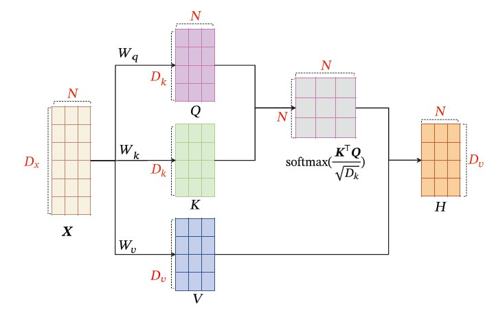
    $$
    \begin{aligned}
    &\boldsymbol{Q}=\boldsymbol{W}_{q} \boldsymbol{X} \in \mathbb{R}^{D_{k} \times N} \\
    &\boldsymbol{K}=\boldsymbol{W}_{k} \boldsymbol{X} \in \mathbb{R}^{D_{k} \times N} \\
    &\boldsymbol{V}=\boldsymbol{W}_{v} \boldsymbol{X} \in \mathbb{R}^{D_{v} \times N} \\
    & \boldsymbol{H}=\boldsymbol{V} \operatorname{softmax}\left(\frac{\boldsymbol{K}^{\top} \boldsymbol{Q}}{\sqrt{D_{k}}}\right)
    \end{aligned}
    $$
    $Q,K$用于计算各个输入间的相关性。$\operatorname{softmax}\left(\frac{\boldsymbol{K}^{\top} \boldsymbol{Q}}{\sqrt{D_{k}}}\right)$中的第n行第j列元素表示第𝑛 个输出关注到第𝑗
    个输入的权重。因为$QK^{T}$的方差随着$d$的增加而增加，所以除以$\sqrt{d}$以平衡增加的方差，相当于归一化的效果。设里的元素的$Q，K$均值为0，方差为1，那么$A^T=K^TQ$ 中元素的均值为0，方差为d，当d变得很大时，$A$  中的元素的方差也会变得很大，如果  $A$中的元素方差很大，那么$softmax(A)$ 的分布会趋于陡峭(分布的方差大，分布集中在绝对值大的区域)。因此$\boldsymbol{K}^{\top} \boldsymbol{Q}$中每一个元素除以$\sqrt{d}$以后，方差又变为1。这使得 的分布“陡峭”程度与$softmax(A)$、d解耦，从而使得训练过程中梯度值保持稳定。

    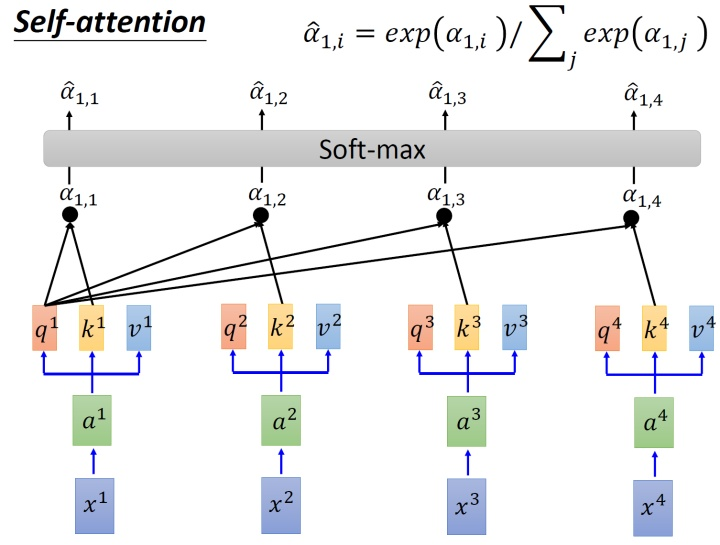

    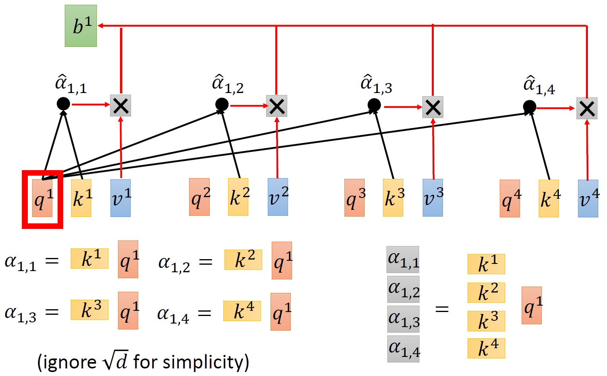

    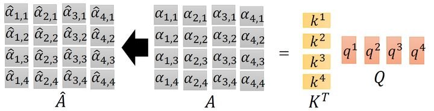

    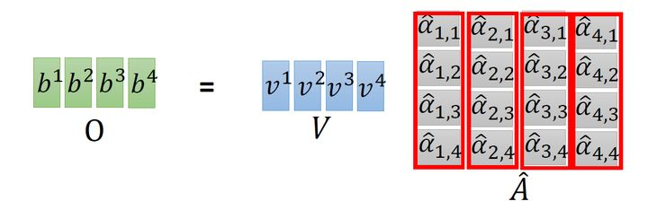

    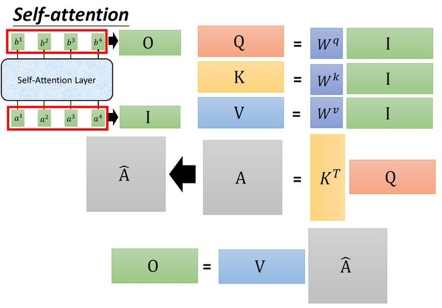

    $W_Q \in R^{D_k \times D_x},W_K \in R^{D_k \times D_x}$表示将输入数据从$D_x$维压缩到$D_k$维（从一个线性空间投影到另一个线性空间，本质上对应了同一个Sequence在不同空间的表达），其每一行表示当前输出维对各个输入维的权重。$Q,K$表示编码后数据在$D_k$各维度上的数值，$Q$的每一列用于查询，$K$的每一列用于被查询。通过对两个子空间中的向量两两计算内积，匹配这2个向量有多接近，获得任意两个输入间的相关性。例如：$K^TQ_{[:,i]} \in R^{N \times 1}$表示其他输入对第$i$个输入的注意力(相关性)；$K_{[:,i]}^TQ\in R^{1 \times N}$表示第$i$个输入对其它输入的注意力(相关性)。

    $W_V \in R^{D_v \times D_x}$表示将输入数据从$D_x$维压缩到$D_k$维(从一个线性空间投影到另一个线性空间），其每一行表示当前输出维对各个输入维的权重。$V$表示编码后数据在$D_v$各维度上的数值。这里的编码相较于$Q$的不同点在于：$D_k$用于计算注意力（相关性），$D_v$用于数据的后向传播。

    $W_Q \in R^{D_k \times D_x},W_K \in R^{D_k \times D_x},W_V \in R^{D_v \times D_x}$每一层线性映射参数矩阵都是独立的，所以经过映射后的Q, K, V各不相同，模型参数优化的目标在于将q, k, v被映射到新的高维空间，使得每层的Q, K, V在不同抽象层面上捕获到q, k, v之间的关系。一般来说，底层layer捕获到的更多是lexical-level的关系，而高层layer捕获到的更多是semantic-level的关系。

    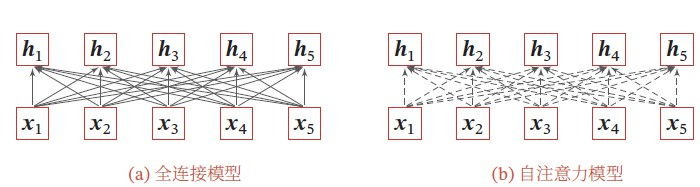

    自注意力机制类型于全连接架构，每一个输出都考虑到全部的输入，同时注意力机制的权重是动态生成的可以处理边长信息序列。

* 自注意力模型可以看作在一个线性投影空间中建立$X$中不同向量之间的交互关系．为了提取更多的交互信息，我们可以使用多头自注意力（Multi-HeadSelf-Attention），在多个不同的投影空间中捕捉不同的交互信息。

    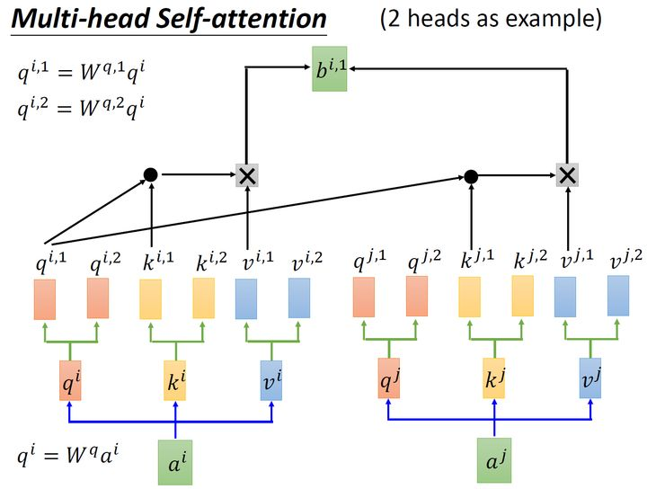

    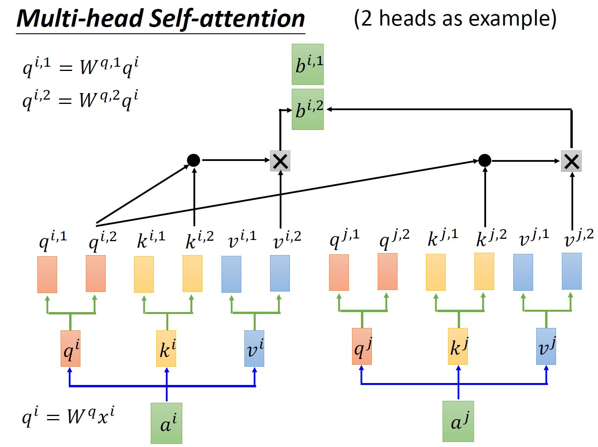

    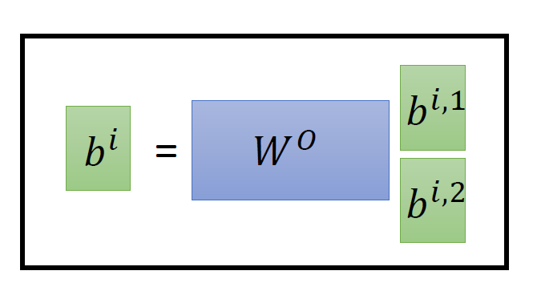

* $X \in C^{n \times m}$，$n$个数据，每个数据$m$维度：

    * 查询矩阵：旨在匹配或查询其他数据成员的重要性，$Q=W^Q(X)\in C^{n \times d}$，$W^Q()$表示线性变换（线性变换可以通过没有激活函数的线性 FC 网络来实现），$d$表示每个数据成员的查询维度。

    * 关键矩阵：旨在被其他数据成员匹配或查询其重要性。$K=W^K(X) \in C^{n \times d}$，$W^K()$示线性变换，$d $表示每个数据成员的关键维度。

    * 值矩阵：旨在提取或保留输入的特征。$V=W^V(X) \in C^{n \times m}$，$W^V()$示线性变。

    * 注意矩阵：旨在衡量输入的不同数据成员之间的重要性，可以用$Softmax(\frac{QK^{T}}{\sqrt{d}})\in C^{n \times n}$，其中采用Softmax归一化，使每行加起来为1。第i行和第j列的元素表示数据成员i对数据成员j的注意力权重。

    * 注意力机制的加权输出，可以表示为归一化注意力矩阵和值矩阵的乘积：
        $$
        \begin{equation*}Attention \left(\mathbf{Q}, \mathbf{K}, \mathbf{V}\right) = Softmax\left(\frac{QK^{T}}{\surd{d}}\right)V, \tag{6}\end{equation*}
        $$

    * 本文中：$n=K,m=2N_t$（复信道转换为实信道），注意力矩阵表示不同用户间的注意力。

* 注意力网络：级联多个注意力层以提高自注意力算法的准确性，归一化操作用于通过将数据归一化为标准正态分布来加速训练。残差连接用于传递未加权输入，防止梯度消失。

    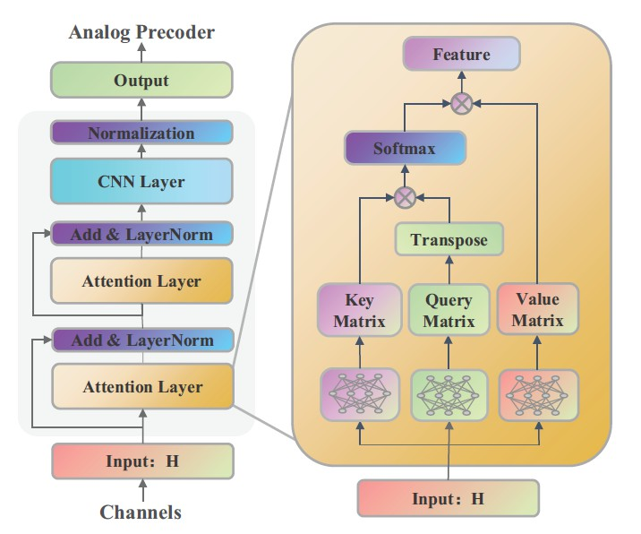

* CNN 层：根据用户间干扰的特征来学习模拟预编码器矩阵。在CNN层，首先对CNN层的输入进行整形$H^r \in R^{K \times  2N_t}  \rightarrow  R^{2 \times K \times N_t}$，可以认为它具有实部和虚部两个通道。接下来将重构输入的通道号扩展为$F≫ 2$以 提取更多特征。然后将特征通道分成两个流，应用不同大小的卷积核来为两个流提取不同尺度的特征，最后将不同尺度的特征整合为实部和虚部的归一化。

    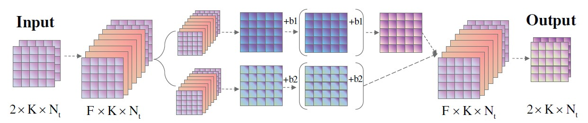

* 例：当用户2与用户1位置相对接近，存在较为严重的干扰，而用户2与用户3、4相距较远，干扰较弱时，注意力矩阵的第二行即用户2的注意力为[ 0.02 , 0 , 0.87 , 0.11 ]，用户2对用户3的注意力权重明显大于用户1，这说明用户2对用户1的关注较少，而对用户3的关注较多。由此，用户2对用户1的干扰可以通过将波束转移到用户 3 来缓解。

#### Unsupervised Learning-Based Fast Beamforming Design for Downlink MIMO

* 端到端网络，输入$H$，得到$W$，无监督训练通过最小化和频谱效率的相反数来实现，功率约束体现在损失函数中(正则化训练问题)：
    $$
    \mathcal{L}(\boldsymbol{\theta} ; \mathbf{h} ; \widehat{\mathbf{w}})=\ell(\boldsymbol{\theta} ; \mathbf{h}, \widehat{\mathbf{w}})+\lambda|\Omega(\widehat{\mathbf{w}})|
    \\
    \ell(\boldsymbol{\theta} ; \mathbf{h} ; \widehat{\mathbf{w}})=-\sum_{k=1}^{K} \log \operatorname{det}\left(\mathbf{I}_{k}+\widehat{\mathbf{W}}_{k}^{\mathrm{H}} \mathbf{H}_{k}^{\mathrm{H}} \widehat{\mathbf{J}}_{\widetilde{v}_{k}}^{-1} \widetilde{v}_{k} \mathbf{H}_{k} \widehat{\mathbf{W}}_{k}\right)
    \\
    \Omega(\widehat{\mathbf{w}})=\sum_{k=1}^{K} \operatorname{Tr}\left(\widehat{\mathbf{W}}_{i} \widehat{\mathbf{W}}_{i}^{\mathrm{H}}\right)
    \\
    $$
    即使添加功率作为损失函数的一部分，DNN输出可能仍然不满足约束，最终输出需要重新缩放：
    $$
    \widehat{\mathbf{W}}^{\mathrm{DNN}}=b \widehat{\mathbf{W}}
    \\
    
    b=\sqrt{\frac{\mathrm{p}_{\max }}{\operatorname{Tr}\left(\widehat{\mathbf{W}} \widehat{\mathbf{W}}^{\mathrm{H}}\right)}}
    $$

* 剪枝算法通过减少每个 DNN 层中的神经元数量来压缩神经网络。设置ApoZ阈值以修剪ApoZ值大的神经元并保留ApoZ小的神经元，这意味着在统计上删除输出为0的神经元，可以减少训练参数。最后重新训练网络以提高网络的性能。
    $$
    \operatorname{APoZ}_{c}^{(l)}=\frac{\sum_{s=1}^{S} \sum_{n=1}^{N} \delta\left(\text { LeakyReLU }\left(\mathbf{o}_{c, s}^{(l)}(n)\right)\right)}{N \times S}
    $$
    其中$o_{c}^l$为第$l$层网络的第$c$个神经元的输出， $N为$验证集数目，$S$为$o_{c}^l$的维度。

#### Unsupervised Deep Learning for Massive MIMO Hybrid Beamforming

*  一种在初始访问 (IA) 中设计同步信号 (SS) 的方法； 一种为模拟预编码器设计码本的方法。

* 当增加 BS 中的天线数量时，快速衰落和干扰的影响会消失。因此，通过大规模 MIMO 获得更高的复用和分集增益，进而导致更高的频谱效率和更高的能量效率。

* 不考虑 CSI 或信道互易性的全部知识，而是使用量化的接收信号强度指标 (RSSI) 来设计混合波束成形预编码器。与 CSI 不同，RSSI 是一个单一的真实值，用户可以很容易地从接收到的信号中进行测量。结果，不需要显式的CSI反馈，这减少了信令开销并提高了系统的频谱效率。

* 监督学习需要知道最佳目标，因此需要大量额外的计算资源才能使用传统的优化方法找到这些目标。此外，在实际情况下，很难获得最佳混合波束成形结构的知识。

* 所提出的 DNN 架构是一种多任务 CNN，可生成混合波束成形的模拟和数字部分，从而降低计算复杂度。

* 基于相位的模拟预编码器 (AP) 设计码本的方法，该方法降低了 DNN 的复杂性，同时提供了接近最佳的总速率性能。

* 模拟预编码使用2bit精度移相器，[1-i,1+i,-1-i,-1+i]共四种选择。

* 三个阶段：

    * SS Burst 传输：BS发送K个SS Burst，每个SS Burst 被所有用户接收，$r_{u}^{(k)}=\mathbf{h}_{u}^{(k) \mathrm{H}} \mathbf{A}_{\mathrm{SS}}^{(k)}+\eta_{u}^{(k)}$

    * RSSI反馈：用户对收到SS Burst测量功率，并经过$N_b$比特的线性量化后经由专用无差错信道反馈给基站：
        $$
        \alpha_{u}^{(k)}=\left|\mathbf{h}_{u}^{(k) \mathrm{H}} \mathbf{A}_{\mathrm{SS}}^{(k)}\right|^{2}+\sigma^{2}, \\
        \boldsymbol{\alpha}_{u}=\left[\alpha_{u}^{(1)}, \ldots, \alpha_{u}^{(K)}\right]^{\mathrm{T}} / \beta \\
        \tilde{\boldsymbol{\alpha}}_{u}=\frac{\left\lfloor\boldsymbol{\alpha}_{u}\left(2^{N_{b}}-1\right)\right\rceil}{\left(2^{N_{b}}-1\right)},
        $$
        
    * 下行数据传输：为了降低 HBF 设计的复杂性，模拟预编码器从码本中选择$\mathbf{A} \in \mathcal{A}$。BS 没有信道系数的直接知识$H$和噪声功率$\sigma ^2$ ，CSI 实际上部分嵌入在接收到的 RSSI 中。通过最大化和频谱效率完成优化：
        $$
        \begin{aligned}
        &\max _{\{\mathbf{A}\}, \mathbf{w}_{u}} R(\mathbf{A}, \mathbf{W})=\sum_{\forall u} \log _{2}\left(1+\frac{\left|\mathbf{h}_{u}^{\mathrm{H}} \mathbf{A} \mathbf{w}_{u}\right|^{2}}{\sum_{j \neq u}\left|\mathbf{h}_{u}^{\mathrm{H}} \mathbf{A} \mathbf{w}_{j}\right|^{2}+\sigma^{2}}\right) \\
        &\text { s.t. } \mathbf{A} \in \mathcal{A} \\
        &\sum_{\forall u} \mathbf{w}_{u}^{\mathrm{H}} \mathbf{A}^{\mathrm{H}} \mathbf{A} \mathbf{w}_{u} \leq P_{\max }
        \end{aligned}
        $$
    
* `deepMIMO`通过将光线追踪方法应用于Distributed城市环境的三维模型以捕获基于几何的特征，例如量化网格上的每个用户位置，得到不同位置的通道之间的相关性以及对材料的依赖性，生成逼真的通道信息的各种环境元素。

* 数据集生成：

    * 核心数据集：包含信道数据，用于设计模拟预编码的码本，和发送 SS Burst $A_{ss}$的模拟预编码器。

    * DNN数据集：包含信道数据与RSSI反馈，用于训练和测试DNN网络。

        

* 全数字预编码设计：提出了一种称为混合结构启发式优化 (HSHO) 的新型非深度学习算法，用于设计全数字预编码器和混合波束成形。
    $$
    \mathbf{u}_{u}=\sqrt{p_{u}} \frac{\left(I_{N_{\mathrm{U}}}+\frac{1}{\sigma^{2}} \sum_{i=1}^{N_{\mathrm{U}-1}} \mathbf{h}_{i} \lambda_{i} \mathbf{h}_{i}^{\mathrm{H}}\right)^{-1} \mathbf{h}_{u}}{\left\|\left(I_{N_{\mathrm{U}}}+\frac{1}{\sigma^{2}} \sum_{i=1}^{N_{\mathrm{U}-1}} \mathbf{h}_{i} \lambda_{i} \mathbf{h}_{i}^{\mathrm{H}}\right)^{-1} \mathbf{h}_{u}\right\|},
    $$
     $p_u,\lambda_u$是待优化的未知实值系数，分别对应用户$u$的波束成形功率和拉格朗日乘数，此外$\sum_u p_u=1$，$\sum_u \lambda_u=1$。可以假设$p_u \approx \lambda_u$，并将功率均分给$K,K \in [0,N_U]$个用户，其余用户$p_u=0$，遍历求解得到最优解，复杂度为$2^{N_U-1}$（$p_u$和为1，$p_{N_U}$可以经由前面参数表示，相当于只有$N_U-1$个参数，从$N_U-1$个中随机选择k个均分资源=>二项式$2^{N_U-1}$,其中$C^0_{N_U-1}$表示资源全给第 $N_U$个元素）。

* 混合波束成型设计：固定$\mathbf{h}^{\prime}=\left(\mathbf{A}^{\mathrm{H}} \mathbf{h}\right)^{\mathrm{H}} \in C^{N_{U} \times N_{RF}}, \mathbf{h}=\left[\mathbf{h}_{1}, \ldots, \mathbf{h}_{N_{\mathrm{U}}}\right]$，等效信道相当于只有$N_{RF}$条虚拟天线，通过最大化$h^{'}$的信道容量使用遗传算法设计SS Burst的模拟编码器$A$。$A$确定后可使用全数字预编码设计算法在等效信道下设计$w$。

* SS Burst设计：寻找SS序列，使得量化后信道矩阵$\mathcal{Q}(\mathbf{h})$与RSSI反馈的$\tilde{\boldsymbol{\alpha}}$互信息最大：$I(\mathcal{Q}(\mathbf{h}), \tilde{\boldsymbol{\alpha}})$，假设用户信道矩阵与用户的位置存在双射函数，优化问题变为：$\max _{\mathbf{A}_{S S}^{(k)} \forall K} I\left(\left(X_{U}, Y_{U}\right), \tilde{\boldsymbol{\alpha}}\right)$，可以使用混合波束成形阶段的遗传算法求解。

* 模拟预编码码本设计：在2bit移相器下，共有$4^{N^{RF}*N_t}$种可能的码字，对于core dataset中的第$n$个信道矩阵，使用遗传算法计算他们的模拟预编码器$A_{(n)}$，如果在当前信道$H$下计算生成的混合编码矩阵的频谱效率强于码本中的任何码字的一定倍数，则把$A_{(n)}$加入码本，否则当前信道的最优$A,W$从码本中选择，完成当前信道下训练数据的构建：$(H,U,W,A)$：
    $$
    R(\mathbf{A}(n), \mathbf{W}(n))>\xi \max _{\forall l} R\left(\mathbf{A}_{(l)}, \mathbf{W}_{(l)}(n)\right)
    $$
    其中$W_{(n)},W_{(l)(n)}$分别由$A_{(n)},A_{(l)}$使用全数字预编码器算法在等效信道下生成。同时为了防止码本过大，在码本数超过1000后不再添加新的码字。

    由于后续码本的加入，之前生成的数据对中的选择的码本可能已经不再是最优，所有还需要在码本固定后更新数据集：
    $$
    \mathbf{A}(n)=\underset{\forall \mathbf{A}_{(l)} \in \mathcal{A}}{\arg \max } R\left(\mathbf{A}_{(l)}, \mathbf{W}_{(l)}(n)\right)
    $$
    最后根据在core数据集中各个码字被使用的次数，对码字进行排序，删除使用次数最少的码字，并将使用该码字的数据对中的码字转移到码本中的其它码字上，不断重复每次删除使用率最低的一个码字，直到core dataset下平均求和率达到原始码本下和速率的99.5%时，停止码本大小减小。

* 神经网咯设计：HBF-Net用于预测当前信道下数字编码器(回归任务)$\overline{\mathbf{W}}$和模拟预编码器在码本中的下标（分类任务）$P=\left[p_{a_{(1)}}, \ldots, p_{a_{(l)}}, \ldots, p_{a_{(L)}}\right]$；APF-Net用于预测当前信道下全数字编码器(回归任务)$u$和模拟预编码器在码本中的下标（分类任务）$P=\left[p_{a_{(1)}}, \ldots, p_{a_{(l)}}, \ldots, p_{a_{(L)}}\right]$，数值编码器由最小二乘生成$\tilde{\mathbf{W}}$，AFP-Net 方法确保保持模拟和数字预编码器之间的对齐。具体网络为多任务网络，HBF-Net，APF-Net公用部分网络，二者尽在最优一层的输出上不同。

    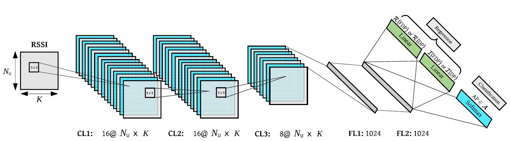


* 损失函数定义：

    * HBF-Net：$\mathcal{L}_{\mathrm{HBF}}=-\sum_{l=1}^{L} p_{a_{(l)}} R\left(\mathbf{A}_{(l)}, \overline{\mathbf{W}}\right)$

    * APF-Net：通过从码本中选择适当的AP，使FDP和率最大化，同时也使HBF和率最大化，通过保持模拟预码器和数字预码器的对齐，AFP-Net相较于HBF-Net可以获得了更好的和率性能。$\mathcal{L}_{\mathrm{APF}}=\mathcal{L}_{\mathrm{FDP}}+\mathcal{L}_{\mathrm{AP}}=-\sum_{\forall u} \log _{2}\left(1+\operatorname{SINR}\left(\mathbf{u}_{u}\right)\right)-\sum_{l=1}^{L} p_{a_{(l)}} R\left(\mathbf{A}_{(l)}, \tilde{\mathbf{W}}_{(l)}\right)$

* 测试场景：主干道路上的小区域；主干道路上的扩展大区间；两条主干道路的交叉区域。在不同的区间上噪声功率恒定，但信号功率会有变化，导致各自的信噪比环境不同。

* 性能比较：PZF在低信噪比下性能差，高信噪比下性能好，OMP算法在不同信噪比下性能变化不大，较稳定。PZF和OMP技术都需要对CSI有充分的了解，因此在FDD场景中需要一个高带宽的反馈通道来报告完整的CSI，这不利于系统的频谱效率。当用户数量增加时，PZF 和 OMP 方法不能很好地扩展。这可以解释为增加用户数量和固定基站中的天线数量会产生更多的用户间干扰。此外如果在大规模 MIMO 系统中天线数量与用户数量之比足够大，PZF 只能提供接近最优的结果。随着用户数量的增加，这个比率会降低，并且 PZF 的总速率性能会崩溃。CSI的反馈需要$N_T*N_U*2*N_b$bit数据，RSSI的反馈只需要$K*N_b*N_U$bit数据。

* 参数影响：

    * 增大SSBurst的数量K，也是 RSSI 值的数量，可以增加了 DNN 可用的 CSI 数量，可以提高最终的可实现速率。然而需要发送更多 SSB，因此也降低了信道效率。
    * 增大RSSI量化的bit数，可以提高最终的速率，改变量化位数，可以实现频谱效率提升与 DNN 的性能之间存在权衡。
    * 以参数数量衡量的 DNN 的复杂性可以预期取决于优化问题的复杂性。因此增加 BS 中的天线数量或用户数量应该需要更复杂的 DNN。对于更多的天线，DNN 需要更多的信息来设计 HBF，因此需要更多的 RSSI 传输，需要更大的K。

* 复杂度

    一次复数乘法等价于4次实数乘法；一个复数除法等价于8次实数乘法；两个复数矩阵$N \times P,P \times M$相乘，需要$NMP$次复数乘法；一个$N \times N$方阵求奇异值需要$4N^3$次实数乘法。

    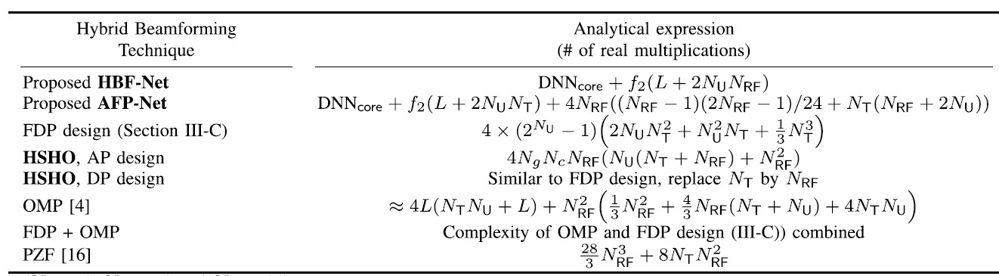
