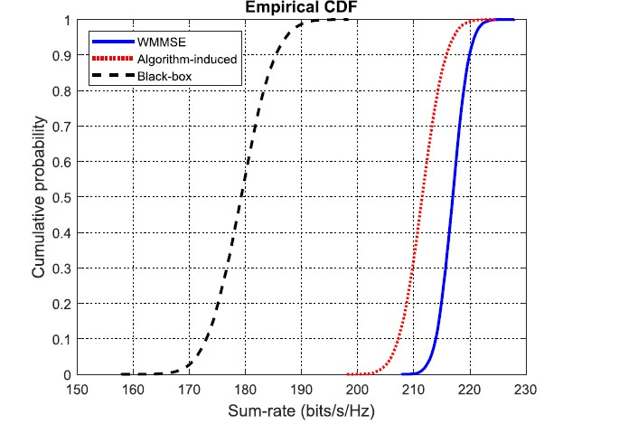
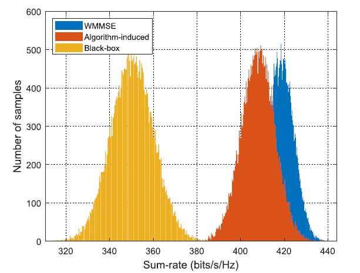
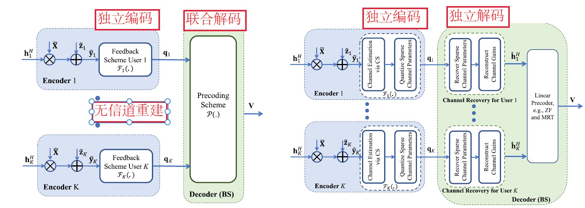
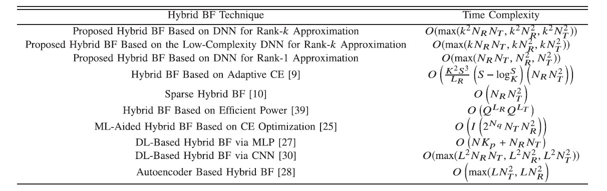

## 波束成形

#### Iterative Algorithm Induced Deep-Unfolding Neural Networks: Precoding Design for Multiuser MIMO Systems

* 优化理论辅助算法通常需要相当大的计算复杂度，为此本文首先提出了一个深度展开框架，其中以矩阵形式开发了迭代算法诱导深度展开神经网络（IAIDNN）的一般形式，以解决 MU-MIMO 系统中预编码设计的和速率最大化问题。开发了一种基于经典加权最小均方误差 (WMMSE) 迭代算法结构的高效 IAIDNN，将迭代 WMMSE 算法展开为分层结构，其中引入了许多可训练的参数来代替前向传播中的高复杂度操作。

* 基于黑盒的神经网络 (NNs) 的可解释性和泛化能力较差，并且可能无法保证其性能。基于数据驱动的黑盒神经网络需要大量的训练样本，训练时间长。深度展开：将迭代展开为类似于基于现有迭代的 NN 的分层结构算法。

* 在前向传播（FP）中设计了IAIDNN的结构，其中引入了许多可训练的参数。在反向传播（BP）中，提出了矩阵形式的IAIDNN的广义链式法则（GCR），它描述了两个相邻层之间梯度的递推关系。基于 GCR 计算不同层中可训练参数的梯度。

* 迭代 WMMSE 算法：通过将功率约束集成到目标函数中，得到一个等效的无约束和速率最大化问题，其目标函数被视为无监督训练阶段的损失函数。

*  IAIDNN将迭代 WMMSE 算法展开为具有一系列矩阵乘法和非线性运算的分层结构。一方面使用少得多的迭代次数，即 IAIDNN 中的层数来近似迭代 WMMSE 算法，并避免矩阵求逆以降低计算复杂度。另一方面，通过引入可训练参数来提高性能。在 FP 中，应用逐元素非线性函数和逆矩阵的一阶泰勒展开结构来近似矩阵求逆运算。在 BP 中，使用所提出的 GCR 来计算可训练参数的梯度，并基于随机梯度下降 (SGD) 方法更新它们。

* 迭代算法的表示：$\min _{\mathbf{X}} f(\mathbf{X} ; \mathbf{Z}) \text { s.t. } \mathbf{X} \in \mathcal{X} \rightarrow \mathbf{X}^{t}=F_{t}\left(\mathbf{X}^{t-1} ; \mathbf{Z}\right) \quad t \in \mathcal{T} \triangleq\{1,2, \ldots, T\}$，将最终得到的$X^T$带入$f(X,Z)$得到最终结果。其中$f()$为目标函数，$X$为待优化变量，$Z$为随即参数，$F_t()$为$X^{t-1}$到$X^{t}$的映射函数，$T$为时间步数。

    迭代算法的神经网络表示：$\mathbf{X}^{t}=F_{t}\left(\mathbf{X}^{t-1} ; \mathbf{Z}\right) \rightarrow \mathbf{X}^{l}=\mathcal{F}_{l}\left(\mathbf{X}^{l-1} ; \boldsymbol{\theta}^{l}, \mathbf{Z}\right) \quad l \in \mathcal{L} \triangleq\{1,2, \ldots, L\}$，将最终得到的$X^L$带入$f(X,Z)$得到最终结果。其中$\theta$为待训练参数，$L$为网络层数。

* 矩阵网络间的梯度方向传播，GCR(generalized chain rule)：$\mathbf{G}^{l-1}=\mathbf{E}^{l}\left(\left(\mathbf{F}^{l} \mathbf{G}^{l} \mathbf{A}^{l}\right) \circ\left(\mathbf{B}^{l}\right)^{T}\right) \mathbf{C}^{l}$，通常的全连接神经网络传递的是向量，是矩阵网络的一种特例。

* GCR(generalized chain rule)具有三个优势可以对复杂的可训练参数做BP；可以实现复矩阵的求逆和行列式等操纵；基于GCR得到封闭形式的梯度，与自动微分相比，它更准确收敛速度更快。

* MMSE问题：MMSE问题与功率约束下的最大和速率问题等价，可以定义辅助变量$U,W$，再以迭代的方式用闭式表达式更新$U,V,W$，最终得到混合与编码矩阵$V_k$：
    $$
    \max _{\left\{\mathbf{V}_{k}\right\}}  \sum_{k=1}^{K} \omega_{k} \log \operatorname{det}\left(\mathbf{I}+\mathbf{H}_{k} \mathbf{V}_{k} \mathbf{V}_{k}^{H} \mathbf{H}_{k}^{H}\right.\\
    \left.\left(\sum_{m \neq k} \mathbf{H}_{k} \mathbf{V}_{m} \mathbf{V}_{m}^{H} \mathbf{H}_{k}^{H}+\frac{\sigma_{k}^{2}}{P_{T}} \sum_{n=1}^{K} \operatorname{Tr}\left(\mathbf{V}_{n} \mathbf{V}_{n}^{H}\right) \mathbf{I}\right)^{-1}\right)
    $$

* 展开网络：传统的WMMSE每次迭代需要大量的矩阵求逆运算。利用待求逆矩阵主对角元素远大于其它元素的特性，以及$A^{-1}$再$A_0$的一阶泰勒展开式的特性，使用$A^+X+AY+Z$来逼近$A^{-1}$，其中$X,Y,X$为待训练参数。将迭代WMMSE算法中的求逆操作使用上式替代，将迭代WMMSE的一次迭代看作神经网络的一层，$X^U,Y^U,Z^V,O^U,X^V,Y^V,Z^V,O^V,X^W,Y^W,Z^W$作为每一层的参数，和速率作为损失函数，使用梯度的后向传播更新每一层的参数。

    扩展：增加可学习的参数，可以更高的逼近$A^{-1}$，比如：$A^+X+PA^{-1}Y+Z$。

* 复杂度：展开网络的层数远少于迭代WMMSE；展开网络使用等效求逆实现求逆，复杂度比迭代WMMSE中的$A^{-1}$更低。展开网络的梯度后向传播拥有闭式表达，比常见神经网络的自动微分机制更高效，训练速度更快，并且展开网络利用了专业知识，只需要训练表达式中的少量参数，需要的训练数据也更少。

* 泛用性：当在线部署阶段的$N_t,N_r,K$比训练场景对应的参数更小时，可以通过将信道数据补零至与训练的信道相同的维度即可，不用再重新训练网络。由于展开网络优化的是训练姐下的平均和速率，所以其对不完美CSI的鲁棒性较强，此外通过考虑 CSI 误差统计量，并对目标函数进行微调，展开网络同样适用于存在 CSI 错误和多单元系统情况下的鲁棒预编码算法设计。

* 性能比较：该算法的性能与迭代的 WMMSE 算法的性能之间的差距随着 k 的增大而增大。这主要是因为问题变得更加复杂，具有更多的局部最优解和鞍点。另外随着 k 的增加，$V_k$中各元素之间的差异趋于增大，即接近0或1，这使得网络更难学到令人满意的结果。

* 随着展开网络的层数增加，和速率性能先增加，然后降低。这是因为当层数较小时，展开网络的自由度较小，导致它的学习能力不能令人满意，只有少量可训练参数。因此，当层数增加时性能提高。然而由于一系列的矩阵求逆和乘法运算，梯度的数值误差随层数的增大而增大。当层数相对较大时，网络的学习能力受到数值误差的限制，从而导致和速率性能的下降。其最优层数随着$N_t,K$的增加而增加。

* 统计算法在大量数据集下的表现，绘制其概率分布与概率密度显示算法性能平均值与方差的衡量比较。
 

#### Deep Reinforcement Learning for Distributed Dynamic MISO Downlink-Beamforming Coordination

* 提出一种分布式动态下行波束形成协调(DDBC)方法的 CSI 的部分可观测性。每个基站可以训练自己的深度Q网络，并根据环境选择合适的波束形成器，通过设计的有限信息交换协议进行观测。

#### Deep Learning for Distributed Channel Feedback and Multiuser Precoding in FDD Massive MIMO

* 导频的联合设计和一种新的 DNN 体系结构，该体系结构将接收到的导频直接映射到用户端的反馈位，然后将所有用户的反馈位直接映射到基站的预编码矩阵中，可以显著提高系统的整体性能。

* 数据驱动方法在性能和复杂性方面都有优势，特别是在模型不确定和传统优化方法具有高复杂性的情况下，多用户信道估计、量化和反馈问题可以被认为是一个分布式信源编码问题，可以使用机器学习方法进行求解。下行 FDD 预编码系统的端到端设计可以看作是在有限反馈率约束下计算独立信源(即不同用户的独立的信道)的恢复函数(即根据编码信道计算下行基站的最佳预编码矩阵)以最大限度地实现系统目标，例如根据速率有限的反馈，恢复所有用户的和速率的 DSC 问题。

* 下行训练导频和用户采用的反馈方案可视为源编码器，而基站采用的预编码方案可视为解码器，而传统的信道反馈方案可以看作是一种独立的信源编码策略，对每个用户的信道进行独立量化。本文的性能增益来自于整体的 DSC 和预编码设计，它们绕过了每个用户的单个显式信道估计。Hojatian H, Nadal J, Frigon J F, et  al. Unsupervised deep learning for massive MIMO hybrid beamforming[J].  IEEE Transactions on Wireless Communications, 2021.同理。

    

* 考虑了端到端系统，包括下行导频的设计，有限反馈下的信道估计和量化策略，以及基站下行预编码矩阵的设计。由于下行信道估计和量化在用户之间以分布式的方式进行，然后反馈到基站的集中位置进行预编码，因此整个系统类似于 DSC 方案。

* 优势：
    * 两个或两个以上相关信源使用独立的编码器和相同的解码器的联合的最优无损编解码比独立编解码有效得多，所以优化的分布式信道压缩策略比传统的独立的 CSI 估计和反馈策略具有明显的优势，可以减少信息量。预编码矩阵是所有用户通道的函数，信息理论的考虑表明，我们可以采用 DSC 策略做得更好。
    * 信道反馈与预编码联合设计具有显著的优势。与传统的通信系统设计方法不同的是，深度学习框架可以对通信系统的不同模块分别进行优化，它可以联合设计端到端性能优化的所有组件。
    * 深度学习框架在端到端通信系统的优化过程中隐式地以数据驱动的方式学习信道分布，而不需要可跟踪的数学信道模型。

* 提出了一种数据驱动的方法，通过在每个用户端训练一个 DNN 和在基站端训练一个 DNN，可以有效地设计信道估计、分布式压缩、用户端反馈和基站端多用户预编码。特别是，我们提出了一种新的神经网络结构，封装了所有的组件的 FDD 下行预编码系统。

* DNN 结构中，反馈信息位被建模为二进制神经元的输出，这些二元神经元在训练过程中将具有消失的梯度，从而抑制了网络参数的训练。为了克服这个问题，我们用直通(ST)估计量的变种来近似二进制层的梯度。

* 系统参数：
    * 如果外接系统参数只改变输入数据的概率分布（如信道路径数，信噪比），可以在系统参数范围较广的情况下训练 DNN，可以当这些参数的先验知识不可用时设计出更具鲁棒性的系统。
    * 系统参数也改变所提出 DNN 中某些层的输入/输出尺寸（如反馈速率限制和用户数）。使用两步训练方法：第一步用户端DNN的输出是软二进制值(-1到+1之间)，利用训练好的改进网络获得导频序列和信道估计方案等参数。第二步固定了用户端  DNN，但对用户端 DNN 输出采用不同的量化分辨率$Q$，以适应不同的反馈速率。对于每个反馈率，我们进行另一轮的训练，其中只有 bs 方 DNN  参数是可训练的。用户端操作不依赖于网络中用户数的特性，我们只需要训练和存储不同的bs端dnn来处理网络中不同的用户数。

* 有限反馈可以分为两类：

    * 通过利用 CSI的空间和/或时间相关性来减少反馈开销。信道可以在某些基础上表示为不相关的稀疏向量的函数(如信道的角域)  ，用户可以使用稀疏恢复算法(如压缩感知恢复算法(CS))恢复稀疏信道参数，并随后将这些参数的量化版本反馈给  BS，基站根据量化的稀疏信道参数重构信道，然后采用传统的线性预编码方案。这种基于 cs 的反馈协议实质上采用了一种独立的信源编码策略，即对每个用户的信道进行独立量化。
    * 基于码本的反馈。BS 首先沿着可能的预编码方向传输，然后每个用户发送关于 top-p 最强接收信号的索引及其相应的 SNRs 的反馈信息。最后在基站处理反馈信息，以便从码本中选择每个用户的预编码器。

    CSI 反馈方案在非常有限的下行链路训练和反馈资源中的优势对于有限散射环境中的大规模 MIMO 系统来说更为显著。这是因为在下行链路训练和反馈资源利用方面，一些稀疏信道参数的 CSI 估计、量化和反馈要比基于码本的预编码方案有效得多。相比较下基于码本的方法中码本大小会随着基站天线数的增大而增大。

* 端到端处理：导频设计$\widetilde { \mathbf {X}} $->接收导频$\begin{equation*} \widetilde { \mathbf {y}}_{k} = \mathbf {h}_{k}^{H} \widetilde { \mathbf {X}} + \widetilde { \mathbf {z}}_{k}\end{equation*} $ ->信息提取并反馈$\begin{equation*} \mathbf {q}_{k} = \mathcal {F}_{k}\left ({\widetilde { \mathbf {y}}_{k}}\right)\end{equation*}$ ->基站设计编码矩阵$\begin{equation*} \mathbf {V}= \mathcal {P} \left ({\mathbf {q}}\right) \end{equation*}$

* 优化问题：
    $$
    \begin{align*} { \mathop {\mathrm {maximize}} _{\widetilde { \mathbf {X}},\hspace {2pt}\{\mathcal {F}_{k}(\cdot)\}_{\forall k},\hspace {2pt}\mathcal {P}(\cdot)}}& \quad \sum _{k=1}^{K} \log _{2}\left ({1 + \dfrac {\lvert \mathbf {h} _{k}^{H} \mathbf {v}_{k} \rvert ^{2}}{ \sum _{j\not =k} \lvert \mathbf {h} _{k}^{H} \mathbf {v}_{j} \rvert ^{2}+\sigma ^{2} } }\right)\qquad \\ \mathrm {subject ~to} \quad& \quad \mathbf {V}= \mathcal {P}\left ({\left [{ \mathbf {q}_{1}^{T},\ldots, \mathbf {q}_{K}^{T} }\right]^{T} }\right),\\&\quad \mathbf {q}_{k} = \mathcal {F}_{k}(\mathbf {h}_{k}^{H} \widetilde { \mathbf {X}} + \widetilde { \mathbf {z}}_{k}), \forall k, \\&\quad \mathrm {Tr}(\mathbf {V} \mathbf {V} ^{H}) \leq P,\\&\quad \|\widetilde{\mathbf {x}} _\ell \|^{2}_{2}\leq P, \forall \ell,\end{align*}
    $$

* 基于MS信道估计量化反馈，BS重建信道的方法只有在使用大量导频，以及足够的反馈比特时才能取得良好的效果。端到端DNN中在每个用户处使用 DNN 将接收到的导频直接映射到反馈位，在 BS 处使用 DNN 将来自所有用户的反馈位直接映射到预编码矩阵。

* 网络设计：

    * 导频设计部分：将$\widetilde { \mathbf {X}}$建模为一个使用线性激活函数全连接层中的权重，且网络偏置为0，接收$h_k$作为输入，输出就是用户接收到导频信号，对$\widetilde { \mathbf {X}}$的功率约束可以使用$l_2$正则方法，权重的约束就是对功率的约束，并在每次迭代后使用功率约束。可训练参数为$\widetilde { \mathbf {X}}$。

        在某些情况下，不同用户的渠道分配是 i.i.d，一个共同的用户端 DNN  可以被系统中的多个用户采用。出先通过训练单用户系统来学习编码参数(包括导频矩阵和信道估计/反馈方案)，然后对所有用户采用相同的编码 DNN，并根据系统中用户的总数分别训练 基站端DNN 的参数。

    * 信息提取部分：使用多个全连接层，接收$\widetilde { \mathbf {y}}_{k}$作为输入，最后的激活函数使用$sgn()$实现输出0,1序列。可训练参数为$\Theta_{\mathrm{R}}^{(k)} \triangleq\left\{\mathbf{W}_{r}^{(k)}, \mathbf{b}_{r}^{(k)}\right\}_{r=1}^{R}$。由于梯度无法在$sgn()$处传递，使用sigma-adjusted  straight-throught：$\frac{2}{1+\exp \left(-\alpha^{(i)} u\right)}-1$，该函数通过不断增大$\alpha$可以以逼近$sgn()$，对得到的浮点数使用$Lloyd-Max$算法，根据他们的概率分布函数，划分为$2^Q$区间，即每个浮点值编码为$Q$bit值，每个用户反馈给基站数据$B=S*Q$bit。

    * 预编码设计：使用多个全连接层，输入为$K*B*Q$长度的0,1序列，输出即为$V$，并使用功率约束。可训练参数为$\Theta_{\mathrm{T}} \triangleq\left\{\mathbf{W}_{t}, \mathbf{b}_{t}\right\}_{t=1}^{T}$。

* 性能比较：
    * DNN通过最大化和速率，跳过信道估计，在较低导频数量下其性能强于基于CS恢复方法的MRT/ZF，且需要的反馈比特$B$也较MRT/ZF更少。
    * 当路径数可变时训练集可以使用包含多种路径数的数据训练网络，提高网络对路径失配的鲁棒性，其适应性提升在较少导频数下更明显。
    * 当用户量化精度$Q$与数据个数$S$可变时训练集可以使用包含多种$S，Q$的数据训练网络，提高网络对不同数据输入的鲁棒性，可以使用一个网络处理不同$B$的情形。
    * 当用户数可变时，由于在某些情况下，不同用户的渠道分配是 i.i.d，一个共同的用户端 DNN  可以被系统中的多个用户采用。基站端需要针对$KSQ$的变化对网络结构做出调整。

#### Beamforming Optimization for Intelligent Reflecting Surface Assisted MISO: A Deep Transfer Learning Approach

* 迁移学习(DTL)的框架来学习如何在 IRS 端无监督的优化移相器。IRS(恒模约束) 和 BS 上的联合主被动波束形成。

* 智能反射面(IRS)作为一种无源器件，通过在平面上集成大量的低成本被动反射元件，实现了对无线传播环境的实时智能重构，从而为无线链路提供了更多的自由度。

*  将迁移学习理论与深度学习理论相结合，可以减少对样本数量的依赖。TL 意味着在一个学习任务中学到的东西被重复使用，以提高在另一个学习任务中的概括性。当目标域和源域的数据分布相似时，使用 TL 可以重用训练好的模型。

* 传统的机器学习方法是针对不同的 IRS 系统，将信道状态信息(CSI)数据和训练过程分离开来。因此当从源 IRS 系统向目标 IRS 系统转移时，没有保留关于无线信道传播特性的经验知识。基于 dtl 框架可以在源域获得最优的无源相移矩阵，其次训练好的权重可以转移到目标域中执行相应的新任务，这种策略称为微调。

* 贡献：通过最小化基站的传输功率来解决波束形成最佳化问题；提出了一个与基站传输功率密切相关的损耗函数，非监督式学习。

* RS 多次反射的信号会因为路径损失而被忽略；通过信道估计可以在 IRS 控制器上获得信道状态信息。

* 接收信号：$y=\left(\mathbf{h}_{r}^{H} \Theta \mathbf{G}+\mathbf{h}_{d}^{H}\right) \mathbf{w} s+n$，其中$\mathbf{h}_{r}^{H} \in \mathbb{C}^{1 \times N}$ 为用户与IRS间信道, $\mathrm{G} \in \mathbb{C}^{N \times M}$ 为基站到IRS信道, $\mathbf{h}_{d}^{H} \in \mathbb{C}^{1 \times M}$ 是基站与用户间信道, $\mathbf{w} \in \mathbb{C}^{M \times 1}$ 是基站编码向量。$\Theta=diag(\beta_1 e^{j\theta_1},...,\beta_N e^{j\theta_N})$为IRS反射矩阵，其中$\theta_n \in(0,2\pi]$为相移，$\beta_n \in[0,1]$为反射幅度。

* 优化问题：其中$\gamma$为信噪比。
  $$
  \begin{array}{ll}
  \min _{\mathbf{w}, \Theta} & \|\mathbf{w}\|^{2} \\
  \text { s.t. } & \left|\left(\mathbf{h}_{r}^{H} \boldsymbol{\Theta} \mathbf{G}+\mathbf{h}_{d}^{H}\right) \mathbf{w}\right|^{2} \geq \gamma \sigma^{2}, \\
  & \left|\theta_{n}\right|=1, n=1, \ldots, N,
  \end{array}
  $$
  当相移矩阵固定后，最低发射功率的预编码矩阵可以通过MRT获得:
  $$
  \mathbf{w}^{*}=\sqrt{P} \frac{\left(\mathbf{h}_{r}^{H} \boldsymbol{\Theta} \mathbf{G}+\mathbf{h}_{d}^{H}\right)^{H}}{\left\|\mathbf{h}_{r}^{H} \boldsymbol{\Theta} \mathbf{G}+\mathbf{h}_{d}^{H}\right\|}
  $$
  最小化发射功率就是最大化信道增益：
  $$
  \begin{array}{cc|c}
    \max _{\Theta} & \left\|\mathbf{h}_{r}^{H} \Theta \mathbf{G}+\mathbf{h}_{d}^{H}\right\|^{2} \\
  \text { s.t. } & \left|\Theta_{i, i}\right|=1
  \end{array}
  $$
  如果移相器相位离散：其中$\mathcal{F}=\{0, \Delta \theta, \ldots,(L-1) \Delta \theta\},L=2^B$
  $$
  \begin{array}{cl}
  \max _{\boldsymbol{\Theta}} & \left\|\mathbf{h}_{r}^{H} \boldsymbol{\Theta} \mathbf{G}+\mathbf{h}_{d}^{H}\right\|^{2} \\
  \text { s.t. } & \theta_{n} \in \mathcal{F}, \forall n \in \mathcal{N} .
  \end{array}
  $$
  
* 网络：

  输入：$h^H_r,G,h^H_d$输出$\theta$。根据上述系统模型生成$N_s$样本，构造出训练数据集$D_s$ ，并用于源域的预训练。然后使用相同的过程生成 $N_t$  样本作为目标数据集在目标域内的 $D_t$。由于源域和目标域中 IRS 元素的数量不同，训练数据和测试数据的分布也不同。

  训练：1)在源域建立预训练的神经网络模型,当损耗函数收敛时进入微调阶段。2)在目标域中细化预训练模型。微调的目的是精炼部分参数的预训练神经网络的目标任务,对于小规模的数据集，如果对网络的所有参数进行重新训练，就很容易产生过度拟合。为适应在源域和目标域不同的输入和输出维度，输入层和输出层的权重需要在目标域完全重新训练，另一方面作为特征提取器的中间层(已经包含了无线传播环境的特征)的权重只需要微调，这意味着模型被重用，部分层次的训练权重被转移到目标 IRS 系统模型。只有少量的未标记数据用于网络的重新训练。

  损失函数：$\text { Loss }=\frac{1}{K} \sum_{k=1}^{K} \frac{\gamma_{k} \sigma_{k}^{2}}{\left\|\mathbf{h}_{k, r}^{H} \boldsymbol{\Theta}_{k} \mathbf{G}_{k}+\mathbf{h}_{k, d}^{H}\right\|^{2}}$，损失函数的下降意味着信道增益的增加。

* 结果：

  * 当用户接近BS时，BS和用户之间的强直接信道使其受益匪浅，因此发射功率最低。随着用户逐渐远离  BS，功率也会增加。当用户逐渐原理BS而不断靠近IRS时，功率再次减小，因为从 IRS 接收到的反射信号逐渐变强。如果没有  IRS，所需的传输功率会随着距离的增加而迅速增加。结果表明利用IRS被动波束形成技术可以有效地扩大信号覆盖范围，解决室内覆盖盲点问题，改善小区边缘用户体验等。

  * DTL 的fine-toune阶段的迭代次数并不随IRS的天线数的增加而显著增加，这意味着大规模 IRS 系统的训练开销相对较低。

#### Deep Learning for Direct Hybrid Precoding in Millimeter Wave Massive MIMO Systems

* 在无监督的情况下优化基于周围环境的压缩信道感知向量，将感知能力集中在最有希望的空间方向上。该神经网络结构考虑了射频链的约束，并将发射机/接收机测量矩阵建模为两个复值卷积层。其次该模型学习如何直接从投影信道矢量(接收信号)构造混合结构的射频波束形成矢量,跳过信道估计，将问题变为用户编码，基站解码的问题。与传统的非机器学习方法相比，该方法可以显著降低训练导频开销。

* 传统算法利用 mmWave 通道的稀疏特性，通过压缩测量(通常是随机的)来感知通道。然后利用追踪算法等压缩测量数据重构信道，最后利用所构造的信道设计混合预编码矩阵，它没有利用先前的信道观测来减少与估计信道和设计模拟预编码相关的训练开销，此外传统信道估计由于在发射机和接收机上都有大量的天线，导致高的训练开销，并且射频链受到严格的硬件限制。

  本方法可以根据用户分布和周围环境优化测量(压缩感知)向量，将测量/感知能力集中在最有希望的空间方向上，并且深度学习模型直接从压缩测量中学习(并记忆)如何预测混合波束形成向量。机器学习工具可以有效地利用先前对信道估计的观察和混合预编码设计，显著地减少了与 mmWave 信道训练和预编码设计问题相关的训练开销。

* 由于毫米波下信道的稀疏性，所以多径数目有限（一般是3~5）。

* 穷举算法：$F_{RF},W_{RF}$各列由预定义码本构成，$F_{BB},W_{BB}$由等效信道$\overline{\mathbf{H}}=\mathbf{W}_{\mathrm{RF}}^{\mathrm{H}} \mathbf{H F}_{\mathrm{RF}}$SVD后的奇异矩阵构成。
  $$
  \begin{aligned}
  \left\{\mathbf{F}_{\mathrm{RF}}^{\star}, \mathbf{W}_{\mathrm{RF}}^{\star}\right\}=& \underset{\left[\mathrm{F}_{\mathrm{RF}}\right]_{,, n_{\mathrm{t}}} \in \mathcal{F}, \forall n_{\mathrm{t}}}{\operatorname{argmax}} \log _{2} \mid \mathbf{I}+\mathrm{SNRW}_{\mathrm{RF}}^{\mathrm{H}} \mathbf{H F}_{\mathrm{RF}} \times\left(\mathbf{F}_{\mathrm{RF}}^{\mathrm{H}} \mathbf{F}_{\mathrm{RF}}\right)^{-1} \mathbf{F}_{\mathrm{RF}}^{\mathrm{H}} \mathbf{H}^{\mathrm{H}} \mathbf{W}_{\mathrm{RF}}\mid \\
  &\left[\mathrm{W}_{\mathrm{RF}}\right]_{:, n_{\mathrm{r}}} \in \mathcal{W}, \forall n_{\mathrm{r}} \\
  \end{aligned}
  $$
  如果码本相互正交比如DFT码本：
  $$
  \begin{aligned}
  \mathbf{F}_{\mathrm{BB}}^{\star} &=tr\left(\mathbf{F}_{\mathrm{RF}}^{\mathrm{H}} \mathbf{F}_{\mathrm{RF}}\right)^{-\frac{1}{2}}[\overline{\mathbf{V}}]_{:, 1: N_{\mathrm{S}}}, \\
  \mathbf{W}_{\mathrm{BB}}^{\star} &=[\overline{\mathbf{U}}]_{:, 1: N_{\mathrm{S}}},
  \end{aligned}
  $$
  穷举算法复杂度高。
  
* 网络结构：自动预编码神经网络由两个主要部分组成: 

  (i)信道编码器学习如何优化压缩感知矢量，使用神经网络实现压缩感知，信道编码器网络的两个卷积层的权值将用作发射机和接收机的模拟测量矩阵，使感知功率集中在最有希望的方向。 $\mathbf{P} \in C^{N_{\mathrm{t}} \times M_{\mathrm{t}}},\mathbf{Q} \in C^{N_{\mathrm{r}} \times M_{\mathrm{r}}}$ 为发射机和接收机用于测量信道的矩阵：
  $$
  \mathbf{Y}=\sqrt{P_{\mathrm{T}}} \mathbf{Q}^{\mathrm{H}} \mathbf{H} \mathbf{P}+\mathbf{Q}^{\mathrm{H}} \mathbf{V}\\
  \mathbf{vec(Y)}=\sqrt{P_{\mathrm{T}}}\left(\mathbf{P}^{T} \otimes \mathbf{Q}^{\mathrm{H}}\right) \mathbf{ vec({H})}+\mathbf{vec(Q^{H}V)}
  $$
  矢量化的信道矢量 h 和两个测量矩阵的乘积可以通过将这个信道矢量输入一个由两个连续卷积层组成的神经网络来仿真。使用$M_r$个一维卷积核，每个内核的大小为 $N_r$，步长为 $N_r$，表示一个接收测量向量,一个核的权重参数表示$Q$的一列，卷积层的输出为$M_r$个特征Map,将其flatten后输入第二层卷积，实现对$P$的模拟。通过训练优化$P,Q$，训练后的网络参数即为发送/接收压缩信道测量矩阵，这种优化使测量矩阵适应周围环境和用户分布，并将感知能力集中在有希望的空间方向上。该信道测量的输出(接收传感矢量 y)将被输入到预编码网络中，以预测射频波束形成/合成矢量。

  (ii)预编码器学习如何直接从接收感知矢量预测混合结构的射频波束形成/合成矢量，即信道编码器的输出。接收经过信道传播的测量矩阵$y$，通过两个输出层直接得到$size(\mathcal{F})$个值，表示码本中各个码字被选择概率，最终得到$N_T^{RF}$个预测码字的下标集合$y_{pred}$（多标签分类任务，多任务学习）。一旦模拟编码确定，可以利用式(7)计算数值预编码。

* 训练数据：包含信道添加噪声的信道矩阵，和模拟预编码矩阵各列在H由基于Gram-Schmidt的混合预编码算法得到码本中的下标。对于模拟预编码器的输出为大小为$size(\mathcal{F})$的$N^{RF}_t-hot$向量。

* 损失函数：两个任务都使用交叉熵损失函数，最终的损失为二者的平均值：
  $$
  L_F=\frac{1}{size(\mathcal{F})} \sum_{i}-\left[y^F_{i} \cdot \log \left(p^F_{i}\right)+\left(1-y^F_{i}\right) \cdot \log \left(1-p^F_{i}\right)\right] \\
  L_W=\frac{1}{size(\mathcal{W})} \sum_{i}-\left[y^W_{i} \cdot \log \left(p^W_{i}\right)+\left(1-y^W_{i}\right) \cdot \log \left(1-p^W_{i}\right)\right]
  $$

* 准确率：可以以较少的导频开销实现较高的预测准确率。
  $$
  acc_F=\frac{\sum_{i=1}^{N_{sample}} \frac{\left|y_{\text {true }}^{(i)} \cap y_{\text {pred }}^{(i)}\right|}{\left|y_{\text {true }}^{(i)}\right|}}{N_{\text {samples }}}  \\
  acc_W=\frac{\sum_{i=1}^{N_{sample}} \frac{\left|y_{\text {true }}^{(i)} \cap y_{\text {pred }}^{(i)}\right|}{\left|y_{\text {true }}^{(i)}\right|}}{N_{\text {samples }}}
  $$

* 导频开销：ML=$M_tM_r$，穷举=$N_tN_r$，压缩感知$\approx \frac{N_tN_r}{10}$。深度学习模型利用先前的观测优化了基于环境/用户位置的信道感知，并从接收信道感知矢量和最佳模拟预编码/合并那里学习了映射，导频开销大大减少。

#### A Family of Deep Learning Architectures for Channel Estimation and Hybrid Beamforming in Multi-Carrier mm-Wave Massive MIMO

* 混合结构中缺乏全数字波束形成，毫米波相干时间短，这对信道估计造成了额外的限制。 
* 混合预编码：高维纯相位模拟波束形成器和低维基带数字波束形成器的组合显著减少了射频链的数量，同时还保持了足够的波束形成增益。
* 室内和车辆通信是高度可变的，相干时间短，因此必须使用对信道数据偏差具有鲁棒性的信道估计算法。 
* 宽带频率选择性信道混合波束形成的关键挑战是设计一个通用的模拟波束形成器，该波束形成器在所有子载波之间共享，而数字（基带）波束形成器权重需要特定于子载波。频率选择性信道中的最佳波束形成矢量取决于频率。
* 在线模型允许我们在信道统计信息发生变化时估计信道和波束形成器。 
* 预编码器和组合器的应用并不违反正交性，因为对于每个子载波获得基带预编码器/组合器，并且对于所有子载波，模拟预编码器/组合器是相同的。 
* 信道估计：接收导频信号作为输入并在输出层产生信道矩阵估计。在导频传输过程中，发射机只激活一个射频链，在单波束上传输导频；接收器同时打开所有 RF 链。

#### Deep Learning for SVD and Hybrid Beamforming

* 参数：AOD_el /AOA_el [-pi/2,pi/2]，AOD_za/AOA_za [0,2pi]

* 可以使用对应于信道矩阵的最大奇异值的k个奇异值来确定k个最佳波束方向。

* 混合预编码大大减少了射频链的数量，从全数字方案下与天线数量相同，到最少可以与数据流数目相同。

* OMP解空间受限（阵列相应/DFT码本），导致频谱效率低。

* 具有平方误差损失函数的线性自动编码器的最优权矩阵是输入协方差矩阵的特征向量在空间上的正交投影。当以Frobenius范数测量误差时，SVD为矩阵H作为秩k矩阵的最佳逼近提供了合理的解决方案。

* 量化层实现移相器相位量化，归一化层实现功率约束。

* 由于高自由空间路径损耗，毫米波信道具有有限的散射，每个散射体在Tx和Rx之间贡献一条传播路径。如果H满秩路径数$L=min\{N_t,N_r\}$。

* dropout与maxpool都可以视为数据压缩策略，dropout的误差下降慢于maxpool，但最终效果更好，复杂神经网络需要高dropout率，防止过拟合，简单神经网络泛用性要求不高需要较低的dropout率。

* 量化策略：

  0. 统一量化器离散化权重，在统一量化器中每个权重被舍入到来自有限量化级别集合的最接近的值：

     

  $$
  \tilde{\alpha}_{i} \triangleq \frac{2 \pi}{2^{N_{q}}} \sum_{q=1}^{2^{N_{q}}} \varepsilon\left( \alpha _i-\frac{2 \pi q}{2^{N_{q}}}\right), \quad \alpha _i \in[0,2 \pi)
  $$

  ​	其中$\varepsilon(x)=\left\{\begin{array}{l}
  0, x<0 \\
  1, x \geq 0
  \end{array}\right.$。统一量化器会导致梯度消失，误差梯度无法反向传播。

  ​	Ma W, Qi C, Zhang Z, et al. Sparse channel estimation and hybrid precoding using 	deep learning for millimeter wave massive MIMO[J]. IEEE Transactions on 		          	Communications, 2020, 68(5): 2838-2849.

  1. 步长和分段线性函数的组合来近似均匀量化，训练网络时：

  $$
  \tilde{\alpha}_{i}= \begin{cases}0, & \text { if } 0 \leq \alpha_{i} \leq \frac{2 \pi(n-\gamma)}{2^{N_{q}}} \\ \alpha_{i}, & \text { if } \frac{2 \pi(n-\gamma)}{2^{N_{q}}}<\alpha_{i} \leq \frac{2 \pi(n+\gamma)}{2^{N_{q}}}, \\ & n=1, \ldots, 2^{N_{q}}-1 \\ \frac{2 \pi n}{2^{N_{q}}}, & \text { if } \frac{2 \pi(n+\gamma)}{2^{N_{q}}}<\alpha_{i} \leq \frac{2 \pi((n+1)-\gamma)}{2^{N_{q}}}, \\ & n=1, \ldots, 2^{N_{q}}-1 \\ \alpha_{i}, & \text { if } \frac{2 \pi\left(2^{N_{q}}-\gamma\right)}{2^{N_{q}}}<\alpha_{i} \leq 2 \pi\end{cases}
  $$

  ​	其中$0 \leq \gamma \leq 1$,$\frac{2 \pi n}{2^{N_{q}}} \leq \alpha_{i} \leq \frac{2 \pi(n+1)}{2^{N_{q}}}$。测试时：
  $$
  \tilde{\alpha}_{i}=\frac{2 \pi n}{2^{N_{q}}}
  $$
  ​	当$\gamma=0$，训练阶段与测试阶段将具有相同的量化策略，当$\gamma=1$，训练时的可导区间增加。

  2. 用Sigmoid函数代替均匀量化中的每个阶跃函数
     $$
     \tilde{\alpha}_{i}=\frac{1}{1+\exp \left(\beta\left(\alpha_{i}-b_{n}\right)\right)}+o_{n},
     $$
      $\beta$ 为输入的缩放因子， $b_{n},o_{n}$ 分别是第n个量化级别的偏置和偏移。当$\beta$ 增大时将接近均匀量化测率。

  3. 由于权重在前向传播过程中不会更新，因此前向传播时使用阶跃函数来应用均匀量化，梯度反向传播时使用量化策略2。

     考虑一个单用户多流毫米MIMO通信系统，收发双方都使用全连接架构以及均匀线性阵列(ULA)天线，相邻的天线间距为半个波长。发送端发送的数据流数为$N_\rm{S}$，同时配备$N_\rm{T}$天线和$N_T^{RF}$射频链路，接收端配备$N_\rm{R}$天线和$N_R^{RF}$射频链路，假设收发双方只使用模拟波束成形和模拟合并, 只通过调节移相器的方式来生成波束。

  $$
  N_s\\N_{\rm s}
  $$

  

  2. 前向传播将$\alpha_{i}$依据概率赋值为$2^{N_Q}$个量化点中的某个点，
     $$
     \tilde{\alpha}_{i}=\frac{\left\lfloor 2^{N_{q}} \alpha_{i}\right\rfloor}{2^{N_{q}}}+\frac{r_{i}}{2^{N_{q}}}
     $$
     其中$r_{i} \sim \operatorname{Bernoulli}\left(2^{N_{q}} \alpha_{i}-\left\lfloor 2^{N_{q}} \alpha_{i}\right\rfloor\right)$。反向传播使用直通估计器：
     $$
     \frac{\partial \tilde{\alpha}_{i}}{\tilde{\alpha}_{j}}= \begin{cases}1, & \text { if } \alpha_{i} \text { has been quantized to } \tilde{\alpha}_{j} \\ 0, & \text { otherwise }\end{cases}
     $$

  3. 近似量化器：
     $$
     \tilde{\alpha}_{i} \triangleq \frac{\pi}{2^{N_{q}}} \sum_{q=1}^{2^{N_{q}}} \tanh \left(\eta\left({\alpha}_{i}-\frac{2 \pi q}{2^{N_{q}}}\right)\right)+1, \quad {\alpha}_{i} \in[0,2 \pi)
     $$
     当$\eta$取值越大，近似量化器越接近于离线量化器。

     Ma W, Qi C, Zhang Z, et al. Sparse channel estimation and hybrid precoding using deep learning for millimeter wave massive MIMO[J]. IEEE Transactions on Communications, 2020, 68(5): 2838-2849.

* 流程：

  -> 构建神经网络以$H$为输入得到其前$N_s$个奇异值$ \sigma_1,...,\sigma_{N_s}$与发送端模拟和数据编码器的估计$t_1^{BB},...,t_{N_sN^t_{RF}}^{BB};t_1^{RF},...,t_{N^t_{RF}N_t}^{RF}$，接收端模拟和数据合并器的估计$r_1^{BB},...,r_{N_sN^t_{RF}}^{BB};r_1^{RF},...,r_{N^t_{RF}N_t}^{RF}$。

  -> 对$t^{RF},r^{RF}$经过量化层进行量化，$t^{BB},r^{BB}$输入归一化层进行功率约束，得到$T^{RF},T^{BB},R^{RF},R^{BB}$。

  -> $T=T^{RF}T^{BB}=[t_1,...,t_{Ns}],R=R^{RF}R^{BB}=[r_1,...,r_{Ns}],\Sigma=diag(\sigma_1,...,\sigma_k)$，

  -> $\tilde{\mathbf{H}}=R\Sigma T^H$，损失函数定义为：
  $$
  \mathcal{L}(\theta)=\frac{\left\|\mathbf{H}-\tilde{\mathbf{H}}\right\|_{F}}{\left\|\mathbf{H}\right\|_{F}}+\lambda_{1} \sum_{i \neq j}\left\|{\mathbf{r}}_{i}^{H} {\mathbf{r}}_{j}\right\|_{2}+\lambda_{2} \sum_{i \neq j}\left\|{\mathbf{t}}_{i}^{H} {\mathbf{t}}_{j}\right\|_{2},
  $$
  其中第2,3项是为了正交性约束$\left\|{\mathbf{t}}_{i}^{H} {\mathbf{t}}_{j}\right\|_{2}=\left\|{\mathbf{r}}_{i}^{H} {\mathbf{r}}_{j}\right\|_{2}=0 \quad \forall i, j \quad \text { s.t. } i \neq j$。本文将$\lambda_1=\lambda_2=0.01$。

* 时间复杂度：

  
