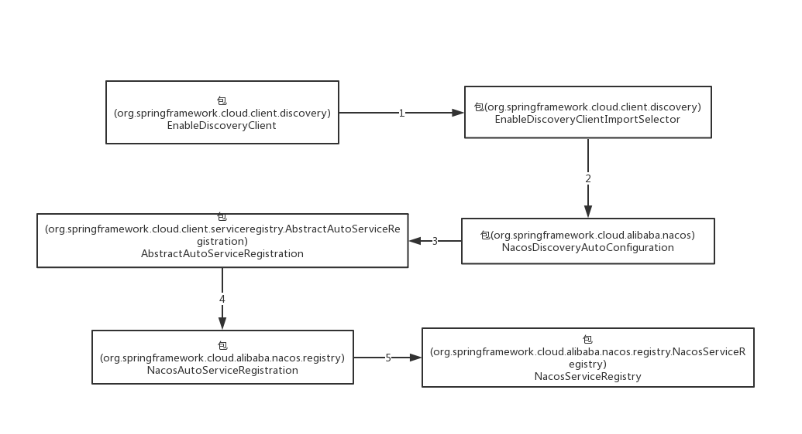
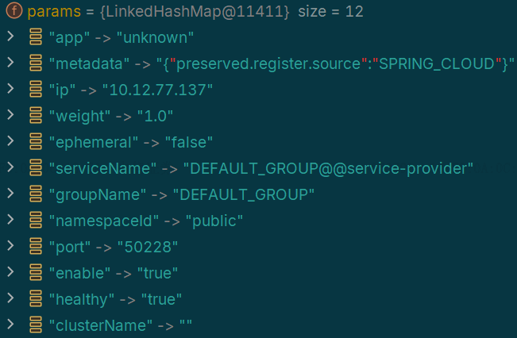
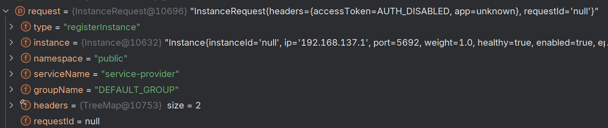
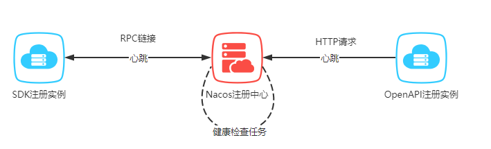

## 服务注册机制

[toc]

服务自动注册可以通过使用注解`EnableDiscoveryClient`实现。该注解本质上是在配置项中开启自动服务注册，第三方服务组件根据` Spring-Cloud-Commons`中的`discovery, serviceregistry`模块标准规范，读取配置，实现自己的服务发现和注册机制。

### 注解配置

* `EnableDiscoveryClient`注解的作用是手动引入选择器组件`EnableDiscoveryClientImportSelector`

```java
@Import(EnableDiscoveryClientImportSelector.class)
public @interface EnableDiscoveryClient {
	boolean autoRegister() default true;
}
```

* `EnableDiscoveryClientImportSelector`继承`SpringFactoryImportSelector` ，用于选择需要装配的配置类。`selectImports`将根据是否开启自动注册，决定是否导入配置类`AutoServiceRegistrationConfiguration`，是的配置项生效。

```java
public class EnableDiscoveryClientImportSelector extends SpringFactoryImportSelector<EnableDiscoveryClient> {
    // 选择需要装配的配置类
	@Override
	public String[] selectImports(AnnotationMetadata metadata) {
		String[] imports = super.selectImports(metadata);
		AnnotationAttributes attributes = AnnotationAttributes
				.fromMap(metadata.getAnnotationAttributes(getAnnotationClass().getName(), true));
		boolean autoRegister = attributes.getBoolean("autoRegister");
        // 是否开启自动注册
		if (autoRegister) {
			List<String> importsList = new ArrayList<>(Arrays.asList(imports));
            // 手动导入配置类AutoServiceRegistrationConfiguration
importsList.add("org.springframework.cloud.client.serviceregistry.AutoServiceRegistrationConfiguration");
			imports = importsList.toArray(new String[0]);
		}
		return imports;
	}
```

* `AutoServiceRegistrationConfiguration`的作用是将配置信息`AutoServiceRegistrationProperties`装配为Bean放入容器中，用于服务自动注册的配置数据源。

```java
@EnableConfigurationProperties(AutoServiceRegistrationProperties.class)
public class AutoServiceRegistrationConfiguration {
}
```

* `AutoServiceRegistrationProperties`中保存是否开启自动注册、管理类的配置信息，以及快速失败策略。

```java
@ConfigurationProperties("spring.cloud.service-registry.auto-registration")
public class AutoServiceRegistrationProperties {
    // 等价于添加配置型 spring.cloud.service-registry.auto-registration.enabled= true
	private boolean enabled = true;
	private boolean registerManagement = true;
	private boolean failFast = false;
}
```

### Nacos服务注册



#### 启动配置类

* Nacos主动注册的启动包`com.alibaba.cloud.nacos.discovery`的`META-INF/Spring/org.springframework.boot.autoconfigure.AutoConfiguration.imports`添加配置类信息

```
com.alibaba.cloud.nacos.registry.NacosServiceRegistryAutoConfiguration
```

* `META-INF/Spring/xxx.imports`为`SpringBoot3`新引入特性，作用和`Spring.factories`相似，都是在模块启动时加在装配指定的配置类。

* 自动注册配置类`NacosServiceRegistryAutoConfiguration`使用条件装配，当`spring.cloud.service-registry.auto-registration.enabled=true`时被装配，通过添加注解`EnableDiscoveryClient`，该配置项目已设置为`true`。

  生成Bean中`NacosServiceRegistry`用于执行向NacosServer执行注册操作，`NacosAutoServiceRegistration`接收`NacosServiceRegistry`作为构造器参数，用于在`WebServer`就绪时，调用`NacosServiceRegistry`完成自动注册。

```java
// AutoServiceRegistrationProperties配置了enabled=true，当前配置类将被装配
@ConditionalOnProperty(value = "spring.cloud.service-registry.auto-registration.enabled",
		matchIfMissing = true)
public class NacosServiceRegistryAutoConfiguration {
	@Bean
	public NacosServiceRegistry nacosServiceRegistry(
			NacosServiceManager nacosServiceManager,
			NacosDiscoveryProperties nacosDiscoveryProperties) {
		return new NacosServiceRegistry(nacosServiceManager, nacosDiscoveryProperties);
	}
	@Bean
	@ConditionalOnBean(AutoServiceRegistrationProperties.class)
	public NacosAutoServiceRegistration nacosAutoServiceRegistration(
			NacosServiceRegistry registry,
			AutoServiceRegistrationProperties autoServiceRegistrationProperties,
			NacosRegistration registration) {
		return new NacosAutoServiceRegistration(registry,
				autoServiceRegistrationProperties, registration);
	}
}
```

#### 注册行为发起

* 自动注册协调类`NacosAutoServiceRegistration`继承自`AbstractAutoServiceRegistration`。`AbstractAutoServiceRegistration`实现了`ApplicationListener`接口，用于监听服务就绪事件`WebServerInitializedEvent`。当事件发布时，触发服务注册，而注册的真正执行者为作为构造器参数传入的`NacosServiceRegistry`。

```java
public abstract class AbstractAutoServiceRegistration<R extends Registration>
		implements ApplicationListener<WebServerInitializedEvent> {
    // 监听服务就绪事件 WebServerInitializedEvent
	public void onApplicationEvent(WebServerInitializedEvent event) {
		this.port.compareAndSet(0, event.getWebServer().getPort());
		this.start();
	}
	// 委托NacosServiceRegistry完成注册
	protected void register() {
		this.serviceRegistry.register(getRegistration());
	}
}
```

* `NacosServiceRegistry`实现了 spring-cloud-commons 提供的 `ServiceRegistry` 接口，重写了register方法，在register 方法中将配置文件装换成Instance实例。在`NacosServiceRegistry#register`方法，在设置完服务ID、group后，调用命名服务器`NamingService#registerInstance` 方法注册服务实例。

```java
public class NacosServiceRegistry implements ServiceRegistry<Registration> {
	@Override
	public void register(Registration registration) {
        // 基本参数设置
		NamingService namingService = namingService();
		String serviceId = registration.getServiceId();
		String group = nacosDiscoveryProperties.getGroup();
		Instance instance = getNacosInstanceFromRegistration(registration);
		namingService.registerInstance(serviceId, group, instance);
	}
```

* 命名服务器`NamingService`为当前服务实例设置IP、port、负载均衡权重、集群名称后传递到下游的命名服务器客户端代理，执行`NamingHttpClientProxy#registerService`方法。

```java
public class NacosNamingService implements NamingService {
    public void registerInstance(String serviceName, String groupName, String ip, int port, String clusterName){
        // 设置基本参数
        Instance instance = new Instance();
        instance.setIp(ip);
        instance.setPort(port);
        instance.setWeight(1.0);
        instance.setClusterName(clusterName);
        registerInstance(serviceName, groupName, instance);
    }
```

#### 注册行为执行

* `NamingHttpClientProxy#registerService`方法中，将根据当前服务实例是否是临时实例（实例的生命周期通常由客户端的心跳机制来维持），以及NacosServer是否支持RPC协议，决定使用HTTP或者gRPC方式完成服务注册。

##### 使用HTTP协议

* 如果使用HTTP协议，将由`NamingHttpClientProxy`代理命名服务器客户端，根据当前服务实例构建HTTP请求头信息，传递到`callServer`方法，构建请求URL，并通过`NacosRestTemplate`向NacosServer发送服务注册请求，完成注册。

```java
public class NamingHttpClientProxy extends AbstractNamingClientProxy {
    public void registerService(String serviceName, String groupName, Instance instance) throws NacosException {
        // 请求头参数
        final Map<String, String> params = new HashMap<>(32);
        params.put(CommonParams.NAMESPACE_ID, namespaceId);
        params.put(CommonParams.SERVICE_NAME, groupedServiceName);
        params.put(CommonParams.GROUP_NAME, groupName);
        params.put(CommonParams.CLUSTER_NAME, instance.getClusterName());
        params.put(IP_PARAM, instance.getIp());
        params.put(PORT_PARAM, String.valueOf(instance.getPort()));
        params.put(WEIGHT_PARAM, String.valueOf(instance.getWeight()));
        params.put(REGISTER_ENABLE_PARAM, String.valueOf(instance.isEnabled()));
        params.put(HEALTHY_PARAM, String.valueOf(instance.isHealthy()));
        params.put(EPHEMERAL_PARAM, String.valueOf(instance.isEphemeral()));
        params.put(META_PARAM, JacksonUtils.toJson(instance.getMetadata()));
        reqApi(UtilAndComs.nacosUrlInstance, params, HttpMethod.POST);
    }
    
 public String callServer(String api, Map<String, String> params, Map<String, String> body, String curServer,
            String method) {
        String namespace = params.get(CommonParams.NAMESPACE_ID);
        String group = params.get(CommonParams.GROUP_NAME);
        String serviceName = params.get(CommonParams.SERVICE_NAME);
        params.putAll(getSecurityHeaders(namespace, group, serviceName));
        Header header = NamingHttpUtil.builderHeader();
        String url;
     	// 通过POST方法向服务注册地址 http://127.0.0.1:8848/nacos/v1/ns/instance 发起请求
        url = NamingHttpClientManager.getInstance().getPrefix() + curServer + api;
        HttpRestResult<String> restResult = nacosRestTemplate.exchangeForm(url, header,
                    Query.newInstance().initParams(params), body, method, String.class);
    }
}
```



##### 使用gRPC协议

* Nacos2.0新增gRPC协议作为默认的服务注册协议，`gRPC`使用`HTTP2`协议跟服务端建立长连接，相较于`HTTP`协议下频繁创建和销毁连接，使用gRPC协议可以降低服务器资源消耗，提升服务注册流程的性能。此时将由`NamingGrpcClientProxy`代理命名服务器客户端，完成服务注册。

```java
public class NamingGrpcClientProxy extends AbstractNamingClientProxy {
    
    public void registerService(String serviceName, String groupName, Instance instance) {
    if (instance.isEphemeral()) {
        // 临时实例
        registerServiceForEphemeral(serviceName, groupName, instance);
    } else {
        // 永久实例
        doRegisterServiceForPersistent(serviceName, groupName, instance);
    }
    
    private void registerServiceForEphemeral(String serviceName, String groupName, Instance instance){
     // 将服务实例存储到客户端缓存
    redoService.cacheInstanceForRedo(serviceName, groupName, instance);
    doRegisterService(serviceName, groupName, instance);
    }

    private <T extends Response> T requestToServer(AbstractNamingRequest request, Class<T> responseClass){
    Response response = null;
    request.putAllHeader(getSecurityHeaders(request.getNamespace(), request.getGroupName(), request.getServiceName()));
    }
}
    
```

* 对于临时实例将被缓存到客户端缓存，用于客户端与服务端重新建立连接时自动注册到服务端。之后进入`requestToServer`执行注册请求的发送，完成服务单位注册。注册请求中包含实例对象以及实例所对应的服务基本信息。




## 心跳保活

* 对于一个实例和健康状态相关的属性有：是否健康、是否开启、是否是临时实例。其中临时实例是指在服务注册时被标记为“短暂”的实例，会根据需求随时上线或者下线实例，此种实例的生命周期通常由客户端的心跳机制来维持。与之相对应好的是永久实例，该种实例将会一直在线，例如数据节点实例。

```java
public class Instance implements Serializable {
    private boolean healthy = true;
    private boolean enabled = true;
    // 是否是临时实例
    private boolean ephemeral = true;
}
```

### 临时实例保活机制

* 对于临时实例，实例通过 RPC/HTTP 连接向 Nacos 注册中心发送心跳，如果客户端和注册中心的连接断开，那么注册中心会主动剔除该 client 所注册的服
* NacosServer同时存在主动检测机制，`NacosServer`通过定时任务，每隔`3s`检查超过`20s`没有发送请求数据的连接。并向对应的客户端发送一个存活探测请求，如果请求不通或者响应失败，NacosServer将认为服务实例不可用，服务实例将从服务注册表中剔除。



### 永久实例保活机制

* 对于永久实例的的健康检查，Nacos 采用注册中心探测机制，注册中心会在持久化服务初始化时根据客户端选择的协议类型注册探活的定时任务。


Spring-Cloud-Commons 模块实现了一套规范，我们直接去看在服务发现的规范是什么？我们能够找到`DiscoveryClient`接口。

NacosDiscoveryClient 