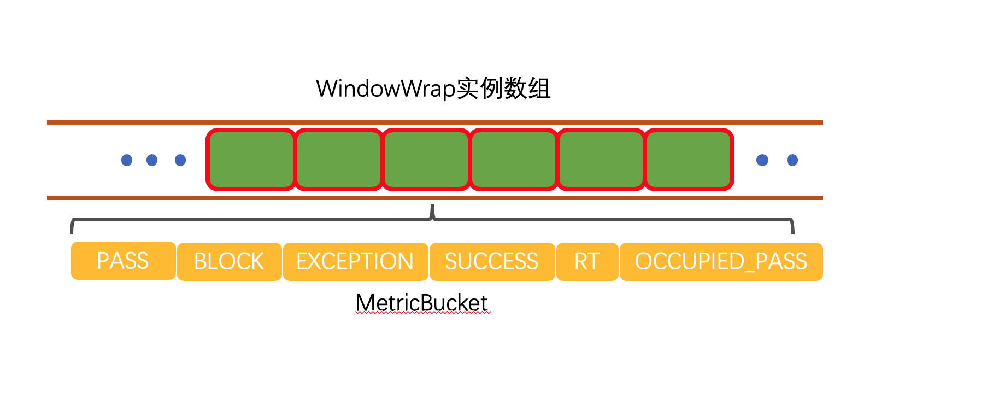
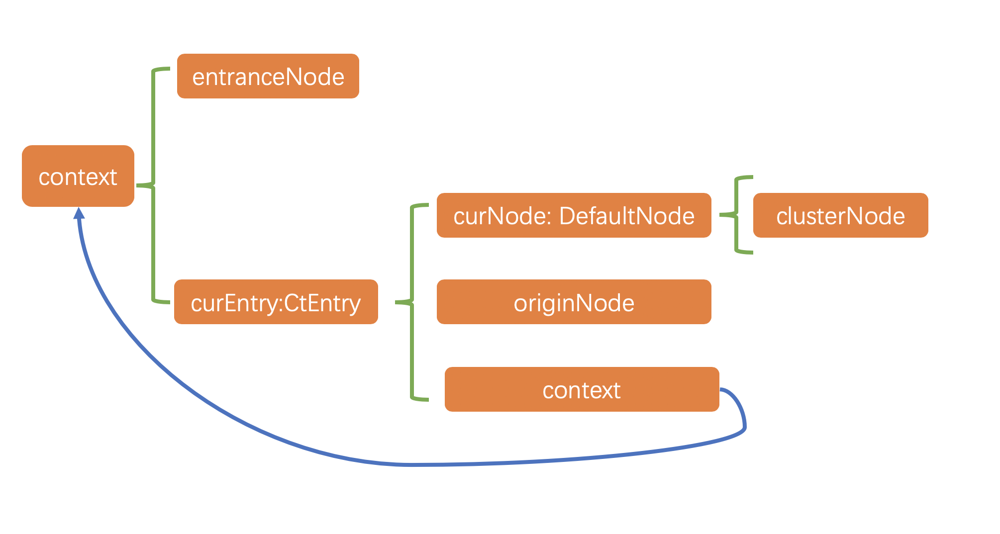
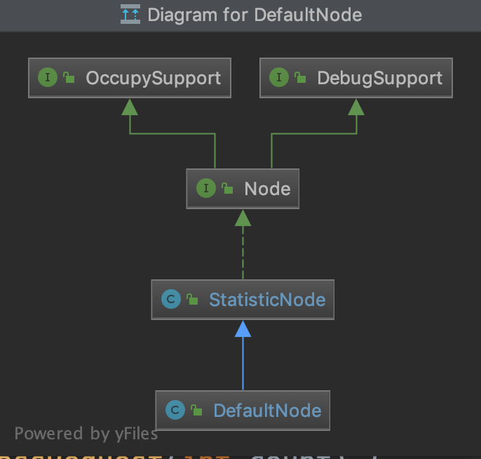

[](https://www.cnblogs.com/luozhiyun/)

[](https://www.cnblogs.com/luozhiyun/)

# [luozhiyun](https://www.cnblogs.com/luozhiyun)

- 
- [首页](https://www.cnblogs.com/luozhiyun/)
- [标签](https://www.cnblogs.com/luozhiyun/tag)
- [关于](https://www.luozhiyun.com/关于)
- [新随笔](https://i.cnblogs.com/EditPosts.aspx?opt=1)
- 
- 
- https://myblackboxrecorder.com/sentinel-reading-4/

# [1.Sentinel源码分析—FlowRuleManager加载规则做了什么？](https://www.cnblogs.com/luozhiyun/p/11439993.html)


分类: [Sentinel](https://www.cnblogs.com/luozhiyun/category/1538235.html) 标签: [Sentinel](https://www.cnblogs.com/luozhiyun/tag/Sentinel/)

最近我很好奇在RPC中限流熔断降级要怎么做，hystrix已经1年多没有更新了，感觉要被遗弃的感觉，那么我就把眼光聚焦到了阿里的Sentinel，顺便学习一下阿里的源代码。

这一章我主要讲的是FlowRuleManager在加载FlowRule的时候做了什么，下一篇正式讲Sentinel如何控制并发数的。

下面我给出一个简化版的demo，这个demo只能单线程访问，先把过程讲清楚再讲多线程版本。

初始化流量控制的规则：限定20个线程并发访问

```java
Copypublic class FlowThreadDemo {

    private static AtomicInteger pass = new AtomicInteger();
    private static AtomicInteger block = new AtomicInteger();
    private static AtomicInteger total = new AtomicInteger();
    private static AtomicInteger activeThread = new AtomicInteger();

    private static volatile boolean stop = false;
    private static final int threadCount = 100;

    private static int seconds = 60 + 40;
    private static volatile int methodBRunningTime = 2000;

    public static void main(String[] args) throws Exception {
        System.out.println(
            "MethodA will call methodB. After running for a while, methodB becomes fast, "
                + "which make methodA also become fast ");
        tick();
        initFlowRule();

        Entry methodA = null;
        try {
            TimeUnit.MILLISECONDS.sleep(5);
            methodA = SphU.entry("methodA");
            activeThread.incrementAndGet();
            //Entry methodB = SphU.entry("methodB");
            TimeUnit.MILLISECONDS.sleep(methodBRunningTime);
            //methodB.exit();
            pass.addAndGet(1);
        } catch (BlockException e1) {
            block.incrementAndGet();
        } catch (Exception e2) {
            // biz exception
        } finally {
            total.incrementAndGet();
            if (methodA != null) {
                methodA.exit();
                activeThread.decrementAndGet();
            }
        }
    }

    private static void initFlowRule() {
        List<FlowRule> rules = new ArrayList<FlowRule>();
        FlowRule rule1 = new FlowRule();
        rule1.setResource("methodA");
        // set limit concurrent thread for 'methodA' to 20
        rule1.setCount(20);
        rule1.setGrade(RuleConstant.FLOW_GRADE_THREAD);
        rule1.setLimitApp("default");

        rules.add(rule1);
        FlowRuleManager.loadRules(rules);
    }

    private static void tick() {
        Thread timer = new Thread(new TimerTask());
        timer.setName("sentinel-timer-task");
        timer.start();
    }

    static class TimerTask implements Runnable {

        @Override
        public void run() {
            long start = System.currentTimeMillis();
            System.out.println("begin to statistic!!!");

            long oldTotal = 0;
            long oldPass = 0;
            long oldBlock = 0;

            while (!stop) {
                try {
                    TimeUnit.SECONDS.sleep(1);
                } catch (InterruptedException e) {
                }
                long globalTotal = total.get();
                long oneSecondTotal = globalTotal - oldTotal;
                oldTotal = globalTotal;

                long globalPass = pass.get();
                long oneSecondPass = globalPass - oldPass;
                oldPass = globalPass;

                long globalBlock = block.get();
                long oneSecondBlock = globalBlock - oldBlock;
                oldBlock = globalBlock;

                System.out.println(seconds + " total qps is: " + oneSecondTotal);
                System.out.println(TimeUtil.currentTimeMillis() + ", total:" + oneSecondTotal
                    + ", pass:" + oneSecondPass
                    + ", block:" + oneSecondBlock
                    + " activeThread:" + activeThread.get());
                if (seconds-- <= 0) {
                    stop = true;
                }
                if (seconds == 40) {
                    System.out.println("method B is running much faster; more requests are allowed to pass");
                    methodBRunningTime = 20;
                }
            }

            long cost = System.currentTimeMillis() - start;
            System.out.println("time cost: " + cost + " ms");
            System.out.println("total:" + total.get() + ", pass:" + pass.get()
                + ", block:" + block.get());
            System.exit(0);
        }
    }
}
```

### FlowRuleManager[#](https://www.cnblogs.com/luozhiyun/p/11439993.html#615210328)

在这个demo中，首先会调用FlowRuleManager#loadRules进行规则注册
我们先聊一下规则配置的代码：

```java
Copyprivate static void initFlowRule() {
    List<FlowRule> rules = new ArrayList<FlowRule>();
    FlowRule rule1 = new FlowRule();
    rule1.setResource("methodA");
    // set limit concurrent thread for 'methodA' to 20
    rule1.setCount(20);
    rule1.setGrade(RuleConstant.FLOW_GRADE_THREAD);
    rule1.setLimitApp("default");

    rules.add(rule1);
    FlowRuleManager.loadRules(rules);
}
```

这段代码里面先定义一个**流量控制规则**，然后调用loadRules进行注册。

#### FlowRuleManager初始化[#](https://www.cnblogs.com/luozhiyun/p/11439993.html#4153147684)

**FlowRuleManager**
FlowRuleManager 类里面有几个静态参数：

```java
Copy//规则集合
private static final Map<String, List<FlowRule>> flowRules = new ConcurrentHashMap<String, List<FlowRule>>();
//监听器
private static final FlowPropertyListener LISTENER = new FlowPropertyListener();
//用来监听配置是否发生变化
private static SentinelProperty<List<FlowRule>> currentProperty = new DynamicSentinelProperty<List<FlowRule>>();

//创建一个延迟的线程池
@SuppressWarnings("PMD.ThreadPoolCreationRule")
private static final ScheduledExecutorService SCHEDULER = Executors.newScheduledThreadPool(1,
    new NamedThreadFactory("sentinel-metrics-record-task", true));

static {
    //设置监听
    currentProperty.addListener(LISTENER);
    //每一秒钟调用一次MetricTimerListener的run方法
    SCHEDULER.scheduleAtFixedRate(new MetricTimerListener(), 0, 1, TimeUnit.SECONDS);
}
```

在初始化的时候会为静态变量都赋上值。

在新建MetricTimerListener实例的时候做了很多事情，容我慢慢分析。

**MetricTimerListener**

```java
Copypublic class MetricTimerListener implements Runnable {

    private static final MetricWriter metricWriter = new MetricWriter(SentinelConfig.singleMetricFileSize(),
        SentinelConfig.totalMetricFileCount());
	   ....
}
```

首次初始化MetricTimerListener的时候会创建一个MetricWriter实例。我们先看传入的两个参数SentinelConfig.*singleMetricFileSize*()和SentinelConfig.*totalMetricFileCount*()。

SentinelConfig在首次初始化的时候会初始化静态代码块：

**SentinelConfig**

```java
Copystatic {
    try {
        initialize();
        loadProps();
        resolveAppType();
        RecordLog.info("[SentinelConfig] Application type resolved: " + appType);
    } catch (Throwable ex) {
        RecordLog.warn("[SentinelConfig] Failed to initialize", ex);
        ex.printStackTrace();
    }
}
```

这段静态代码块主要是设置一下配置参数。

**SentinelConfig#singleMetricFileSize**
**SentinelConfig#totalMetricFileCount**

```java
Copypublic static long singleMetricFileSize() {
    try {
        //获取的是 1024 * 1024 * 50
        return Long.parseLong(props.get(SINGLE_METRIC_FILE_SIZE));
    } catch (Throwable throwable) {
        RecordLog.warn("[SentinelConfig] Parse singleMetricFileSize fail, use default value: "
                + DEFAULT_SINGLE_METRIC_FILE_SIZE, throwable);
        return DEFAULT_SINGLE_METRIC_FILE_SIZE;
    }
}

public static int totalMetricFileCount() {
    try {
        //默认是：6
        return Integer.parseInt(props.get(TOTAL_METRIC_FILE_COUNT));
    } catch (Throwable throwable) {
        RecordLog.warn("[SentinelConfig] Parse totalMetricFileCount fail, use default value: "
                + DEFAULT_TOTAL_METRIC_FILE_COUNT, throwable);
        return DEFAULT_TOTAL_METRIC_FILE_COUNT;
    }
}
```

singleMetricFileSize方法和totalMetricFileCount主要是获取SentinelConfig在静态变量里设入得参数。

然后我们进入到MetricWriter的构造方法中：
**MetricWriter**

```java
Copypublic MetricWriter(long singleFileSize, int totalFileCount) {
    if (singleFileSize <= 0 || totalFileCount <= 0) {
        throw new IllegalArgumentException();
    }
    RecordLog.info(
            "[MetricWriter] Creating new MetricWriter, singleFileSize=" + singleFileSize + ", totalFileCount="
                    + totalFileCount);
    //  /Users/luozhiyun/logs/csp/
    this.baseDir = METRIC_BASE_DIR;
    File dir = new File(baseDir);
    if (!dir.exists()) {
        dir.mkdirs();
    }

    long time = System.currentTimeMillis();
    //转换成秒
    this.lastSecond = time / 1000;
    //singleFileSize = 1024 * 1024 * 50
    this.singleFileSize = singleFileSize;
    //totalFileCount = 6
    this.totalFileCount = totalFileCount;
    try {
        this.timeSecondBase = df.parse("1970-01-01 00:00:00").getTime() / 1000;
    } catch (Exception e) {
        RecordLog.warn("[MetricWriter] Create new MetricWriter error", e);
    }
}
```

构造器里面主要是创建文件夹，设置单个文件大小，总文件个数，设置时间。

讲完了MetricTimerListener的静态属性，现在我们来讲MetricTimerListener的run方法。

**MetricTimerListener#run**

```java
Copypublic void run() {
    //这个run方法里面主要是做定时的数据采集，然后写到log文件里去
    Map<Long, List<MetricNode>> maps = new TreeMap<Long, List<MetricNode>>();
    //遍历集群节点
    for (Entry<ResourceWrapper, ClusterNode> e : ClusterBuilderSlot.getClusterNodeMap().entrySet()) {
        String name = e.getKey().getName();
        ClusterNode node = e.getValue();
        Map<Long, MetricNode> metrics = node.metrics();
        aggregate(maps, metrics, name);
    }
    //汇总统计的数据
    aggregate(maps, Constants.ENTRY_NODE.metrics(), Constants.TOTAL_IN_RESOURCE_NAME);
    if (!maps.isEmpty()) {
        for (Entry<Long, List<MetricNode>> entry : maps.entrySet()) {
            try {
                //写入日志中
                metricWriter.write(entry.getKey(), entry.getValue());
            } catch (Exception e) {
                RecordLog.warn("[MetricTimerListener] Write metric error", e);
            }
        }
    }
}
```

上面的run方法其实就是每秒把统计的数据写到日志里去。其中`Constants.ENTRY_NODE.metrics()`负责统计数据，我们下面分析以下这个方法。

`Constants.ENTRY_NODE`这句代码会实例化一个ClusterNode实例。
ClusterNode是继承StatisticNode，统计数据时在StatisticNode中实现的。


Metrics方法也是调用的StatisticNode方法。

我们先看看**StatisticNode**的全局变量

```java
Copypublic class StatisticNode implements Node {
		//构建一个统计60s的数据，设置60个滑动窗口，每个窗口1s
		//这里创建的是BucketLeapArray实例来进行统计
		private transient volatile Metric rollingCounterInSecond = new ArrayMetric(SampleCountProperty.SAMPLE_COUNT,
    IntervalProperty.INTERVAL);
		//上次统计的时间戳
		private long lastFetchTime = -1;
		.....
}
```

然后我们看看StatisticNode的metrics方法：
**StatisticNode#metrics**

```java
Copypublic Map<Long, MetricNode> metrics() {
    // The fetch operation is thread-safe under a single-thread scheduler pool.
    long currentTime = TimeUtil.currentTimeMillis();
    //获取当前时间的滑动窗口的开始时间
    currentTime = currentTime - currentTime % 1000;
    Map<Long, MetricNode> metrics = new ConcurrentHashMap<>();
    //获取滑动窗口里统计的数据
    List<MetricNode> nodesOfEverySecond = rollingCounterInMinute.details();
    long newLastFetchTime = lastFetchTime;
    // Iterate metrics of all resources, filter valid metrics (not-empty and up-to-date).
    for (MetricNode node : nodesOfEverySecond) {
        //筛选符合的滑动窗口的节点
        if (isNodeInTime(node, currentTime) && isValidMetricNode(node)) {
            metrics.put(node.getTimestamp(), node);
            //选出符合节点里最大的时间戳数据赋值
            newLastFetchTime = Math.max(newLastFetchTime, node.getTimestamp());
        }
    }
    //设置成滑动窗口里统计的最大时间
    lastFetchTime = newLastFetchTime;

    return metrics;
}
```

这个方法主要是调用rollingCounterInMinute进行数据的统计，然后筛选出有效的统计结果返回。

我们进入到rollingCounterInMinute是ArrayMetric的实例，所以我们进入到ArrayMetric的details方法中

**ArrayMetric#details**

```java
Copypublic List<MetricNode> details() {
    List<MetricNode> details = new ArrayList<MetricNode>();
    //调用BucketLeapArray
    data.currentWindow();
    //列出统计结果
    List<WindowWrap<MetricBucket>> list = data.list();
    for (WindowWrap<MetricBucket> window : list) {
        if (window == null) {
            continue;
        }
        //对统计结果进行封装
        MetricNode node = new MetricNode();
        //代表一秒内被流量控制的请求数量
        node.setBlockQps(window.value().block());
        //则是一秒内业务本身异常的总和
        node.setExceptionQps(window.value().exception());
        // 代表一秒内到来到的请求
        node.setPassQps(window.value().pass());
        //代表一秒内成功处理完的请求；
        long successQps = window.value().success();
        node.setSuccessQps(successQps);
        //代表一秒内该资源的平均响应时间
        if (successQps != 0) {
            node.setRt(window.value().rt() / successQps);
        } else {
            node.setRt(window.value().rt());
        }
        //设置统计窗口的开始时间
        node.setTimestamp(window.windowStart());

        node.setOccupiedPassQps(window.value().occupiedPass());

        details.add(node);
    }

    return details;
}
```

这个方法首先会调用`dat.currentWindow（）`设置当前时间窗口到窗口列表里去。然后调用`data.list()`列出所有的窗口数据，然后遍历不为空的窗口数据封装成MetricNode返回。

data是BucketLeapArray的实例，BucketLeapArray继承了LeapArray，主要的统计都是在LeapArray中进行的，所以我们直接看看LeapArray的currentWindow方法。

**LeapArray#currentWindow**

```java
Copypublic WindowWrap<T> currentWindow(long timeMillis) {
    if (timeMillis < 0) {
        return null;
    }
    //通过当前时间判断属于哪个窗口
    int idx = calculateTimeIdx(timeMillis);
    //计算出窗口开始时间
    // Calculate current bucket start time.
    long windowStart = calculateWindowStart(timeMillis);

    while (true) {
        //获取数组里的老数据
        WindowWrap<T> old = array.get(idx);
        if (old == null) {
           
            WindowWrap<T> window = new WindowWrap<T>(windowLengthInMs, windowStart, newEmptyBucket(timeMillis));
            if (array.compareAndSet(idx, null, window)) {
                // Successfully updated, return the created bucket.
                return window;
            } else {
                // Contention failed, the thread will yield its time slice to wait for bucket available.
                Thread.yield();
            }
            // 如果对应时间窗口的开始时间与计算得到的开始时间一样
            // 那么代表当前即是我们要找的窗口对象，直接返回
        } else if (windowStart == old.windowStart()) {
             
            return old;
        } else if (windowStart > old.windowStart()) { 
            //如果当前的开始时间小于原开始时间，那么就更新到新的开始时间
            if (updateLock.tryLock()) {
                try {
                    // Successfully get the update lock, now we reset the bucket.
                    return resetWindowTo(old, windowStart);
                } finally {
                    updateLock.unlock();
                }
            } else {
                // Contention failed, the thread will yield its time slice to wait for bucket available.
                Thread.yield();
            }
        } else if (windowStart < old.windowStart()) {
            //一般来说不会走到这里
            // Should not go through here, as the provided time is already behind.
            return new WindowWrap<T>(windowLengthInMs, windowStart, newEmptyBucket(timeMillis));
        }
    }
}
```

这个方法里首先会传入一个timeMillis是当前的时间戳。然后调用calculateTimeIdx

```java
Copyprivate int calculateTimeIdx(/*@Valid*/ long timeMillis) {
    //计算当前时间能够落在array的那个节点上
    long timeId = timeMillis / windowLengthInMs;
    // Calculate current index so we can map the timestamp to the leap array.
    return (int)(timeId % array.length());
}
```

calculateTimeIdx方法用当前的时间戳除以每个窗口的大小，再和array数据取模。array数据是一个容量为60的数组，代表被统计的60秒分割的60个小窗口。

举例：
例如当前timeMillis = 1567175708975
timeId = 1567175708975/1000 = 1567175708
timeId % array.length() = 1567175708%60 = 8
也就是说当前的时间窗口是第八个。

然后调用calculateWindowStart计算当前时间开始时间

```java
Copyprotected long calculateWindowStart(/*@Valid*/ long timeMillis) {
    //用当前时间减去窗口大小，计算出窗口开始时间
    return timeMillis - timeMillis % windowLengthInMs;
}
```

接下来就是一个while循环：
在看while循环之前我们看一下array数组里面是什么样的对象
`WindowWrap<T> window = new WindowWrap<T>(windowLengthInMs, windowStart, newEmptyBucket(timeMillis));`
WindowWrap是一个时间窗口的包装对象，里面包含时间窗口的长度，这里是1000；窗口开始时间；窗口内的数据实体，是调用newEmptyBucket方法返回一个MetricBucket。

**MetricBucket**

```java
Copypublic class MetricBucket {

	private final LongAdder[] counters;
	//默认4900
	private volatile long minRt;

	public MetricBucket() {
	    MetricEvent[] events = MetricEvent.values();
	    this.counters = new LongAdder[events.length];
	    for (MetricEvent event : events) {
	        counters[event.ordinal()] = new LongAdder();
	    }
	    //初始化minRt，默认是4900
	    initMinRt();
	}
	...
}
```

MetricEvent是一个枚举类：

```java
Copypublic enum MetricEvent {
    PASS,
    BLOCK,
    EXCEPTION,
    SUCCESS,
    RT,
    OCCUPIED_PASS
}
```

也就是是MetricBucket为每个窗口通过一个内部数组counters统计了这个窗口内的所有数据。

接下来我们来讲一下while循环里所做的事情：

1. 从array里获取bucket节点
2. 如果节点已经存在，那么用CAS更新一个新的节点
3. 如果节点是新的，那么直接返回
4. 如果节点失效了，设置当前节点，清除所有失效节点

举例：

```yaml
Copy1. 如果array数据里面的bucket数据如下所示：
     B0       B1      B2    NULL      B4
 ||_______|_______|_______|_______|_______||___
 200     400     600     800     1000    1200  timestamp
                             ^
                          time=888
正好当前时间所对应的槽位里面的数据是空的，那么就用CAS更新

2. 如果array里面已经有数据了，并且槽位里面的窗口开始时间和当前的开始时间相等，那么直接返回
     B0       B1      B2     B3      B4
 ||_______|_______|_______|_______|_______||___
 200     400     600     800     1000    1200  timestamp
                             ^
                          time=888

3. 例如当前时间是1676，所对应窗口里面的数据的窗口开始时间小于当前的窗口开始时间，那么加上锁，然后设置槽位的窗口开始时间为当前窗口开始时间，并把槽位里面的数据重置
   (old)
             B0       B1      B2    NULL      B4
 |_______||_______|_______|_______|_______|_______||___
 ...    1200     1400    1600    1800    2000    2200  timestamp
                              ^
                           time=1676
```

所以上面的array数组大概是这样：



array数组由一个个的WindowWrap实例组成，WindowWrap实例里面由MetricBucket进行数据统计。

然后继续回到ArrayMetric的details方法，讲完了上面的`data.currentWindow()`，现在再来讲`data.list()`

list方法最后也会调用到LeapArray的list方法中：
**LeapArray#list**

```java
Copypublic List<WindowWrap<T>> list(long validTime) {
    int size = array.length();
    List<WindowWrap<T>> result = new ArrayList<WindowWrap<T>>(size);

    for (int i = 0; i < size; i++) {
        WindowWrap<T> windowWrap = array.get(i);
        //如果windowWrap节点为空或者当前时间戳比windowWrap的窗口开始时间大超过60s，那么就跳过
        //也就是说只要60s以内的数据
        if (windowWrap == null || isWindowDeprecated(validTime, windowWrap)) {
            continue;
        }
        result.add(windowWrap);
    }
    return result;
}
```

这个方法是用来把array里面都统计好的节点都找出来，并且是不为空，且是当前时间60秒内的数据。

最后Constants.*ENTRY_NODE*.metrics() 会返回所有符合条件的统计节点数据然后传入aggregate方法中，遍历为每个MetricNode节点设置Resource为*TOTAL_IN_RESOURCE_NAME*，封装好调用`metricWriter.write`进行写日志操作。

最后总结一下在初始化FlowRuleManager的时候做了什么：

1. FlowRuleManager在初始化的时候会调用静态代码块进行初始化

2. 在静态代码块内调用ScheduledExecutorService线程池，每隔1秒调用一次MetricTimerListener的run方法

3. MetricTimerListener会调用

    ```
    Constants.ENTRY_NODE.metrics()
    ```

    进行定时的统计

    1. 调用StatisticNode进行统计，统计60秒内的数据，并将60秒的数据分割成60个小窗口
    2. 在设置当前窗口的时候如果里面没有数据直接设置，如果存在数据并且是最新的直接返回，如果是旧数据，那么reset原来的统计数据
    3. 每个小窗口里面的数据由MetricBucket进行封装

4. 最后将统计好的数据通过*metricWriter*写入到log里去

#### FlowRuleManager加载规则[#](https://www.cnblogs.com/luozhiyun/p/11439993.html#1108937524)

FlowRuleManager是调用loadRules进行规则加载的：

**FlowRuleManager#loadRules**

```java
Copypublic static void loadRules(List<FlowRule> rules) {
    currentProperty.updateValue(rules);
}
```

currentProperty这个实例是在FlowRuleManager是在静态代码块里面进行加载的，上面我们讲过，生成的是DynamicSentinelProperty的实例。

我们进入到DynamicSentinelProperty的updateValue中：

```java
Copypublic boolean updateValue(T newValue) {
    //判断新的元素和旧元素是否相同
    if (isEqual(value, newValue)) {
        return false;
    }
    RecordLog.info("[DynamicSentinelProperty] Config will be updated to: " + newValue);

    value = newValue;
    for (PropertyListener<T> listener : listeners) {
        listener.configUpdate(newValue);
    }
    return true;
}
```

updateValue方法就是校验一下是不是已经存在相同的规则了，如果不存在那么就直接设置value等于新的规则，然后通知所有的监听器更新一下规则配置。

*currentProperty*实例里面的监听器会在FlowRuleManager初始化静态代码块的时候设置一个FlowPropertyListener监听器实例，FlowPropertyListener是FlowRuleManager的内部类：

```java
Copyprivate static final class FlowPropertyListener implements PropertyListener<List<FlowRule>> {

    @Override
    public void configUpdate(List<FlowRule> value) {
        Map<String, List<FlowRule>> rules = FlowRuleUtil.buildFlowRuleMap(value);
        if (rules != null) {
            flowRules.clear();
            //这个map的维度是key是Resource
            flowRules.putAll(rules);
        }
        RecordLog.info("[FlowRuleManager] Flow rules received: " + flowRules);
    }
	 ....
}
```

configUpdate首先会调用`FlowRuleUtil.buildFlowRuleMap（）`方法将所有的规则按resource分类，然后排序返回成map，然后将FlowRuleManager的原来的规则清空，放入新的规则集合到flowRules中去。

**FlowRuleUtil#buildFlowRuleMap**
这个方法最后会调用到FlowRuleUtil的另一个重载的方法：

```java
Copypublic static <K> Map<K, List<FlowRule>> buildFlowRuleMap(List<FlowRule> list, Function<FlowRule, K> groupFunction,
                                                          Predicate<FlowRule> filter, boolean shouldSort) {
    Map<K, List<FlowRule>> newRuleMap = new ConcurrentHashMap<>();
    if (list == null || list.isEmpty()) {
        return newRuleMap;
    }
    Map<K, Set<FlowRule>> tmpMap = new ConcurrentHashMap<>();

    for (FlowRule rule : list) {
        //校验必要字段：资源名，限流阈值， 限流阈值类型，调用关系限流策略，流量控制效果等
        if (!isValidRule(rule)) {
            RecordLog.warn("[FlowRuleManager] Ignoring invalid flow rule when loading new flow rules: " + rule);
            continue;
        }
        if (filter != null && !filter.test(rule)) {
            continue;
        }
        //应用名，如果没有则会使用default
        if (StringUtil.isBlank(rule.getLimitApp())) {
            rule.setLimitApp(RuleConstant.LIMIT_APP_DEFAULT);
        }
        //设置拒绝策略：直接拒绝、Warm Up、匀速排队，默认是DefaultController
        TrafficShapingController rater = generateRater(rule);
        rule.setRater(rater);

        //获取Resource名字
        K key = groupFunction.apply(rule);
        if (key == null) {
            continue;
        }
        //根据Resource进行分组
        Set<FlowRule> flowRules = tmpMap.get(key);

        if (flowRules == null) {
            // Use hash set here to remove duplicate rules.
            flowRules = new HashSet<>();
            tmpMap.put(key, flowRules);
        }

        flowRules.add(rule);
    }
    //根据ClusterMode LimitApp排序
    Comparator<FlowRule> comparator = new FlowRuleComparator();
    for (Entry<K, Set<FlowRule>> entries : tmpMap.entrySet()) {
        List<FlowRule> rules = new ArrayList<>(entries.getValue());
        if (shouldSort) {
            // Sort the rules.
            Collections.sort(rules, comparator);
        }
        newRuleMap.put(entries.getKey(), rules);
    }
    return newRuleMap;
}
```

这个方法首先校验传进来的rule集合不为空，然后遍历rule集合。对rule的必要字段进行校验，如果传入了过滤器那么校验过滤器，然后过滤resource为空的rule，最后相同的resource的rule都放到一起排序后返回。
注意这里默认生成的rater是DefaultController。

到这里FlowRuleManager已经分析完毕了，比较长。

0

[« ](https://www.cnblogs.com/luozhiyun/p/11413856.html)上一篇： [12.源码分析—如何为SOFARPC写一个序列化？](https://www.cnblogs.com/luozhiyun/p/11413856.html)
[» ](https://www.cnblogs.com/luozhiyun/p/11451557.html)下一篇： [2. Sentinel源码分析—Sentinel是如何进行流量统计的？](https://www.cnblogs.com/luozhiyun/p/11451557.html)

posted @ 2019-08-31 18:18 [luozhiyun](https://www.cnblogs.com/luozhiyun) 阅读(5128) 评论(0) [编辑](https://i.cnblogs.com/EditPosts.aspx?postid=11439993) [收藏](javascript:void(0)) [举报](javascript:void(0))


（评论功能已被禁用）

[](https://www.cnblogs.com/cmt/p/18358162)

**编辑推荐：**
· [一文搞懂应用架构的3个核心概念](https://www.cnblogs.com/tangshiye/p/18357630)
· [深入理解单元测试：技巧与最佳实践](https://www.cnblogs.com/crossoverJie/p/18361162)
· [数据裂变，数据库高可用架构设计实践](https://www.cnblogs.com/wzh2010/p/15886892.html)
· [聊一聊 Netty 数据搬运工 ByteBuf 体系的设计与实现](https://www.cnblogs.com/binlovetech/p/18358350)
· [［动画进阶］神奇的卡片 Hover 效果与 Blur 的特性探究](https://www.cnblogs.com/coco1s/p/18358267)

**阅读排行：**
· [花了一天时间帮财务朋友开发了一个实用小工具](https://www.cnblogs.com/xiezhr/p/18366585)
· [可以调用Null的实例方法吗？](https://www.cnblogs.com/artech/p/18362421/call_callvirt)
· [.NET 9发布的最后一个预览版Preview 7， 下个月发布RC](https://www.cnblogs.com/shanyou/p/18365522)
· [离线算法 莫队算法进阶](https://www.cnblogs.com/Ratio-Yinyue1007/p/18365270)
· [仅花一天时间，开发者重制 32 年前经典 Mac 应用！](https://www.cnblogs.com/jssst/p/18367055)

Copyright © 2024 luozhiyun
Powered by .NET 8.0 on Kubernetes

Powered By [Cnblogs](https://www.cnblogs.com/) | Theme [simple-color1.0.0](https://github.com/YJLAugus/cnblogs-theme-simple-color)[luozhiyun](https://www.cnblogs.com/luozhiyun)

- 
- [首页](https://www.cnblogs.com/luozhiyun/)
- [标签](https://www.cnblogs.com/luozhiyun/tag)
- [关于](https://www.luozhiyun.com/关于)
- [新随笔](https://i.cnblogs.com/EditPosts.aspx?opt=1)
- 
- 
- 

# [2. Sentinel源码分析—Sentinel是如何进行流量统计的？](https://www.cnblogs.com/luozhiyun/p/11451557.html)


undefinedundefined

这一篇我还是继续上一篇没有讲完的内容，先上一个例子：

```java
Copyprivate static final int threadCount = 100;

public static void main(String[] args) {
    initFlowRule();

    for (int i = 0; i < threadCount; i++) {
        Thread entryThread = new Thread(new Runnable() {
            @Override
            public void run() {
                while (true) {
                    Entry methodA = null;
                    try {
                        TimeUnit.MILLISECONDS.sleep(5);
                        methodA = SphU.entry("methodA");   
                    } catch (BlockException e1) {
                        // Block exception
                    } catch (Exception e2) {
                        // biz exception
                    } finally { 
                        if (methodA != null) {
                            methodA.exit(); 
                        }
                    }
                }
            }
        });
        entryThread.setName("working thread");
        entryThread.start();
    }
}


private static void initFlowRule() {
    List<FlowRule> rules = new ArrayList<FlowRule>();
    FlowRule rule1 = new FlowRule();
    rule1.setResource("methodA");
    // set limit concurrent thread for 'methodA' to 20
    rule1.setCount(20);
    rule1.setGrade(RuleConstant.FLOW_GRADE_THREAD);
    rule1.setLimitApp("default");

    rules.add(rule1);
    FlowRuleManager.loadRules(rules);
}
```

### SphU#entry[#](https://www.cnblogs.com/luozhiyun/p/11451557.html#1047719405)

我先把例子放上来

```java
CopyEntry methodA = null;
try { 
    methodA = SphU.entry("methodA");
	  // dosomething 
} catch (BlockException e1) {
    block.incrementAndGet();
} catch (Exception e2) {
    // biz exception
} finally {
    total.incrementAndGet();
    if (methodA != null) {
        methodA.exit(); 
    }
}
```

我们先进入到entry方法里面：
**SphU#entry**

```java
Copypublic static Entry entry(String name) throws BlockException {
    return Env.sph.entry(name, EntryType.OUT, 1, OBJECTS0);
}
```

这个方法里面会调用Env的sph静态方法，我们进入到Env里面看看

```java
Copypublic class Env {

    public static final Sph sph = new CtSph();

    static {
        // If init fails, the process will exit.
        InitExecutor.doInit();
    }
}
```

这个方法初始化的时候会调用`InitExecutor.doInit()`
**InitExecutor#doInit**

```java
Copypublic static void doInit() {
    //InitExecutor只会初始化一次，并且初始化失败会退出
    if (!initialized.compareAndSet(false, true)) {
        return;
    }
    try {
        //通过spi加载InitFunc子类，默认是MetricCallbackInit
        ServiceLoader<InitFunc> loader = ServiceLoader.load(InitFunc.class);
        List<OrderWrapper> initList = new ArrayList<OrderWrapper>();
        for (InitFunc initFunc : loader) {
            RecordLog.info("[InitExecutor] Found init func: " + initFunc.getClass().getCanonicalName());
            //由于这里只有一个loader里面只有一个子类，那么直接就返回initList里面包含一个元素的集合
            insertSorted(initList, initFunc);
        }
        for (OrderWrapper w : initList) {
            //这里调用MetricCallbackInit的init方法
            w.func.init();
            RecordLog.info(String.format("[InitExecutor] Executing %s with order %d",
                w.func.getClass().getCanonicalName(), w.order));
        }
    } catch (Exception ex) {
        RecordLog.warn("[InitExecutor] WARN: Initialization failed", ex);
        ex.printStackTrace();
    } catch (Error error) {
        RecordLog.warn("[InitExecutor] ERROR: Initialization failed with fatal error", error);
        error.printStackTrace();
    }
}
```

这个方法主要是通过spi加载InitFunc 的子类，默认是MetricCallbackInit。
然后会将MetricCallbackInit封装成OrderWrapper实例，然后遍历，调用
MetricCallbackInit的init方法：

**MetricCallbackInit#init**

```java
Copypublic void init() throws Exception {
    //添加回调函数
    //key是com.alibaba.csp.sentinel.metric.extension.callback.MetricEntryCallback
    StatisticSlotCallbackRegistry.addEntryCallback(MetricEntryCallback.class.getCanonicalName(),
            new MetricEntryCallback());
    //key是com.alibaba.csp.sentinel.metric.extension.callback.MetricExitCallback
StatisticSlotCallbackRegistry.addExitCallback(MetricExitCallback.class.getCanonicalName(),
            new MetricExitCallback());
} 
```

这个init方法就是注册了两个回调实例MetricEntryCallback和MetricExitCallback。

然后会通过调用`Env.sph.entry`会最后调用到CtSph的entry方法：

```java
Copypublic Entry entry(String name, EntryType type, int count, Object... args) throws BlockException {
    //这里name是Resource，type是out
    StringResourceWrapper resource = new StringResourceWrapper(name, type);
    //count是1 ，args是一个空数组
    return entry(resource, count, args);
}
```

这个方法会将resource和type封装成StringResourceWrapper实例，然后调用entry重载方法追踪到CtSph的entryWithPriority方法。

```java
Copy//这里传入得参数count是1，prioritized=false，args是容量为1的空数组
private Entry entryWithPriority(ResourceWrapper resourceWrapper, int count, boolean prioritized, Object... args)
        throws BlockException {
    //获取当前线程的上下文
    Context context = ContextUtil.getContext();
    if (context instanceof NullContext) {
        // The {@link NullContext} indicates that the amount of context has exceeded the threshold,
        // so here init the entry only. No rule checking will be done.
        return new CtEntry(resourceWrapper, null, context);
    }
    //为空的话，创建一个默认的context
    if (context == null) { //1
        // Using default context.
        context = MyContextUtil.myEnter(Constants.CONTEXT_DEFAULT_NAME, "", resourceWrapper.getType());
    }

    // Global switch is close, no rule checking will do.
    if (!Constants.ON) {//这里会返回false
        return new CtEntry(resourceWrapper, null, context);
    }
	  //2
    //创建一系列功能插槽
    ProcessorSlot<Object> chain = lookProcessChain(resourceWrapper);

    /*
     * Means amount of resources (slot chain) exceeds {@link Constants.MAX_SLOT_CHAIN_SIZE},
     * so no rule checking will be done.
     */
    //如果超过了插槽的最大数量，那么会返回null
    if (chain == null) {
        return new CtEntry(resourceWrapper, null, context);
    }

    Entry e = new CtEntry(resourceWrapper, chain, context);
    try {
		  //3
        //调用责任链
        chain.entry(context, resourceWrapper, null, count, prioritized, args);
    } catch (BlockException e1) {
        e.exit(count, args);
        throw e1;
    } catch (Throwable e1) {
        // This should not happen, unless there are errors existing in Sentinel internal.
        RecordLog.info("Sentinel unexpected exception", e1);
    }
    return e;
}
```

这个方法是最核心的方法，主要做了三件事：

1. 如果context为null则创建一个新的
2. 通过责任链方式创建功能插槽
3. 调用责任链插槽

在讲创建context之前我们先看一下ContextUtil这个类初始化的时候会做什么

**ContextUtil**

```java
Copy/**
 * Holds all {@link EntranceNode}. Each {@link EntranceNode} is associated with a distinct context name.
 */
private static volatile Map<String, DefaultNode> contextNameNodeMap = new HashMap<>(); 
static {
    // Cache the entrance node for default context.
    initDefaultContext();
}

private static void initDefaultContext() {
    String defaultContextName = Constants.CONTEXT_DEFAULT_NAME;
    //初始化一个sentinel_default_context，type为in的队形
    EntranceNode node = new EntranceNode(new StringResourceWrapper(defaultContextName, EntryType.IN), null);
    //Constants.ROOT会初始化一个name是machine-root，type=IN的对象
    Constants.ROOT.addChild(node);
    //所以现在map里面有一个key=CONTEXT_DEFAULT_NAME的对象
    contextNameNodeMap.put(defaultContextName, node);
} 
```

ContextUtil在初始化的时候会先调用*initDefaultContext*方法。通过`Constants.ROOT`创建一个root节点，然后将创建的node作为root的子节点入队，然后将node节点put到*contextNameNodeMap*中
结构如下：

```makefile
CopyConstants.ROOT:
					machine-root(EntryType#IN)
						/
					  /
			sentinel_default_context(EntryType#IN)
```

现在我们再回到entryWithPriority方法中：

```verilog
Copyif (context == null) {//1
    // Using default context.
    context = MyContextUtil.myEnter(Constants.CONTEXT_DEFAULT_NAME, "", resourceWrapper.getType());
}
```

如果context为空，那么会调用`MyContextUtil.myEnter`创建一个新的context，这个方法最后会调用到`ContextUtil.trueEnter`方法中进行创建。

```java
Copyprotected static Context trueEnter(String name, String origin) {
    Context context = contextHolder.get();
    if (context == null) {
        Map<String, DefaultNode> localCacheNameMap = contextNameNodeMap;
        DefaultNode node = localCacheNameMap.get(name);
        if (node == null) {
            //如果为null的话，检查contextNameNodeMap的size是不是超过2000
            if (localCacheNameMap.size() > Constants.MAX_CONTEXT_NAME_SIZE) {
                setNullContext();
                return NULL_CONTEXT;
            } else {
                // 重复initDefaultContext方法的内容
                try {
                    LOCK.lock();
                    node = contextNameNodeMap.get(name);
                    if (node == null) {
                        if (contextNameNodeMap.size() > Constants.MAX_CONTEXT_NAME_SIZE) {
                            setNullContext();
                            return NULL_CONTEXT;
                        } else {
                            node = new EntranceNode(new StringResourceWrapper(name, EntryType.IN), null);
                            // Add entrance node.
                            Constants.ROOT.addChild(node);

                            Map<String, DefaultNode> newMap = new HashMap<>(contextNameNodeMap.size() + 1);
                            newMap.putAll(contextNameNodeMap);
                            newMap.put(name, node);
                            contextNameNodeMap = newMap;
                        }
                    }
                } finally {
                    LOCK.unlock();
                }
            }
        }
        context = new Context(node, name);
        context.setOrigin(origin);
        contextHolder.set(context);
    }

    return context;
}
```

在trueEnter方法中会做一个校验，如果*contextNameNodeMap*中的数量已经超过了2000，那么会返回一个*NULL_CONTEXT*。由于我们在initDefaultContext中已经初始化过了node节点，所以这个时候直接根据name获取node节点放入到*contextHolder*中。

创建完了context之后我们再回到entryWithPriority方法中继续往下走：

```javascript
Copy//创建一系列功能插槽
ProcessorSlot<Object> chain = lookProcessChain(resourceWrapper);
```

通过调用lookProcessChain方法会创建功能插槽

**CtSph#lookProcessChain**

```java
CopyProcessorSlot<Object> lookProcessChain(ResourceWrapper resourceWrapper) {
    //根据resourceWrapper初始化插槽
    ProcessorSlotChain chain = chainMap.get(resourceWrapper);
    if (chain == null) {
        synchronized (LOCK) {
            chain = chainMap.get(resourceWrapper);
            if (chain == null) {
                // Entry size limit.最大插槽数量为6000
                if (chainMap.size() >= Constants.MAX_SLOT_CHAIN_SIZE) {
                    return null;
                }
                //初始化新的插槽
                chain = SlotChainProvider.newSlotChain();
                Map<ResourceWrapper, ProcessorSlotChain> newMap = new HashMap<ResourceWrapper, ProcessorSlotChain>(
                        chainMap.size() + 1);
                newMap.putAll(chainMap);
                newMap.put(resourceWrapper, chain);
                chainMap = newMap;
            }
        }
    }
    return chain;
}
```

这里会调用`SlotChainProvider.newSlotChain`进行插槽的初始化。

**SlotChainProvider#newSlotChain**

```java
Copypublic static ProcessorSlotChain newSlotChain() {
    if (slotChainBuilder != null) {
        return slotChainBuilder.build();
    }
    //根据spi初始化slotChainBuilder，默认是DefaultSlotChainBuilder
    resolveSlotChainBuilder();

    if (slotChainBuilder == null) {
        RecordLog.warn("[SlotChainProvider] Wrong state when resolving slot chain builder, using default");
        slotChainBuilder = new DefaultSlotChainBuilder();
    }
    return slotChainBuilder.build();
}
```

默认调用DefaultSlotChainBuilder的build方法进行初始化

**DefaultSlotChainBuilder#build**

```java
Copypublic ProcessorSlotChain build() {
    ProcessorSlotChain chain = new DefaultProcessorSlotChain();
    //创建Node节点
    chain.addLast(new NodeSelectorSlot());
    //用于构建资源的 ClusterNode  
    chain.addLast(new ClusterBuilderSlot());
    chain.addLast(new LogSlot());
    //用于统计实时的调用数据
    chain.addLast(new StatisticSlot());
    //用于对入口的资源进行调配
    chain.addLast(new SystemSlot());
    chain.addLast(new AuthoritySlot());
    //用于限流
    chain.addLast(new FlowSlot());
    //用于降级
    chain.addLast(new DegradeSlot());
    return chain;
}
```

DefaultProcessorSlotChain里面会创建一个头节点，然后把其他节点通过addLast串成一个链表：


最后我们再回到CtSph的entryWithPriority方法中，往下走调用`chain.entry`方法触发调用链。

### Context[#](https://www.cnblogs.com/luozhiyun/p/11451557.html#1669991237)

在往下看Slot插槽之前，我们先总结一下Context是怎样的一个结构：



在Sentinel中，所有的统计操作都是基于context来进行的。context会通过ContextUtil的trueEnter方法进行创建，会根据context的不同的name来组装不同的Node来实现数据的统计。

在经过NodeSelectorSlot的时候会根据传入的不同的context的name字段来获取不同的DefaultNode对象，然后设置到context的curEntry实例的curNode属性中。

**NodeSelectorSlot#entry**

```java
Copypublic void entry(Context context, ResourceWrapper resourceWrapper, Object obj, int count, boolean prioritized, Object... args)
    throws Throwable {
    DefaultNode node = map.get(context.getName());
    if (node == null) {
        synchronized (this) {
            node = map.get(context.getName());
            if (node == null) {
                node = new DefaultNode(resourceWrapper, null);
                HashMap<String, DefaultNode> cacheMap = new HashMap<String, DefaultNode>(map.size());
                cacheMap.putAll(map);
                cacheMap.put(context.getName(), node);
                map = cacheMap;
                // Build invocation tree
                ((DefaultNode) context.getLastNode()).addChild(node);
            }

        }
    }
	 //设置到context的curEntry实例的curNode属性中
    context.setCurNode(node);
    fireEntry(context, resourceWrapper, node, count, prioritized, args);
}
```

然后再经过ClusterBuilderSlot槽位在初始化的时候会初始化一个静态的全局clusterNodeMap用来记录所有的ClusterNode，维度是ResourceWrapper。每次调用entry方法的时候会先去全局的clusterNodeMap，找不到就会创建一个新的clusterNode，放入到node的ClusterNode属性中，用来统计ResourceWrapper维度下面的所有数据。

```java
Copy//此变量是静态的，所以只会初始化一次，存有所有的ResourceWrapper维度下的数据
private static volatile Map<ResourceWrapper, ClusterNode> clusterNodeMap = new HashMap<>();

public void entry(Context context, ResourceWrapper resourceWrapper, DefaultNode node, int count,
                  boolean prioritized, Object... args)
    throws Throwable {
    if (clusterNode == null) {
        synchronized (lock) {
            if (clusterNode == null) {
                // Create the cluster node.
                clusterNode = new ClusterNode();
                HashMap<ResourceWrapper, ClusterNode> newMap = new HashMap<>(Math.max(clusterNodeMap.size(), 16));
                newMap.putAll(clusterNodeMap);
                newMap.put(node.getId(), clusterNode);

                clusterNodeMap = newMap;
            }
        }
    }
    node.setClusterNode(clusterNode);
 
    if (!"".equals(context.getOrigin())) {
        Node originNode = node.getClusterNode().getOrCreateOriginNode(context.getOrigin());
        context.getCurEntry().setOriginNode(originNode);
    } 
    fireEntry(context, resourceWrapper, node, count, prioritized, args);
}
```

### StatisticSlot[#](https://www.cnblogs.com/luozhiyun/p/11451557.html#3214369347)

```java
Copypublic void entry(Context context, ResourceWrapper resourceWrapper, DefaultNode node, int count,
                  boolean prioritized, Object... args) throws Throwable {
    try {
        //先直接往下调用，如果没有报错则进行统计
        // Do some checking.
        fireEntry(context, resourceWrapper, node, count, prioritized, args);

        //当前线程数加1
        // Request passed, add thread count and pass count.
        node.increaseThreadNum();
        //通过的请求加上count
        node.addPassRequest(count); 
 			...
    } catch (PriorityWaitException ex) {
        node.increaseThreadNum(); 
			...
    } catch (BlockException e) {
        //设置错误信息
        // Blocked, set block exception to current entry.
        context.getCurEntry().setError(e);
			...
        //设置被阻塞的次数
        // Add block count.
        node.increaseBlockQps(count); 
			...
        throw e;
    } catch (Throwable e) {
        // Unexpected error, set error to current entry.
        context.getCurEntry().setError(e);

        //设置异常的次数
        // This should not happen.
        node.increaseExceptionQps(count); 
			...
        throw e;
    }
}
```

这段代码中，我把不相关的代码都省略了，不影响我们的主流程。
在entry方法里面，首先是往下继续调用，根据其他的节点的情况来进行统计，比如抛出异常，那么就统计ExceptionQps，被阻塞那么就统计BlockQps，直接通过，那么就统计PassRequest。

我们先看一下线程数是如何统计的：`node.increaseThreadNum()`

**DefaultNode#increaseThreadNum**
我们先看一下DefaultNode的继承关系：


```java
Copypublic void increaseThreadNum() {
    super.increaseThreadNum();
    this.clusterNode.increaseThreadNum();
}
```

所以`super.increaseThreadNum`是调用到了父类的increaseThreadNum方法。

`this.clusterNode.increaseThreadNum()`这句代码和`super.increaseThreadNum`是一样的使用方式，所以看看StatisticNode的increaseThreadNum方法就好了

**StatisticNode#increaseThreadNum**

```java
Copyprivate LongAdder curThreadNum = new LongAdder();

public void decreaseThreadNum() {
    curThreadNum.increment();
}
```

这个方法很简单，每次都直接使用LongAdder的api加1就好了，最后会在退出的时候减1，使用LongAdder也保证了原子性。

如果请求通过的时候会继续往下调用`node.addPassRequest`：

**DefaultNode#addPassRequest**

```java
Copypublic void addPassRequest(int count) {
    super.addPassRequest(count);
    this.clusterNode.addPassRequest(count);
}
```

这句代码也是调用了StatisticNode的addPassRequest方法进行统计的。

**StatisticNode#addPassRequest**

```java
Copypublic void addPassRequest(int count) {
    rollingCounterInSecond.addPass(count);
    rollingCounterInMinute.addPass(count);
}
```

这段代码里面有两个调用，一个是按分钟统计的，一个是按秒统计的。因为我们这里是使用的FlowRuleManager所以是会记录按分钟统计的。具体是怎么初始化，以及怎么打印统计日志的可以看看我上一篇分析：[1.Sentinel源码分析—FlowRuleManager加载规则做了什么？](https://www.cnblogs.com/luozhiyun/p/11439993.html)，我这里不再赘述。

所以我们直接看看`rollingCounterInMinute.addPass(count)`这句代码就好了，这句代码会直接调用ArrayMetric的addPass方法。

**ArrayMetric#addPass**

```java
Copypublic void addPass(int count) {
    //获取当前的时间窗口
    WindowWrap<MetricBucket> wrap = data.currentWindow();
    //窗口内的pass加1
    wrap.value().addPass(count);
}
```

这里会首先调用currentWindow获取当前的时间窗口WindowWrap，然后调用调用窗口内的MetricBucket的addPass方法加1，我继续拿我上一篇文章的图过来说明：


我面来到MetricBucket的addPass方法：
**MetricBucket#addPass**

```java
Copypublic void addPass(int n) {
    add(MetricEvent.PASS, n);
}

public MetricBucket add(MetricEvent event, long n) {
    counters[event.ordinal()].add(n);
    return this;
}
```

addPass方法会使用枚举类然后将counters数组内的pass槽位的值加n；counters数组是LongAdder数组，所以也不会有线程安全问题。

node.increaseBlockQps和node.increaseExceptionQps代码也是一样的，大家可以自行去看看。

### FlowSlot[#](https://www.cnblogs.com/luozhiyun/p/11451557.html#3401600406)

FlowSlot可以根据预先设置的规则来判断一个请求是否应该被通过。

**FlowSlot**

```java
Copyprivate final FlowRuleChecker checker;

public FlowSlot() {
    this(new FlowRuleChecker());
}

public void entry(Context context, ResourceWrapper resourceWrapper, DefaultNode node, int count,
                  boolean prioritized, Object... args) throws Throwable {
    checkFlow(resourceWrapper, context, node, count, prioritized);

    fireEntry(context, resourceWrapper, node, count, prioritized, args);
}

void checkFlow(ResourceWrapper resource, Context context, DefaultNode node, int count, boolean prioritized)
    throws BlockException {
    checker.checkFlow(ruleProvider, resource, context, node, count, prioritized);
}
```

FlowSlot在实例化的时候会设置一个规则检查器，然后在调用entry方法的时候会调用规则检查器的checkFlow方法

我们进入到FlowRuleChecker的checkFlow 方法中：
**FlowRuleChecker#checkFlow**

```java
Copypublic void checkFlow(Function<String, Collection<FlowRule>> ruleProvider, ResourceWrapper resource,
                      Context context, DefaultNode node, int count, boolean prioritized) throws BlockException {
    if (ruleProvider == null || resource == null) {
        return;
    }
    //返回FlowRuleManager里面注册的所有规则
    Collection<FlowRule> rules = ruleProvider.apply(resource.getName());
    if (rules != null) {
        for (FlowRule rule : rules) {
            //如果当前的请求不能通过，那么就抛出FlowException异常
            if (!canPassCheck(rule, context, node, count, prioritized)) {
                throw new FlowException(rule.getLimitApp(), rule);
            }
        }
    }
}

private final Function<String, Collection<FlowRule>> ruleProvider = new Function<String, Collection<FlowRule>>() {
    @Override
    public Collection<FlowRule> apply(String resource) {
        // Flow rule map should not be null.
        Map<String, List<FlowRule>> flowRules = FlowRuleManager.getFlowRuleMap();
        return flowRules.get(resource);
    }
};
```

checkFlow这个方法就是过去所有的规则然后根据规则进行过滤。主要的过滤操作是在canPassCheck中进行的。

**FlowRuleChecker#canPassCheck**

```java
Copypublic boolean canPassCheck(/*@NonNull*/ FlowRule rule, Context context, DefaultNode node, int acquireCount,
                                         boolean prioritized) {
    //如果没有设置limitapp，那么不进行校验，默认会给个defualt
    String limitApp = rule.getLimitApp();
    if (limitApp == null) {
        return true;
    }
    //集群模式
    if (rule.isClusterMode()) {
        return passClusterCheck(rule, context, node, acquireCount, prioritized);
    }
    //本地模式
    return passLocalCheck(rule, context, node, acquireCount, prioritized);
}
```

这个方法首先会校验limitApp，然后判断是集群模式还是本地模式，我们这里暂时分析本地模式。

**FlowRuleChecker#passLocalCheck**

```java
Copyprivate static boolean passLocalCheck(FlowRule rule, Context context, DefaultNode node, int acquireCount,
                                      boolean prioritized) {
    //节点选择
    Node selectedNode = selectNodeByRequesterAndStrategy(rule, context, node);
    if (selectedNode == null) {
        return true;
    }
    //根据设置的规则来拦截
    return rule.getRater().canPass(selectedNode, acquireCount, prioritized);
}
```

本地模式中，首先会调用selectNodeByRequesterAndStrategy进行节点选择，根据不同的模式选择不同的节点，然后调用规则控制器的canPass方法进行拦截。

**FlowRuleChecker#selectNodeByRequesterAndStrategy**

```java
Copystatic Node selectNodeByRequesterAndStrategy(/*@NonNull*/ FlowRule rule, Context context, DefaultNode node) {
    // The limit app should not be empty.
    String limitApp = rule.getLimitApp();
    //关系限流策略
    int strategy = rule.getStrategy();

    String origin = context.getOrigin();
    //origin不为`default` or `other`，并且limitApp和origin相等
    if (limitApp.equals(origin) && filterOrigin(origin)) {//1
        if (strategy == RuleConstant.STRATEGY_DIRECT) {
            // Matches limit origin, return origin statistic node.
            return context.getOriginNode();
        }
        //关系限流策略为关联或者链路的处理
        return selectReferenceNode(rule, context, node);
    } else if (RuleConstant.LIMIT_APP_DEFAULT.equals(limitApp)) {//2
        if (strategy == RuleConstant.STRATEGY_DIRECT) {
            //这里返回ClusterNode，表示所有应用对该资源的所有请求情况
            // Return the cluster node.
            return node.getClusterNode();
        }
        //关系限流策略为关联或者链路的处理
        return selectReferenceNode(rule, context, node);
    } else if (RuleConstant.LIMIT_APP_OTHER.equals(limitApp)
        && FlowRuleManager.isOtherOrigin(origin, rule.getResource())) {//3
        if (strategy == RuleConstant.STRATEGY_DIRECT) {
            return context.getOriginNode();
        }
        //关系限流策略为关联或者链路的处理
        return selectReferenceNode(rule, context, node);
    }

    return null;
}
```

这个方法主要是用来根据控制根据不同的规则，获取不同的node进行数据的统计。

- 在标记1中表示，如果流控规则配置了来源应用且不是"default"或者"other"这种特殊值，那么这种时候该规则就只对配置的来源应用生效。
- 在标记2中表示，limitApp是"default"，代表针对所有应用进行统计。
- 标记7中，这个是"other"值的处理，假设当前请求来源不在当前规则的limitApp中，则进行下面的处理。

我这里引用官方文档的一段话进行解释：

```cpp
Copydefault：表示不区分调用者，来自任何调用者的请求都将进行限流统计。如果这个资源名的调用总和超过了这条规则定义的阈值，则触发限流。

{some_origin_name}：表示针对特定的调用者，只有来自这个调用者的请求才会进行流量控制。例如 NodeA 配置了一条针对调用者caller1的规则，那么当且仅当来自 caller1 对 NodeA 的请求才会触发流量控制。

other：表示针对除 {some_origin_name} 以外的其余调用方的流量进行流量控制。例如，资源NodeA配置了一条针对调用者 caller1 的限流规则，同时又配置了一条调用者为 other 的规则，那么任意来自非 caller1 对 NodeA 的调用，都不能超过 other 这条规则定义的阈值

同一个资源名可以配置多条规则，规则的生效顺序为：{some_origin_name} > other > default
```

然后返回到passLocalCheck方法中，继续往下走，调用`rule.getRater()`，我们这里没有指定特殊的rater，所以返回的是DefaultController。

**DefaultController#canPass**

```java
Copypublic boolean canPass(Node node, int acquireCount, boolean prioritized) {
    //判断是限流还是限制并发数量，然后获取流量或并发数量
    int curCount = avgUsedTokens(node);
    //如果两者相加大于限定的并发数
    if (curCount + acquireCount > count) {
        ... 
        return false;
    }
    return true;
}
```

这里首先调用avgUsedTokens，根据grade判断当前的规则是QPS限流还是线程数限流，如果两者之和大于count，那么返回false。

返回false之后会回到FlowRuleChecker的checkFlow方法，抛出FlowException异常。

到这里Sentinel的主流程就分析完毕了。

1

[« ](https://www.cnblogs.com/luozhiyun/p/11439993.html)上一篇： [1.Sentinel源码分析—FlowRuleManager加载规则做了什么？](https://www.cnblogs.com/luozhiyun/p/11439993.html)
[» ](https://www.cnblogs.com/luozhiyun/p/11478955.html)下一篇： [Kafka笔记—可靠性、幂等性和事务](https://www.cnblogs.com/luozhiyun/p/11478955.html)

posted @ 2019-09-03 10:37 [luozhiyun](https://www.cnblogs.com/luozhiyun) 阅读(3828) 评论(0) [编辑](https://i.cnblogs.com/EditPosts.aspx?postid=11451557) [收藏](javascript:void(0)) [举报](javascript:void(0))


（评论功能已被禁用）

[](https://www.cnblogs.com/cmt/p/18356718)

**编辑推荐：**
· [一文搞懂应用架构的3个核心概念](https://www.cnblogs.com/tangshiye/p/18357630)
· [深入理解单元测试：技巧与最佳实践](https://www.cnblogs.com/crossoverJie/p/18361162)
· [数据裂变，数据库高可用架构设计实践](https://www.cnblogs.com/wzh2010/p/15886892.html)
· [聊一聊 Netty 数据搬运工 ByteBuf 体系的设计与实现](https://www.cnblogs.com/binlovetech/p/18358350)
· [［动画进阶］神奇的卡片 Hover 效果与 Blur 的特性探究](https://www.cnblogs.com/coco1s/p/18358267)

**阅读排行：**
· [北漂日志第1话：惨淡销量、后续发展](https://www.cnblogs.com/ahmad/p/18364774)
· [花了一天时间帮财务朋友开发了一个实用小工具](https://www.cnblogs.com/xiezhr/p/18366585)
· [可以调用Null的实例方法吗？](https://www.cnblogs.com/artech/p/18362421/call_callvirt)
· [.NET 9发布的最后一个预览版Preview 7， 下个月发布RC](https://www.cnblogs.com/shanyou/p/18365522)
· [离线算法 莫队算法进阶](https://www.cnblogs.com/Ratio-Yinyue1007/p/18365270)

Copyright © 2024 luozhiyun
Powered by .NET 8.0 on Kubernetes

Powered By [Cnblogs](https://www.cnblogs.com/) | Theme [simple-color1.0.0](https://github.com/YJLAugus/cnblogs-theme-simple-color)

[](https://www.cnblogs.com/luozhiyun/)

# [luozhiyun](https://www.cnblogs.com/luozhiyun)

- 
- [首页](https://www.cnblogs.com/luozhiyun/)
- [标签](https://www.cnblogs.com/luozhiyun/tag)
- [关于](https://www.luozhiyun.com/关于)
- [新随笔](https://i.cnblogs.com/EditPosts.aspx?opt=1)
- 
- 
- 

# [3. Sentinel源码分析— QPS流量控制是如何实现的？](https://www.cnblogs.com/luozhiyun/p/11489128.html)


undefinedundefined

终于在这周内写了一篇源码解析，每周一篇即使再忙也不能打破

Sentinel源码解析系列：
[1.Sentinel源码分析—FlowRuleManager加载规则做了什么？](https://www.cnblogs.com/luozhiyun/p/11439993.html)
[2. Sentinel源码分析—Sentinel是如何进行流量统计的？](https://www.cnblogs.com/luozhiyun/p/11451557.html)

------

上回我们用基于并发数来讲了一下Sentinel的整个流程，这篇文章我们来讲一下Sentinel的QPS流量控制是如何实现的。

先上一个极简的demo，我们的代码就从这个demo入手：

```java
Copypublic static void main(String[] args) {
    List<FlowRule> rules = new ArrayList<FlowRule>();
    FlowRule rule1 = new FlowRule();
    rule1.setResource("abc"); 
    rule1.setCount(20);
    rule1.setGrade(RuleConstant.FLOW_GRADE_QPS);
    rule1.setLimitApp("default");
    rules.add(rule1);
    FlowRuleManager.loadRules(rules);

    Entry entry = null;

    try {
        entry = SphU.entry("abc");
        //dosomething 
    } catch (BlockException e1) {

    } catch (Exception e2) {
        // biz exception
    } finally {
        if (entry != null) {
            entry.exit();
        }
    }
}
```

在这个例子中我们首先新建了一个FlowRule实例，然后调用了loadRules方法加载规则，这部分的代码都和基于并发数的流量控制的代码是一样的，想要了解的朋友可以去看看我的这一篇文章[1.Sentinel源码分析—FlowRuleManager加载规则做了什么？](https://www.cnblogs.com/luozhiyun/p/11439993.html)，下面我们说说不一样的地方。

在调用FlowRuleManager的loadRules方法的时候会创建一个rater实例：

**FlowRuleUtil#buildFlowRuleMap**

```java
Copy//设置拒绝策略：直接拒绝、Warm Up、匀速排队，默认是DefaultController
TrafficShapingController rater = generateRater(rule);
rule.setRater(rater);
```

我们进入到generateRater看一下是怎么创建实例的：

**FlowRuleUtil#generateRater**

```java
Copyprivate static TrafficShapingController generateRater(/*@Valid*/ FlowRule rule) {
    if (rule.getGrade() == RuleConstant.FLOW_GRADE_QPS) {
        switch (rule.getControlBehavior()) {
            case RuleConstant.CONTROL_BEHAVIOR_WARM_UP:
                //warmUpPeriodSec默认是10 
                return new WarmUpController(rule.getCount(), rule.getWarmUpPeriodSec(),
                    ColdFactorProperty.coldFactor);
            case RuleConstant.CONTROL_BEHAVIOR_RATE_LIMITER:
                //rule.getMaxQueueingTimeMs()默认是500
                return new RateLimiterController(rule.getMaxQueueingTimeMs(), rule.getCount());
            case RuleConstant.CONTROL_BEHAVIOR_WARM_UP_RATE_LIMITER:
                return new WarmUpRateLimiterController(rule.getCount(), rule.getWarmUpPeriodSec(),
                    rule.getMaxQueueingTimeMs(), ColdFactorProperty.coldFactor);
            case RuleConstant.CONTROL_BEHAVIOR_DEFAULT:
            default:
                // Default mode or unknown mode: default traffic shaping controller (fast-reject).
        }
    }
    return new DefaultController(rule.getCount(), rule.getGrade());
}
```

这个方法里面如果设置的是按QPS的方式来限流的话，可以设置一个ControlBehavior属性，用来做流量控制分别是：直接拒绝、Warm Up、匀速排队。

接下来的所有的限流操作全部在FlowSlot中进行，不熟悉Sentinel流程的朋友可以去看看我的这一篇文章：[2. Sentinel源码分析—Sentinel是如何进行流量统计的？](https://www.cnblogs.com/luozhiyun/p/11451557.html)，这篇文章介绍了Sentinel的全流程分析，本文的其他流程基本都在这篇文章上讲了，只有FlowSlot部分代码不同。

接下来我们来讲一下FlowSlot里面是怎么实现QPS限流的

**FlowSlot#entry**

```mipsasm
Copypublic void entry(Context context, ResourceWrapper resourceWrapper, DefaultNode node, int count,
                  boolean prioritized, Object... args) throws Throwable {
    checkFlow(resourceWrapper, context, node, count, prioritized);

    fireEntry(context, resourceWrapper, node, count, prioritized, args);
}

void checkFlow(ResourceWrapper resource, Context context, DefaultNode node, int count, boolean prioritized)
    throws BlockException {
    checker.checkFlow(ruleProvider, resource, context, node, count, prioritized);
}
```

FlowSlot在实例化的时候会实例化一个FlowRuleChecker实例作为checker。在checkFlow方法里面会继续调用FlowRuleChecker的checkFlow方法，其中ruleProvider实例是用来根据根据resource来从flowRules中获取相应的FlowRule。

我们进入到FlowRuleChecker的checkFlow方法中

**FlowRuleChecker#checkFlow**

```java
Copypublic void checkFlow(Function<String, Collection<FlowRule>> ruleProvider, ResourceWrapper resource,
                      Context context, DefaultNode node, int count, boolean prioritized) throws BlockException {
    if (ruleProvider == null || resource == null) {
        return;
    }
    //返回FlowRuleManager里面注册的所有规则
    Collection<FlowRule> rules = ruleProvider.apply(resource.getName());
    if (rules != null) {
        for (FlowRule rule : rules) {
            //如果当前的请求不能通过，那么就抛出FlowException异常
            if (!canPassCheck(rule, context, node, count, prioritized)) {
                throw new FlowException(rule.getLimitApp(), rule);
            }
        }
    }
}
```

这里是调用ruleProvider来获取所有FlowRule，然后遍历rule集合通过canPassCheck方法来进行过滤，如果不符合条件则会抛出FlowException异常。

我们跟进去直接来到passLocalCheck方法：

```java
Copyprivate static boolean passLocalCheck(FlowRule rule, Context context, DefaultNode node, int acquireCount,
                                      boolean prioritized) {
    //节点选择
    Node selectedNode = selectNodeByRequesterAndStrategy(rule, context, node);
    if (selectedNode == null) {
        return true;
    }
    //根据设置的规则来拦截
    return rule.getRater().canPass(selectedNode, acquireCount, prioritized);
}
```

这个方法里面会选择好相应的节点后调用rater的canPass方法来判断是否需要阻塞。

Rater有四个，分别是：DefaultController、RateLimiterController、WarmUpController、WarmUpRateLimiterController，我们挨个分析一下。

其中DefaultController是直接拒绝策略，我们在上一篇文章中已经分析过了，这次我们来看看其他三个。

### RateLimiterController匀速排队[#](https://www.cnblogs.com/luozhiyun/p/11489128.html#1949673617)

它的中心思想是，以固定的间隔时间让请求通过。当请求到来的时候，如果当前请求距离上个通过的请求通过的时间间隔不小于预设值，则让当前请求通过；否则，计算当前请求的预期通过时间，如果该请求的预期通过时间小于规则预设的 timeout 时间，则该请求会等待直到预设时间到来通过（排队等待处理）；若预期的通过时间超出最大排队时长，则直接拒接这个请求。

这种方式适合用于请求以突刺状来到，这个时候我们不希望一下子把所有的请求都通过，这样可能会把系统压垮；同时我们也期待系统以稳定的速度，逐步处理这些请求，以起到“削峰填谷”的效果，而不是拒绝所有请求。

要想使用这个策略需要在实例化FlowRule的时候设置`rule1.setControlBehavior(RuleConstant.CONTROL_BEHAVIOR_RATE_LIMITER)`这样的一句代码。

在实例化Rater的时候会调用FlowRuleUtil#generateRateri创建一个实例：

```scss
Copynew RateLimiterController(rule.getMaxQueueingTimeMs(), rule.getCount());
```

MaxQueueingTimeMs默认是500 ，Count在我们这个例子中传入的是20。

我们看一下具体的canPass方法是怎么实现限流的：

```java
Copypublic boolean canPass(Node node, int acquireCount, boolean prioritized) {
    // Pass when acquire count is less or equal than 0.
    if (acquireCount <= 0) {
        return true;
    }
    // Reject when count is less or equal than 0.
    // Otherwise,the costTime will be max of long and waitTime will overflow in some cases.
    if (count <= 0) {
        return false;
    }

    long currentTime = TimeUtil.currentTimeMillis();
    //两个请求预期通过的时间,也就是说把请求平均分配到1秒上
    // Calculate the interval between every two requests.
    long costTime = Math.round(1.0 * (acquireCount) / count * 1000);

    //latestPassedTime代表的是上一次调用请求的时间
    // Expected pass time of this request.
    long expectedTime = costTime + latestPassedTime.get();
    //如果预期通过的时间加上上次的请求时间小于当前时间，则通过
    if (expectedTime <= currentTime) {
        // Contention may exist here, but it's okay.
        latestPassedTime.set(currentTime);
        return true;
    } else {
        //默认是maxQueueingTimeMs
        // Calculate the time to wait.
        long waitTime = costTime + latestPassedTime.get() - TimeUtil.currentTimeMillis();

        //如果预提时间比当前时间大maxQueueingTimeMs那么多，那么就阻塞
        if (waitTime > maxQueueingTimeMs) {
            return false;
        } else {
            //将上次时间加上这次请求要耗费的时间
            long oldTime = latestPassedTime.addAndGet(costTime);
            try {
                waitTime = oldTime - TimeUtil.currentTimeMillis();
                //再次判断一下是否超过maxQueueingTimeMs设置的时间
                if (waitTime > maxQueueingTimeMs) {
                    //如果是的话就阻塞，并重置上次通过时间
                    latestPassedTime.addAndGet(-costTime);
                    return false;
                }
                //如果需要等待的时间大于零，那么就sleep
                // in race condition waitTime may <= 0
                if (waitTime > 0) {
                    Thread.sleep(waitTime);
                }
                return true;
            } catch (InterruptedException e) {
            }
        }
    }
    return false;
}
```

这个方法一开始会计算一下costTime这个值，将请求平均分配到一秒中。例如：当 count 设为 10 的时候，则代表一秒匀速的通过 10 个请求，也就是每个请求平均间隔恒定为 1000 / 10 = 100 ms。

但是这里有个小bug，如果count设置的比较大，比如设置成10000，那么costTime永远都会等于0，整个QPS限流将会失效。

然后会将costTime和上次的请求时间相加，如果大于当前时间就表明请求的太频繁了，会将latestPassedTime这个属性加上这次请求的costTime，并调用sleep方法让这个线程先睡眠一会再请求。

这里有个细节，如果多个请求同时一起过来，那么每个请求在设置oldTime的时候都会通过addAndGet这个原子性的方法将latestPassedTime依次相加，并赋值给oldTime，这样每个线程的sleep的时间都不会相同，线程也不会同时醒来。

### WarmUpController限流 冷启动[#](https://www.cnblogs.com/luozhiyun/p/11489128.html#3624330837)

当系统长期处于低水位的情况下，当流量突然增加时，直接把系统拉升到高水位可能瞬间把系统压垮。通过"冷启动"，让通过的流量缓慢增加，在一定时间内逐渐增加到阈值上限，给冷系统一个预热的时间，避免冷系统被压垮。

```java
Copy//默认为3
private int coldFactor;
//转折点的令牌数
protected int warningToken = 0;
//最大的令牌数
private int maxToken;
//斜线斜率
protected double slope;
//累积的令牌数
protected AtomicLong storedTokens = new AtomicLong(0);
//最后更新令牌的时间
protected AtomicLong lastFilledTime = new AtomicLong(0);

public WarmUpController(double count, int warmUpPeriodInSec, int coldFactor) {
    construct(count, warmUpPeriodInSec, coldFactor);
}

private void construct(double count, int warmUpPeriodInSec, int coldFactor) {

    if (coldFactor <= 1) {
        throw new IllegalArgumentException("Cold factor should be larger than 1");
    }

    this.count = count;
    //默认是3
    this.coldFactor = coldFactor;

    // thresholdPermits = 0.5 * warmupPeriod / stableInterval.
    // 10*20/2 = 100
    // warningToken = 100;
    warningToken = (int) (warmUpPeriodInSec * count) / (coldFactor - 1);
    // / maxPermits = thresholdPermits + 2 * warmupPeriod /
    // (stableInterval + coldInterval)
    // maxToken = 200
    maxToken = warningToken + (int) (2 * warmUpPeriodInSec * count / (1.0 + coldFactor));

    // slope
    // slope = (coldIntervalMicros - stableIntervalMicros) / (maxPermits
    // - thresholdPermits);
    slope = (coldFactor - 1.0) / count / (maxToken - warningToken);
}
```

这里我拿一张图来说明一下：


X 轴代表 storedPermits 的数量，Y 轴代表生成一个 permits 需要的时间。

假设指定 permitsPerSecond 为 10，那么 stableInterval 为 100ms，而 coldInterval 是 3 倍，也就是 300ms（coldFactor，3 倍 ）。也就是说，当达到 maxPermits 时，此时处于系统最冷的时候，获取一个 permit 需要 300ms，而如果 storedPermits 小于 thresholdPermits 的时候，只需要 100ms。

利用 “获取冷的 permits ” 需要等待更多时间，来限制突发请求通过，达到系统预热的目的。

所以在我们的代码中，maxToken代表的就是图中的maxPermits，warningToken代表的就是thresholdPermits，slope就是代表每次获取permit减少的程度。

我们接下来看看WarmUpController的canpass方法：

**WarmUpController#canpass**

```java
Copypublic boolean canPass(Node node, int acquireCount, boolean prioritized) {
    //获取当前时间窗口的流量大小
    long passQps = (long) node.passQps();
    //获取上一个窗口的流量大小
    long previousQps = (long) node.previousPassQps();
    //设置 storedTokens 和 lastFilledTime 到正确的值
    syncToken(previousQps);

    // 开始计算它的斜率
    // 如果进入了警戒线，开始调整他的qps
    long restToken = storedTokens.get();
    if (restToken >= warningToken) {
        //通过计算当前的restToken和警戒线的距离来计算当前的QPS
        //离警戒线越接近，代表这个程序越“热”，从而逐步释放QPS
        long aboveToken = restToken - warningToken;
        //当前状态下能达到的最高 QPS
        // current interval = restToken*slope+1/count
        double warningQps = Math.nextUp(1.0 / (aboveToken * slope + 1.0 / count));

        // 如果不会超过，那么通过，否则不通过
        if (passQps + acquireCount <= warningQps) {
            return true;
        }
    } else {
        // count 是最高能达到的 QPS
        if (passQps + acquireCount <= count) {
            return true;
        }
    }
    return false;
}
```

这个方法里通过syncToken(previousQps)设置storedTokens的值后，与警戒值做判断，如果没有达到警戒值，那么通过计算和警戒值的距离再加上slope计算出一个当前的QPS值，storedTokens越大当前的QPS越小。

如果当前的storedTokens已经小于警戒值了，说明已经预热完毕了，直接用count判断就好了。

**WarmUpController#syncToken**

```java
Copyprotected void syncToken(long passQps) {
    long currentTime = TimeUtil.currentTimeMillis();
    //去掉毫秒的时间
    currentTime = currentTime - currentTime % 1000;
    long oldLastFillTime = lastFilledTime.get();
    if (currentTime <= oldLastFillTime) {
        return;
    }

    // 令牌数量的旧值
    long oldValue = storedTokens.get();
    // 计算新的令牌数量，往下看
    long newValue = coolDownTokens(currentTime, passQps);

    if (storedTokens.compareAndSet(oldValue, newValue)) {
        // 令牌数量上，减去上一分钟的 QPS，然后设置新值
        long currentValue = storedTokens.addAndGet(0 - passQps);
        if (currentValue < 0) {
            storedTokens.set(0L);
        }
        lastFilledTime.set(currentTime);
    } 
}
```

这个方法通过coolDownTokens方法来获取一个新的value，然后通过CAS设置到storedTokens中，然后将storedTokens减去上一个窗口的QPS值，并为lastFilledTime设置一个新的值。

其实我这里有个疑惑，在用storedTokens减去上一个窗口的QPS的时候并没有做控制，假如处理的速度非常的快，在一个窗口内就减了很多次，直接把当前的storedTokens减到了小于warningToken，那么是不是就没有在一定的时间范围内启动冷启动的效果？

```java
Copyprivate long coolDownTokens(long currentTime, long passQps) {
    long oldValue = storedTokens.get();
    long newValue = oldValue;

    // 添加令牌的判断前提条件:
    // 当令牌的消耗程度远远低于警戒线的时候
    if (oldValue < warningToken) {
        // 根据count数每秒加上令牌
        newValue = (long) (oldValue + (currentTime - lastFilledTime.get()) * count / 1000);
    } else if (oldValue > warningToken) {
        //如果还在冷启动阶段
        // 如果当前通过的 QPS 大于 count/coldFactor，说明系统消耗令牌的速度，大于冷却速度
        //    那么不需要添加令牌，否则需要添加令牌
        if (passQps < (int) count / coldFactor) {
            newValue = (long) (oldValue + (currentTime - lastFilledTime.get()) * count / 1000);
        }
    }
    return Math.min(newValue, maxToken);
}
```

这个方法主要是用来做添加令牌的操作，如果是流量比较小或者是已经预热完毕了，那么就需要根据count数每秒加上令牌，如果是在预热阶段那么就不进行令牌添加。

WarmUpRateLimiterController就是结合了冷启动和匀速排队，代码非常的简单，有了上面的分析，相信大家也能看得懂，所以也就不讲解了。

0

[« ](https://www.cnblogs.com/luozhiyun/p/11478955.html)上一篇： [Kafka笔记—可靠性、幂等性和事务](https://www.cnblogs.com/luozhiyun/p/11478955.html)
[» ](https://www.cnblogs.com/luozhiyun/p/11517918.html)下一篇： [4.Sentinel源码分析— Sentinel是如何做到降级的？](https://www.cnblogs.com/luozhiyun/p/11517918.html)

posted @ 2019-09-08 23:08 [luozhiyun](https://www.cnblogs.com/luozhiyun) 阅读(3330) 评论(1) [编辑](https://i.cnblogs.com/EditPosts.aspx?postid=11489128) [收藏](javascript:void(0)) [举报](javascript:void(0))


（评论功能已被禁用）

[](https://www.cnblogs.com/cmt/p/18358162)

**编辑推荐：**
· [一文搞懂应用架构的3个核心概念](https://www.cnblogs.com/tangshiye/p/18357630)
· [深入理解单元测试：技巧与最佳实践](https://www.cnblogs.com/crossoverJie/p/18361162)
· [数据裂变，数据库高可用架构设计实践](https://www.cnblogs.com/wzh2010/p/15886892.html)
· [聊一聊 Netty 数据搬运工 ByteBuf 体系的设计与实现](https://www.cnblogs.com/binlovetech/p/18358350)
· [［动画进阶］神奇的卡片 Hover 效果与 Blur 的特性探究](https://www.cnblogs.com/coco1s/p/18358267)

**阅读排行：**
· [花了一天时间帮财务朋友开发了一个实用小工具](https://www.cnblogs.com/xiezhr/p/18366585)
· [可以调用Null的实例方法吗？](https://www.cnblogs.com/artech/p/18362421/call_callvirt)
· [.NET 9发布的最后一个预览版Preview 7， 下个月发布RC](https://www.cnblogs.com/shanyou/p/18365522)
· [离线算法 莫队算法进阶](https://www.cnblogs.com/Ratio-Yinyue1007/p/18365270)
· [仅花一天时间，开发者重制 32 年前经典 Mac 应用！](https://www.cnblogs.com/jssst/p/18367055)

Copyright © 2024 luozhiyun
Powered by .NET 8.0 on Kubernetes

Powered By [Cnblogs](https://www.cnblogs.com/) | Theme [simple-color1.0.0](https://github.com/YJLAugus/cnblogs-theme-simple-color)